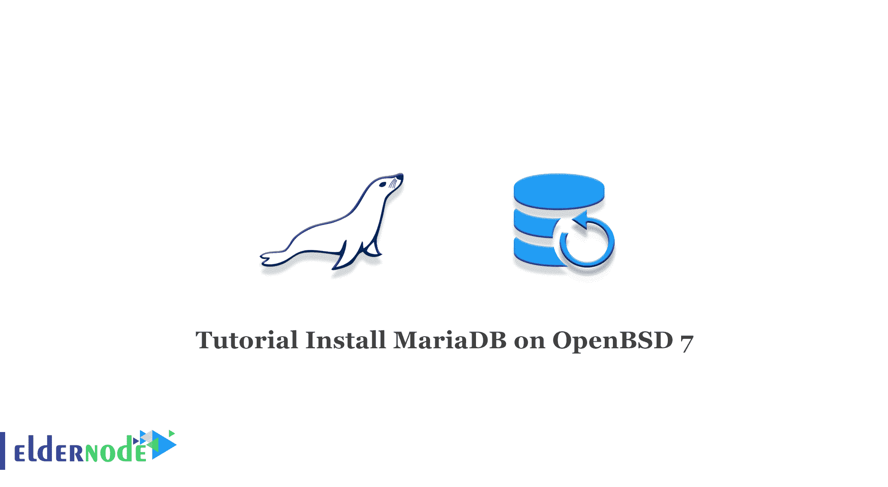

# 教程在 OpenBSD 7 - Eldernode 博客上安装 MariaDB

> 原文：<https://blog.eldernode.com/install-mariadb-on-openbsd-7/>



MariaDB 是一个用于管理流行数据库的免费开源软件，通常用作 MySQL 的替代软件，并使用相同的命令语法。在本文中，我们将一步步教你如何在 OpenBSD 7 上安装 MariaDB。另外，如果你想购买一个 [**Linux VPS**](https://eldernode.com/linux-vps/) 主机，你可以访问 [Eldernode](https://eldernode.com/) 中的软件包。

## **如何在 OpenBSD 7 上安装 MariaDB**

a)首先，通过 SSH 以 root 用户身份登录到服务器，然后在您的服务器上安装来自 OpenBSD 存储库的 [MariaDB](https://blog.eldernode.com/whats-mariadb-how-it-works/) 。

```
pkg_add mariadb-server
```

b)然后将 MariaDB 配置为在引导时启动。

```
rcctl enable mysqld
```

c)在这一步中，启动 MySQL 守护进程。

```
rcctl start mysqld
```

d)然后，验证 MariaDB 是否已启动。

```
rcctl check mysqld
```

e)在最后一步中，您需要运行 mysql_install_db 脚本来创建必要的系统表和二进制文件。

```
mysql_install_db
```

## **如何在 OpenBSD 7 上配置 MariaDB**

第一步，运行 mysql_secure_installation 脚本删除默认数据库和设置。然后为 root 用户设置一个强密码。

```
mysql_secure_installation
```

用 nano 编辑器打开/etc/my.cnf:

```
nano /etc/my/cnf
```

此时，启用/var/run/mysql.sock 地址中的 mysql 套接字，并允许 MariaDB 监听客户端连接的端口 3306。

[客户端-服务器]
socket =/var/run/MySQL/MySQL . sock
port = 3306

最后，用 ctrl + x 保存并关闭文件。

## **如何在 OpenBSD 7 上测试 MariaDB**

要在 OpenBSD 7 上测试 MariaDB，请按顺序执行以下步骤。

1)以 root 身份登录到 MariaDB，并输入 root 密码。

注意:您之前设置的密码。

```
mysql -u root -p
```

2)使用以下命令创建一个新的数据库。

```
MariaDB [(none)]> CREATE DATABASE onedb;
```

3)然后用强密码创建一个新的标准用户。

```
MariaDB [(none)]> CREATE USER 'user2'@'localhost' IDENTIFIED BY 'F5tYh(ikB2wq';
```

4)授予用户对一个数据库的完全权限。

```
MariaDB [(none)]> use onedb;
```

```
MariaDB [onedb]> GRANT ALL PRIVILEGES ON onedb.* TO 'user2'@'localhost';
```

5)重新加载权限。

```
MariaDB [onedb]> FLUSH PRIVILEGES;
```

6)退出根目录。

```
MariaDB [onedb]> EXIT
```

7)此时，这次以标准用户身份登录控制台。

```
mysql -u user2 -p
```

8)然后，使用以下命令，检查用户当前可访问的数据库。

```
MariaDB [(none)]> show databases;
```

您将看到已经添加了 user2。

9)最后，按照下面的命令退出。

```
MariaDB [(none)]> EXIT
```

## 结论

在本教程中，您已经在 OpenBSD 7 上安装、配置和测试了 MariaDB。您还学习了如何创建数据库以及如何连接用户数据库。