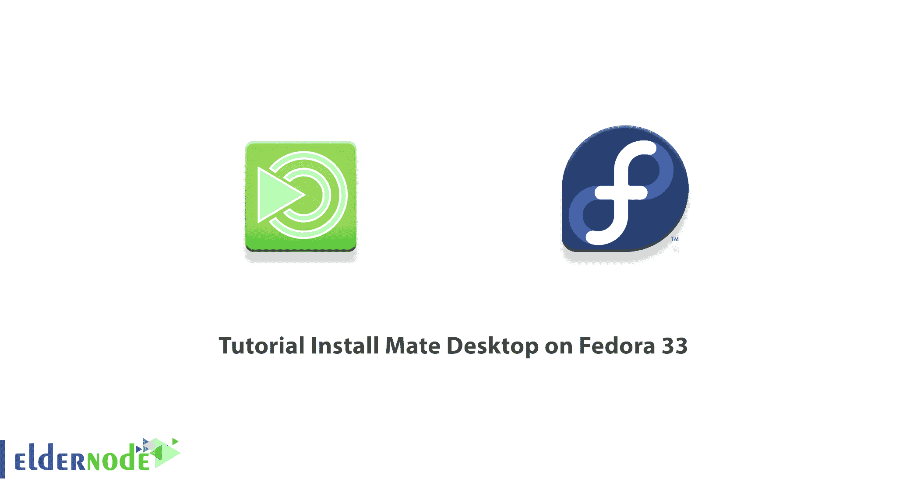
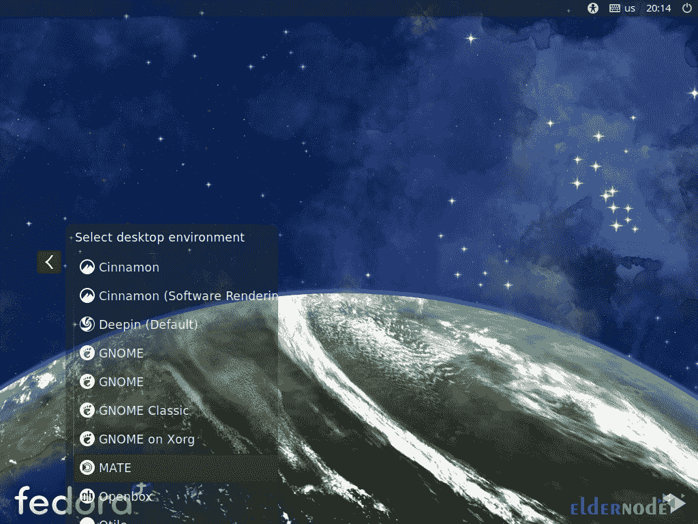
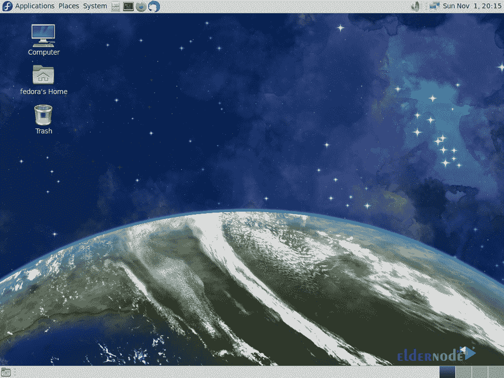

# 教程在 Fedora 33/34 - Eldernode 博客上安装 Mate Desktop

> 原文：<https://blog.eldernode.com/install-mate-desktop-on-fedora/>



【更新】MATE 是一个面向 Unix 系统和 BSD 操作系统的免费开源桌面环境。它是 GNOME 2 的延续，它提供了一个直观且有吸引力的桌面环境。使用 Make desktop 允许您在 Fedora Workstation spin 中体验不同的桌面环境，而不是默认的 GNOME 3。另外，通过使用 Linux 和其他类似 Unix 的操作系统的传统隐喻，它将提供一个直观的、有吸引力的桌面环境。和我们一起通过这篇文章来回顾教程**在 Fedora 33** ，32，34 上一步一步安装 Mate Desktop。要购买自己的 **[Linux VPS](https://eldernode.com/linux-vps/)** ，请访问 [Eldernode](https://eldernode.com/) 上的可用软件包并选择您需要的。

## **在 Fedora 上安装 Mate 桌面 33 |** **Fedora 34**

Mate Desktop 可以帮助您以图形方式登录，如果您的主桌面出现任何故障，您也可以继续工作。它也是一个易于导航和配置的桌面，不需要随着每次更新而过时的第三方扩展。和我们一起回顾在 [Fedora](https://blog.eldernode.com/tag/fedora/) 33，34 上安装 Mate Desktop 所需的步骤。

### **什么是 Mate 桌面？**

马黛茶是以南美植物马黛茶和由马黛茶制成的茶命名的。这个名字最初都是大写字母，以遵循其他自由软件桌面环境的命名法，如 KDE 和 LXDE。

MATE Desktop 就是这样一个桌面环境的实现，它包括一个可以将你连接到本地和网络文件的文件管理器、一个文本编辑器、计算器、存档管理器、图像查看器、文档查看器、系统监视器和终端。所有这些都可以通过控制中心进行高度定制和管理。

MATE 桌面有着丰富的历史，是 GNOME 2 桌面的延续，GNOME 2 桌面是十多年来许多 Linux 和 Unix 操作系统的默认桌面环境。这意味着 MATE Desktop 是经过尝试和测试的，非常可靠。

在本文的续篇中，加入我们来教你如何在 Fedora 33 上安装 Mate Desktop。

## **如何在 Fedora 上安装 Mate Desktop 33 | 32 | 34**

在这一节，我们将教你如何在 Fedora 33 上安装 Mate Desktop。为此，只需遵循以下步骤。

请注意，如果您安装了没有图形用户界面的 Fedora，第一步是安装桌面环境，如下所示。因此，您必须使用以下命令安装 MATE 桌面环境:

```
dnf -y group install "MATE Desktop"
```

现在，您需要以共享用户身份再次登录，以在 CUI 中启动桌面会话。为此，请输入以下命令:

```
echo "exec /usr/bin/mate-session" >> ~/.xinitrc
```

```
startx
```

**重启**系统一次以应用更改。

### **如何在 Fedora 上运行 Mate 桌面 33**

在您成功完成安装过程后，我们现在要开始如何设置 Mate Desktop。在这一步，你必须点击登录页面左下方的[MATE]图标。



如果您遵循了本教程中的所有步骤，您将看到 MATE 桌面会话成功启动:



## 结论

桌面图形用户界面，如 Mate Desktop，有助于用户轻松访问和编辑文件。在这篇文章中，我们试图教你如何在 Fedora 33 上安装 Mate Desktop。