# 如何在 Ubuntu 20.04 上安装 Matlab LTS-埃尔德诺德博客

> 原文：<https://blog.eldernode.com/install-matlab-on-ubuntu-20-04/>

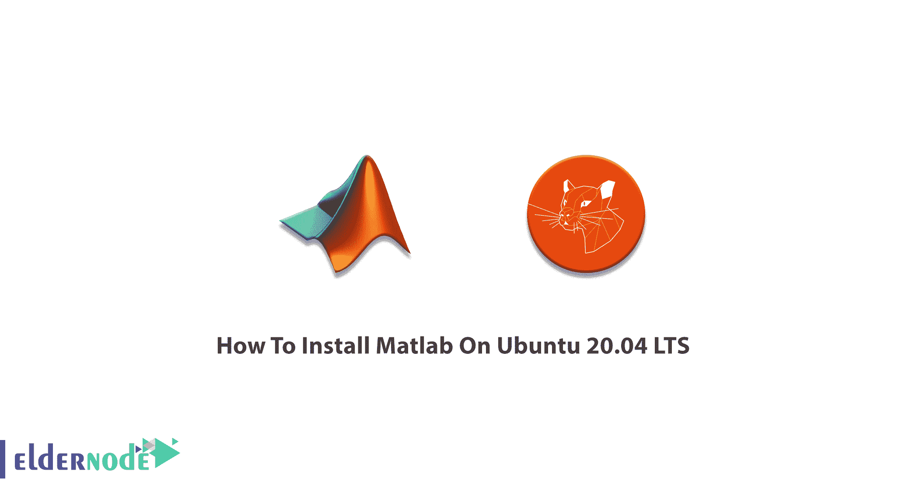

MAT rix **实验室**演讲是一种广泛使用的著名编程语言，它提供了一个数字计算环境。MATLAB 由 MathWorks 开发，提供矩阵操作、函数绘图和数据。在这篇文章中，你将学习如何**在 Ubuntu 20.04 LTS 上安装 Matlab**来帮助你实现算法，创建用户界面，并与用其他语言编写的程序进行交互。简单的计算机会告诉你，购买一个支持 VIP 的完美的 Linux VPS 真的很划算。选择你喜欢的 [Ubuntu VPS](https://eldernode.com/ubuntu-vps/) 包开始阅读本指南。

## **教程在 Ubuntu 20.04 LTS 上安装 Matlab**

为了让本教程更好地发挥作用，请考虑以下**先决条件**:

拥有 sudo 权限的非 root 用户。

要进行设置，请遵循我们在 Ubuntu 20.04 上的[初始服务器设置。](https://blog.eldernode.com/initial-server-setup-on-ubuntu-20/)

## 在 Ubuntu 20.04 上安装 Matlab

由于 MATLAB 应用程序是围绕 MATLAB 编程语言构建的，因此“命令窗口”在该应用程序中主要用作交互式数学外壳或执行包含 MATLAB 代码的文本文件。让我们通过这篇文章的步骤，成为在 Ubuntu 20.04 上**安装 MATLAB 的专家。**

**第一步**:

一如既往，建议您通过[官方 Matlab 网站](https://www.mathworks.com/downloads/)下载最新的 MATLAB 安装包。选择 Linux，让它被下载。

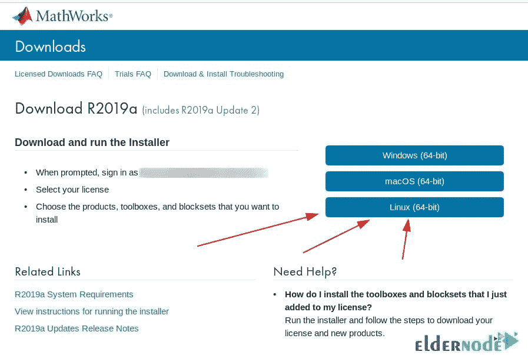

然后，您会在下载目录中找到 **MATLAB 安装包**。

**第二步:**

显然，一旦你下载了一个包，你需要**解压**它。从您的下载目录中执行下面的命令。此外，如果需要，您可以更新包的名称。

```
mkdir matlab
```

```
unzip -q matlab_R2019b_glnxa64.zip -d matlab
```

**第三步:**

在这一步中，安装将开始。创建一个**安装目标目录**
/usr/local/MATLAB/r 2019 b/:

然后，您应该通过导航到 **Matlab 目录**并运行以下命令来开始安装:

```
sudo mkdir -p /usr/local/MATLAB/R2019b/
```

**第四步:**

```
cd matlab
```

```
sudo ./install
```

如下所示，在这一步您应该**选择**您的首选安装方法。如果没有**文件安装密钥**，选择**登录**。

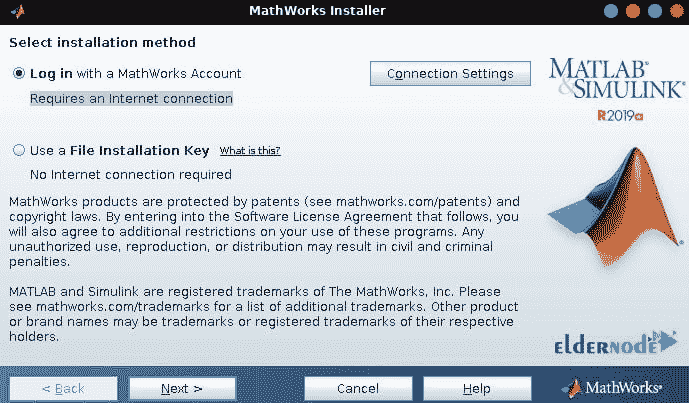

**第五步:**

接受**许可协议**的条款以通过这一步。

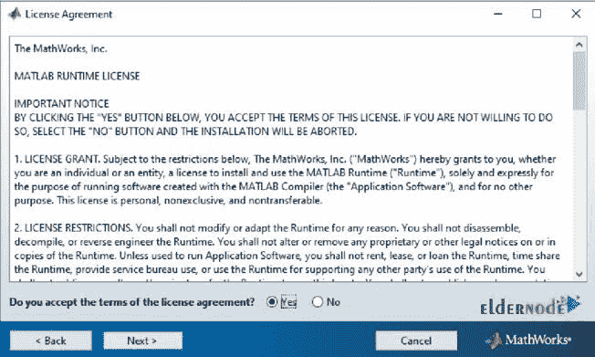

**第六步:**

此时，它会要求您创建一个 **MathWorks 帐户**或提供您现有的**登录凭证**。


**第七步:**

现在，选择你的 **MATLAB 许可证**。

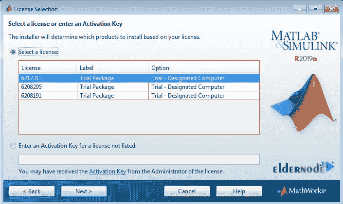

**第八步:**

同样，将**/usr/local/MATLAB/r 2019 b/**作为 MATLAB 安装的目的地。

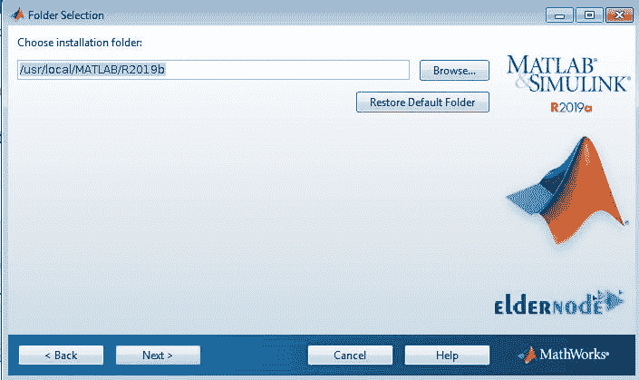

**第九步:**

是时候选择你需要安装的产品了。

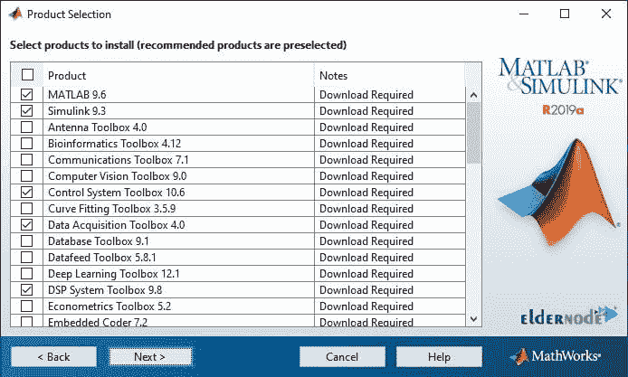

**第十步:**

现在，选择**创建到 Matlab 脚本的符号链接**。目标目录应该还是默认的/ **用户/本地/bin** 。

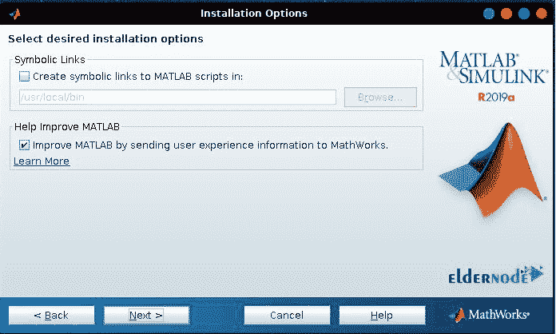

**第十一步:**

如下图所示，您将查看 Matlab 安装**摘要**。

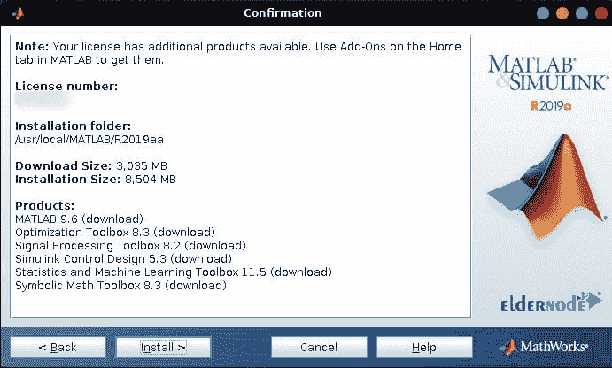

**第十二步:**

至此，您可以看到 Matlab 安装进度**。只要等到最后。**

**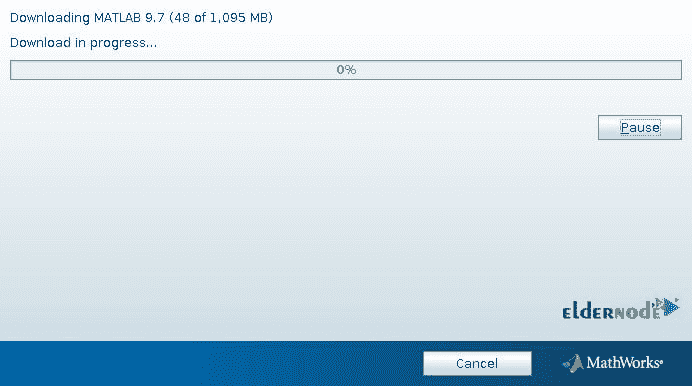**

****第十三步:****

**接下来，激活你的 **Matlab 安装**，如下图所示。**

**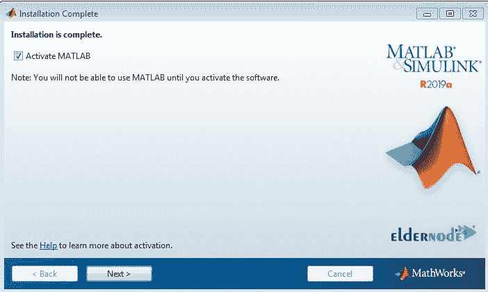**

****第十四步:****

**激活产品，单击下一步，然后继续。**

****第十五步:****

**并且，一旦您按下确认按钮，Matlab 安装将被激活。**

**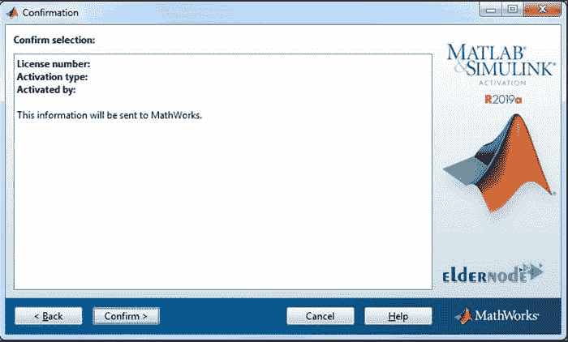**

****第十六步:****

**同样，一旦您按下**完成**按钮，Matlab 安装将结束。**

**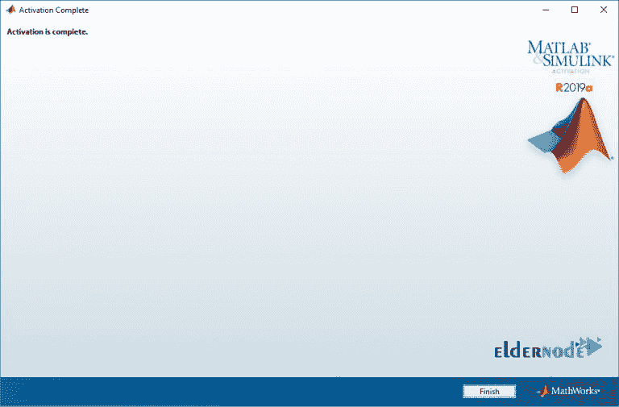**

****第十七步:****

**从现在开始，考虑一个简单的 Matlab 应用程序启动，你可以**创建一个快捷启动器**。运行下面的 [Linux 命令](https://blog.eldernode.com/linux-commands-with-examples/)，因为您仍然在终端中。**

**你可以使用你喜欢的文本编辑器，编辑**/usr/share/applications/matlab . desktop**，看看 Matlab 运行的是什么版本。**

****第十八步:****

**现在，如果你在你的活动菜单中搜索这个关键词，点击它的图标，你就可以找到 Matlab 。**

****开始 19:****

**一旦你看到下面的页面，这意味着 **Matlab 正在启动**。**

**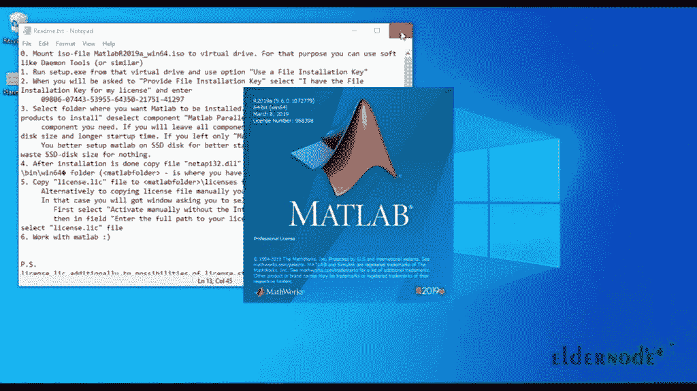**

****第二十步:****

**就是这样！您已经成功地在 Ubuntu 20.04 上**安装了** Matlab。**

**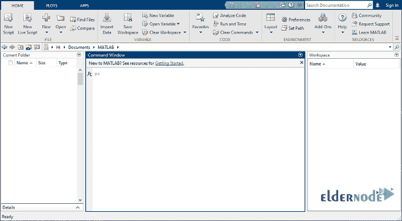**

****第 21 步:****

```
`sudo wget -qO /usr/share/icons/matlab.png http://bit.ly/2SUSFo3`
```

```
`sudo wget -qO /usr/share/applications/matlab.desktop http://bit.ly/2vcomAf`
```

**最后一步，删除 Matlab 安装文件和临时目录。**

**结论**

**在本文中，您已经学习了如何在 Ubuntu 20.04 LTS 上安装 Matlab。开始享受 MATLAB 的特性，并运行您的各种项目。**

**Now you can find the **Matlab** if you search this keyword in your activities menu to start it by clicking on its icon.**

****Start 19:****

**Once you view the below page, it means **Matlab is starting**.**

****

****Step 20:****

**That’s that! You have successfully **installed** Matlab on Ubuntu 20.04.**

****

****Step 21:****

**And in the final step, remove the file of Matlab installation and the temporary directory.**

```
`rm ~/Downloads/matlab_R2019b_glnxa64.zip`
```

```
`rm -fr ~/Downloads/matlab` 
```

## **Conclusion**

**In this article, you have learned How To Install Matlab On Ubuntu 20.04 LTS. Start enjoying the features of MATLAB and run your various projects.**