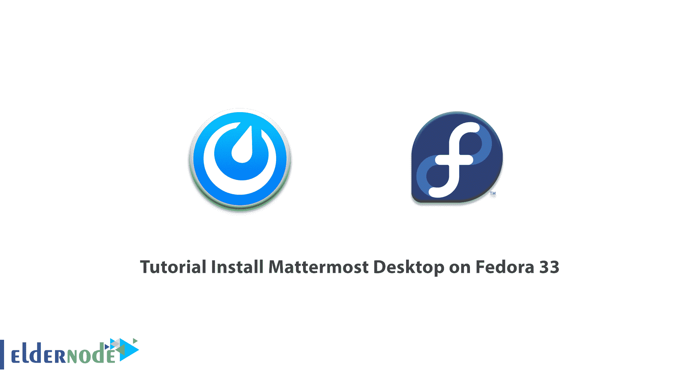

# 教程在 Fedora 33 - Eldernode 博客上安装 Mattermost 桌面

> 原文：<https://blog.eldernode.com/install-mattermost-desktop-on-fedora/>



Mattermost Desktop 是一个强大的集成工具的名称，用于在组织级别的所有团队成员之间提供有用的集成通信。如今，一个组织中人们的工作和活动风格是以不同的方式完成的。与过去不同，如今许多工作都是远程进行的，相比之下，一些组织仍然强调人们在工作场所的实际存在。然而，维护和记录组织中不同成员之间的通信和对话(包括物理的和虚拟的)尤为重要。因此，始终有必要记录如何采取行动、活动的不同阶段等。在组织里。在这篇文章中，我们将教你关于在 Fedora 33 上安装 Mattermost 桌面的**教程。你可以访问 [Eldernode](https://eldernode.com/) 提供的包来购买 [Linux VPS](https://eldernode.com/linux-vps/) 服务器。**

## **如何在 Fedora 33** 上安装 Mattermost 桌面

Mattermost 桌面软件允许您与其他团队成员一起体验组织级别的集成和智能活动。该计划是用于在组织内开展对话的工具。该软件主要用于 DevOps 团队内部的活动，以便从开发流程到运营的所有活动都可以在一个集成的环境中进行跟踪。

在下一节中，我们将讨论 Mattermost 桌面的特性。然后我们会教你如何在 [Fedora 33](https://blog.eldernode.com/install-fedora-on-vps-server/) 上安装 Mattermost Desktop。请加入我们。

### ****(在 Fedora 33 上安装 Mattermost 桌面)****

**–为活跃在 DevOps 领域的公司提供合适的平台。**

**–能够通过 [Windows](https://blog.eldernode.com/tag/windows/) 应用程序、手机、Mac 和 [Linux](https://blog.eldernode.com/tag/linux/) 与其他合作伙伴交流。**

**–非常高的[安全性](https://blog.eldernode.com/tag/security/)以及在不同规模下建立信息系统的能力。**

**–在发起群组对话、渠道等领域的广泛设施。具有搜索文本、发送文本、图像等的可能性。**

**–信息管理和报告领域的广泛设施。**

### ****在 Fedora 33** 上安装 Mattermost 桌面**

**在本节中，我们使用快照在 Fedora 33 上安装 Mattermost Desktop。快照是打包了所有依赖项的程序，可以在所有流行的 Linux 发行版中从单个构建运行。要安装 Snap，您可以轻松运行以下命令:**

```
`sudo dnf install snapd`
```

**您可以**重启**系统一次，以确保应用更改。您可以输入以下命令**启用 snap** 支持，在 **/var/lib/snapd/snap** 和 **/snap** 之间创建一个符号链接:**

```
`sudo ln -s /var/lib/snapd/snap /snap`
```

**最后，您可以轻松地运行以下命令来**在 Fedora 33 上安装 Mattermost Desktop** :**

```
`sudo snap install mattermost-desktop`
```

## **结论**

**Mattermost Desktop 是一个通信程序，允许您与其他团队成员直接通信。在本文中，我们试图教你如何在 Fedora 33 上安装 Mattermost Desktop。如果你对 Ubuntu 发行版感兴趣，可以参考文章[如何在 Ubuntu 20.04](https://blog.eldernode.com/install-mattermost-messaging-on-ubuntu/) 上安装 Mattermost messaging。**