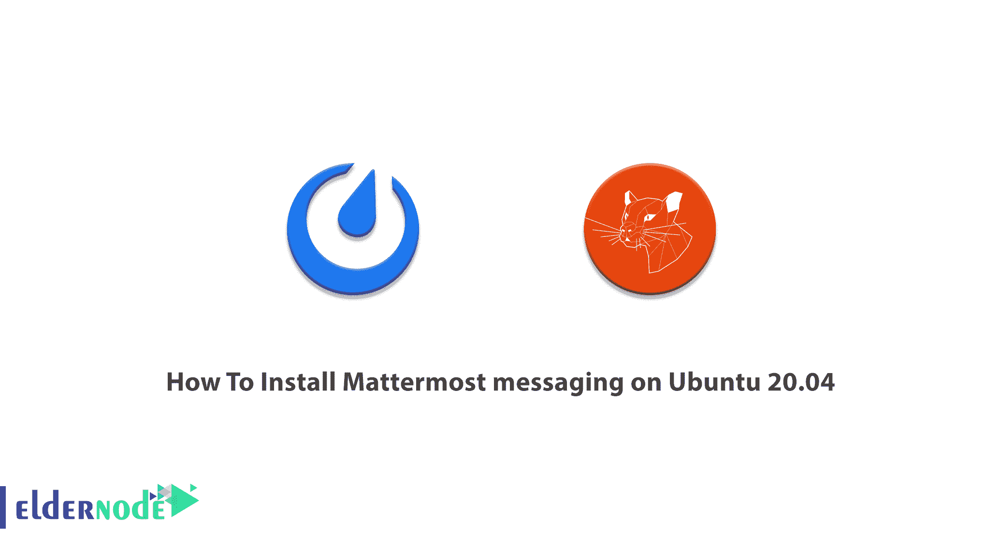
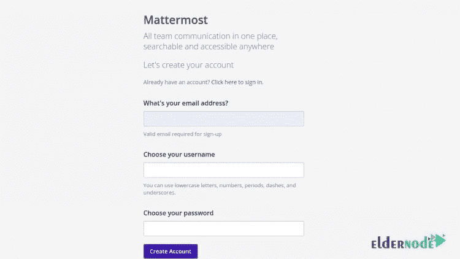
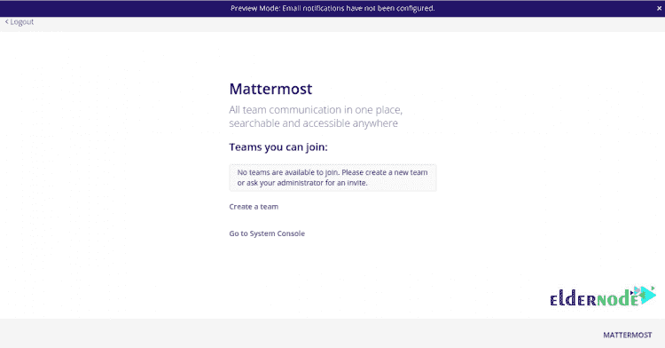
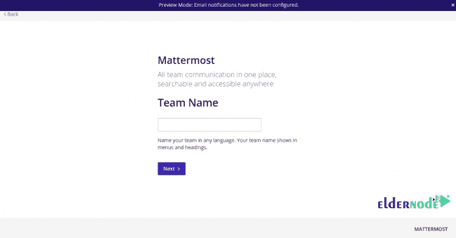
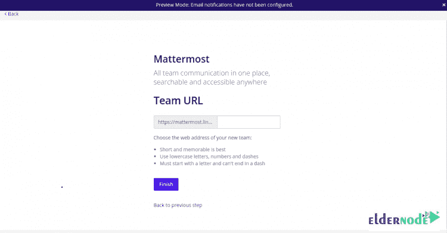
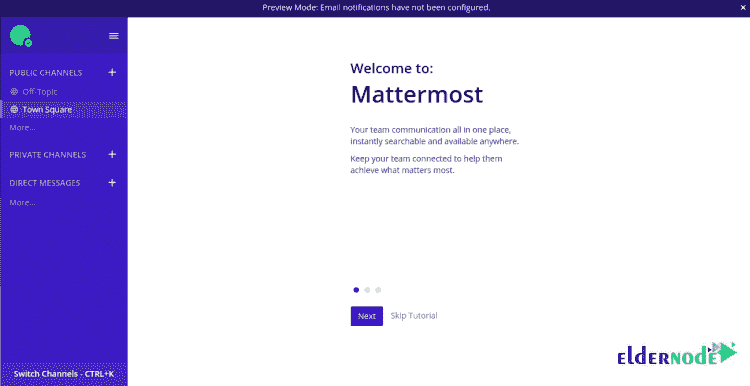
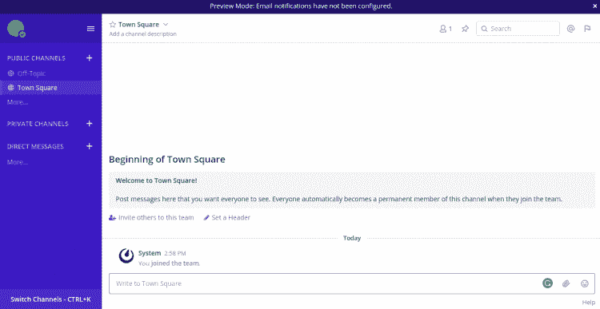

# 如何在 Ubuntu 20.04 - Eldernode 博客上安装 Mattermost messaging

> 原文：<https://blog.eldernode.com/install-mattermost-messaging-on-ubuntu/>



公司和组织需要一个内部聊天平台来构建自己的消息服务。Mattermost 是一个开源的消息传递系统，它是自托管的，供团队和开发人员在一个地方进行交流。这个高度可信的在线聊天服务是用 Golang 和 React 编程语言编写的。在这篇文章中，你将学习如何在 Ubuntu 20.04 上安装 Mattermost messaging。由于你的需要，你可以买一个 [Linux VPS](https://eldernode.com/linux-vps/) 或者准备自己的 [Ubuntu VPS](https://eldernode.com/ubuntu-vps/) 继续阅读。

## **教程在 Ubuntu 20.04 上安装 matter most messaging**

为了让本教程更好地发挥作用，请考虑以下**先决条件**:

拥有 sudo 权限的非 root 用户。

要进行设置，请遵循我们在 Ubuntu 20.04 上的[初始服务器设置。](https://blog.eldernode.com/initial-server-setup-on-ubuntu-20/)

在本指南中，我们将使用[PostgreSQL](https://blog.eldernode.com/tutorial-postgresql-installation-ubuntu-20/)数据库或 [MySQL](https://blog.eldernode.com/installing-mysql-on-ubuntu-20/) 。你将在 Ubuntu 20.04 上安装带有 [Nginx](https://blog.eldernode.com/install-nginx-on-ubuntu-20-04-lts/) 和 [Let's Encrypt SSL](https://blog.eldernode.com/secure-nginx-encrypt-ubuntu/) 的 Mattermost。请和我们一起回顾所需的步骤。

## **在 Ubuntu 20.04 上安装 matter most messaging | Ubuntu 18.04**

据消息称，Mattermost 是 Slack 聊天平台的替代产品。Mattermost 是一个从任何地方或从你的桌面、Android 设备和 iPhone 开始合作的好主意。自从 Mattermost 让他们将人、工具和自动化联系起来后，世界上有许多企业正在增加他们的协作。让我们通过本指南的步骤成为 Mattermost 安装专家。

**首先**，正如我们一直推荐的，开始更新你的系统包。因此，运行下面的命令:

```
apt-get update -y
```

现在，使用以下命令安装其他必需的依赖项:

```
apt-get install curl wget vim git unzip gnupg2 -y
```

### 如何安装和配置 MariaDB

正如我们提到的，Mattermost 使用 MySQL/MariaDB 作为数据库后端。如果您还没有安装 [MariaDB](https://blog.eldernode.com/mariadb-installation-on-ubuntu/) 服务器，请使用下面的命令来安装。

```
apt-get install mariadb-server -y
```

安装完成后，您可以通过运行以下命令登录到 MariaDB。

```
mysql
```

要为 Mttermost 创建数据库和用户，请键入:

```
MariaDB [(none)]> CREATE DATABASE mattermostdb;  MariaDB [(none)]> CREATE USER 'mattermost'@'%' IDENTIFIED BY 'password';
```

然后，您可以通过运行以下命令向 Mattermost 授予所有权限:

```
MariaDB [(none)]> GRANT ALL PRIVILEGES ON mattermostdb.* TO 'mattermost'@'%';
```

并清除特权，从 MariaDB shell 中退出。

```
MariaDB [(none)]> FLUSH PRIVILEGES;  MariaDB [(none)]> EXIT;
```

### 如何安装和配置 Mattermost

建议你从其[官网](https://mattermost.com/)下载 Mattermost 的最新版本。另外，您可以使用下面的命令来下载它。

```
wget https://releases.mattermost.com/5.24.2/mattermost-5.24.2-linux-amd64.tar.gz
```

下载完成后，使用以下命令提取下载的文件:

```
tar -xvzf mattermost-5.24.2-linux-amd64.tar.gz
```

然后，将提取的目录复制到/opt:

```
cp -r mattermost /opt
```

要为 Mettermost 创建数据目录，请运行:

```
mkdir /opt/mattermost/data
```

使用以下命令创建一个单独的用户来运行 Mattermost。

```
useradd --system --user-group mattermost
```

现在是时候将 matter host 目录的所有权更改为 matter host，并通过运行以下命令给予适当的权限:

```
chown -R mattermost:mattermost /opt/mattermost  chmod -R g+w /opt/mattermost
```

应编辑 mattermost 默认配置文件，然后定义您的数据库设置和站点 URL。使用以下命令来完成此操作:

```
nano /opt/mattermost/config/config.json
```

然后，您可以根据您的优先级更改以下行:

```
"SiteURL": "https://mattermost.domain.com",
```

```
"DriverName": "mysql",  "DataSource": "mattermost:[[email protected]](/cdn-cgi/l/email-protection)(localhost:3306)/mattermostdb?charset=utf8mb4,utf8\u0026readTimeout=30s\u0026writeTimeout=30s",
```

完成后，您可以保存并关闭文件。

### 如何为 Mattermost 创建 Systemd 服务文件

此时，您需要创建一个系统服务文件来管理 Mattermost 服务。要创建它，请键入:

```
nano /lib/systemd/system/mattermost.service
```

并添加以下几行:

```
[Unit]  Description=Mattermost  After=network.target  After=mysql.service  Requires=mysql.service
```

```
[Service]  Type=notify  User=mattermost  Group=mattermost  ExecStart=/opt/mattermost/bin/mattermost  TimeoutStartSec=3600  Restart=always  RestartSec=10  WorkingDirectory=/opt/mattermost  LimitNOFILE=49152
```

```
[Install]  WantedBy=mariadb.service
```

然后，您可以保存并关闭该文件。通过运行以下命令重新加载系统守护程序:

```
systemctl daemon-reload
```

现在，您可以使用以下命令启动 Mattermost 服务，并使其在系统重新启动时启动:

```
systemctl start mattermost  systemctl enable mattermost
```

要验证 Mattermost 服务的状态，请使用以下命令。

```
systemctl status mattermost
```

正确的输出应该如下所示:

```
? mattermost.service - Mattermost  Loaded: loaded (/lib/systemd/system/mattermost.service; disabled; vendor preset: enabled)  Active: active (running) since Sat 2020-08-01 09:12:52 UTC; 17s ago  Main PID: 4106 (mattermost)  Tasks: 20 (limit: 2353)  Memory: 85.9M  CGroup: /system.slice/mattermost.service  ??4106 /opt/mattermost/bin/mattermost  ??4198 plugins/com.mattermost.nps/server/dist/plugin-linux-amd64
```

```
Aug 01 09:12:52 ubuntu2004 mattermost[4106]: {"level":"info","ts":1596273172.131499,"caller":"mlog/sugar.go:19","msg":"Sent notification of ne>  Aug 01 09:12:52 ubuntu2004 mattermost[4106]: {"level":"info","ts":1596273172.1841655,"caller":"jobs/workers.go:73","msg":"Starting workers"}  Aug 01 09:12:52 ubuntu2004 mattermost[4106]: {"level":"info","ts":1596273172.1842792,"caller":"bleveengine/bleve.go:267","msg":"UpdateConf Ble>  Aug 01 09:12:52 ubuntu2004 mattermost[4106]: {"level":"info","ts":1596273172.1930475,"caller":"jobs/schedulers.go:74","msg":"Starting schedule>  Aug 01 09:12:52 ubuntu2004 mattermost[4106]: {"level":"info","ts":1596273172.20063,"caller":"app/web_hub.go:83","msg":"Starting websocket hubs>  Aug 01 09:12:52 ubuntu2004 mattermost[4106]: {"level":"info","ts":1596273172.2099638,"caller":"app/license.go:37","msg":"License key from http>  Aug 01 09:12:52 ubuntu2004 mattermost[4106]: {"level":"info","ts":1596273172.2205582,"caller":"app/server.go:525","msg":"Starting Server..."}  Aug 01 09:12:52 ubuntu2004 mattermost[4106]: {"level":"info","ts":1596273172.2208374,"caller":"app/server.go:594","msg":"Server is listening o>  Aug 01 09:12:52 ubuntu2004 mattermost[4106]: {"level":"info","ts":1596273172.2211802,"caller":"commands/server.go:106","msg":"Sending systemd >  Aug 01 09:12:52 ubuntu2004 systemd[1]: Started Mattermost.
```

这样，Mattermost 就在端口 8065 上运行和侦听。

### 如何配置 Nginx

在这一步中，您应该将 Nginx 配置为 Mattermost 的反向代理。要安装 Nginx 包，请键入:

```
apt-get install nginx -y
```

安装完成后，运行下面的命令创建一个 Nginx 虚拟主机配置文件。

```
nano /etc/nginx/sites-available/mattermost.conf
```

再次添加以下几行:

```
upstream mattermost {  server localhost:8065;  keepalive 32;  }
```

```
proxy_cache_path /var/cache/nginx levels=1:2 keys_zone=mattermost_cache:10m max_size=3g inactive=120m use_temp_path=off;
```

```
server {  listen 80;  server_name mattermost.domain.com;
```

```
location ~ /api/v[0-9]+/(users/)?websocket$ {  proxy_set_header Upgrade $http_upgrade;  proxy_set_header Connection "upgrade";  client_max_body_size 50M;  proxy_set_header Host $http_host;  proxy_set_header X-Real-IP $remote_addr;  proxy_set_header X-Forwarded-For $proxy_add_x_forwarded_for;  proxy_set_header X-Forwarded-Proto $scheme;  proxy_set_header X-Frame-Options SAMEORIGIN;  proxy_buffers 256 16k;  proxy_buffer_size 16k;  client_body_timeout 60;  send_timeout 300;  lingering_timeout 5;  proxy_connect_timeout 90;  proxy_send_timeout 300;  proxy_read_timeout 90s;  proxy_pass http://mattermost;  }
```

```
location / {  client_max_body_size 50M;  proxy_set_header Connection "";  proxy_set_header Host $http_host;  proxy_set_header X-Real-IP $remote_addr;  proxy_set_header X-Forwarded-For $proxy_add_x_forwarded_for;  proxy_set_header X-Forwarded-Proto $scheme;  proxy_set_header X-Frame-Options SAMEORIGIN;  proxy_buffers 256 16k;  proxy_buffer_size 16k;  proxy_read_timeout 600s;  proxy_cache mattermost_cache;  proxy_cache_revalidate on;  proxy_cache_min_uses 2;  proxy_cache_use_stale timeout;  proxy_cache_lock on;  proxy_http_version 1.1;  proxy_pass http://mattermost;  }  }
```

完成后，您可以保存并关闭文件。要激活虚拟主机配置，请运行:

```
ln -s /etc/nginx/sites-available/mattermost.conf /etc/nginx/sites-enabled/mattermost.conf
```

要验证 Nginx 是否存在任何配置错误，请键入

```
nginx -t
```

应显示以下输出:

```
nginx: the configuration file /etc/nginx/nginx.conf syntax is ok  nginx: configuration file /etc/nginx/nginx.conf test is successful
```

要应用这些更改，使用以下命令重新启动 Nginx:

```
systemctl restart nginx
```

### 如何使用加密 SSL 保护 Mattermost】

要管理 Let's Encrypt SSL，您需要在系统中安装 Certbot 客户端。使用以下命令来完成此操作:

```
apt-get install python3-certbot-nginx -y
```

安装 Certbot 后，运行下面的命令为您的网站安装 Let's Encrypt SSL。

```
certbot --nginx -d mattermost.domain.com
```

如下所示，您将被要求提供有效的电子邮件地址并接受服务条款。

```
Saving debug log to /var/log/letsencrypt/letsencrypt.log  Plugins selected: Authenticator nginx, Installer nginx  Enter email address (used for urgent renewal and security notices) (Enter 'c' to  cancel): [[email protected]](/cdn-cgi/l/email-protection)
```

```
- - - - - - - - - - - - - - - - - - - - - - - - - - - - - - - - - - - - - - - -  Please read the Terms of Service at  https://letsencrypt.org/documents/LE-SA-v1.2-November-15-2017.pdf. You must  agree in order to register with the ACME server at  https://acme-v02.api.letsencrypt.org/directory  - - - - - - - - - - - - - - - - - - - - - - - - - - - - - - - - - - - - - - - -  (A)gree/(C)ancel: A
```

```
- - - - - - - - - - - - - - - - - - - - - - - - - - - - - - - - - - - - - - - -  Would you be willing to share your email address with the Electronic Frontier  Foundation, a founding partner of the Let's Encrypt project and the non-profit  organization that develops Certbot? We'd like to send you email about our work  encrypting the web, EFF news, campaigns, and ways to support digital freedom.  - - - - - - - - - - - - - - - - - - - - - - - - - - - - - - - - - - - - - - - -  (Y)es/(N)o: Y  Obtaining a new certificate  Performing the following challenges:  http-01 challenge for mattermost.domain.com  Waiting for verification...  Cleaning up challenges  Deploying Certificate to VirtualHost /etc/nginx/sites-enabled/mattermost.conf
```

然后，您需要选择是否将 HTTP 流量重定向到 HTTPS:

```
- - - - - - - - - - - - - - - - - - - - - - - - - - - - - - - - - - - - - - - -  1: No redirect - Make no further changes to the webserver configuration.  2: Redirect - Make all requests redirect to secure HTTPS access. Choose this for  new sites, or if you're confident your site works on HTTPS. You can undo this  change by editing your web server's configuration.  - - - - - - - - - - - - - - - - - - - - - - - - - - - - - - - - - - - - - - - -  Select the appropriate number [1-2] then [enter] (press 'c' to cancel): 2
```

现在，键入 2 并按 Enter 键在您的域上安装 Let's Encrypt SSL 。然后，您将看到如下输出:

```
Redirecting all traffic on port 80 to ssl in /etc/nginx/sites-enabled/mattermost.conf
```

```
- - - - - - - - - - - - - - - - - - - - - - - - - - - - - - - - - - - - - - - -  Congratulations! You have successfully enabled https://mattermost.domain.com
```

```
You should test your configuration at:  https://www.ssllabs.com/ssltest/analyze.html?d=mattermost.domain.com  - - - - - - - - - - - - - - - - - - - - - - - - - - - - - - - - - - - - - - - -
```

```
IMPORTANT NOTES:  - Congratulations! Your certificate and chain have been saved at:  /etc/letsencrypt/live/mattermost.domain.com/fullchain.pem  Your key file has been saved at:  /etc/letsencrypt/live/mattermost.domain.com/privkey.pem  Your cert will expire on 2020-10-30\. To obtain a new or tweaked  version of this certificate in the future, simply run certbot again  with the "certonly" option. To non-interactively renew *all* of  your certificates, run "certbot renew"  - Your account credentials have been saved in your Certbot  configuration directory at /etc/letsencrypt. You should make a  secure backup of this folder now. This configuration directory will  also contain certificates and private keys obtained by Certbot so  making regular backups of this folder is ideal.  - If you like Certbot, please consider supporting our work by:
```

```
Donating to ISRG / Let's Encrypt: https://letsencrypt.org/donate  Donating to EFF: https://eff.org/donate-le
```

```
- We were unable to subscribe you the EFF mailing list because your  e-mail address appears to be invalid. You can try again later by  visiting https://act.eff.org.
```

### 如何访问 Mattermost web 界面

打开 web 浏览器，键入 URL https://mattermost.domain.com，以重定向到 Mattermost 注册屏幕:



然后，输入您的电子邮件地址，姓名，密码，并点击“创建帐户”按钮。将显示以下屏幕。



现在，点击“创建团队”按钮。然后，您将看到下面的屏幕:



为您的团队选择一个名称，然后单击“下一步”按钮。您应该会看到下面的屏幕:



现在，是时候为您的团队提供 UPL 并单击“完成”按钮了。将显示 mattermost 欢迎画面:



最后，单击“跳过教程”按钮，以 Mattermost 控制面板的形式查看以下屏幕:



## 结论

在本文中，您了解了如何在 Ubuntu 20.04 上安装 Mattermost messaging。安装 Mattermost 以确保安全和隐私，从而完全控制数据。它可以与企业安全、身份和合规性系统无缝协作。