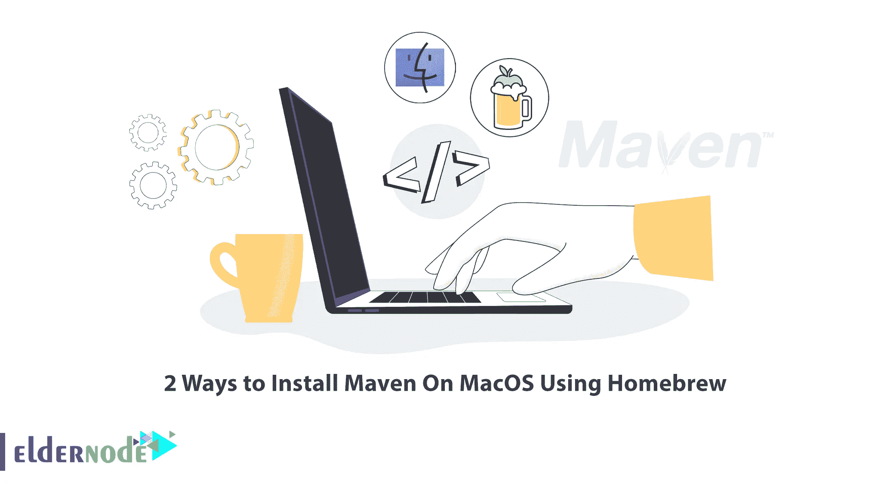
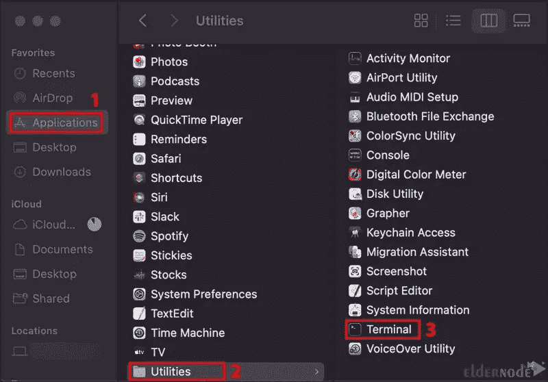
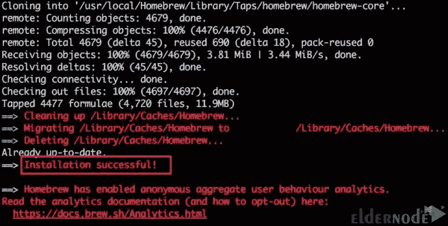

# 使用自制软件在 MacOS 上安装 Maven 的两种方法

> 原文：<https://blog.eldernode.com/install-maven-on-macos-using-homebrew/>



为了能够构建 Java 项目，您需要引入依赖项和语言编译器，并指定如何基于项目类型创建最终的输出包。随着项目越来越大，越来越复杂，这些事项的管理也将变得更加复杂和困难。Apache Maven 是 Java 项目开发过程中重要而有用的工具之一。本文将向您介绍使用自制软件在 MacOS 上安装 Maven 的两种方法。如果你打算购买自己的 [VPS](https://eldernode.com/vps/) 服务器，你可以查看 [Eldernode](https://eldernode.com/) 网站上提供的软件包。

## **如何用家酿**T3 在 MacOS 上安装 Maven

### **什么是 Maven？**

Maven 是一个开源构建工具，允许开发人员构建和记录生命周期框架。它是用 Java 编写的，由 Apache Group 开发，用于同时构建、发布和部署几个项目，以实现更好的项目管理。你可以用它来构建用 C#、Scala、Ruby 等编写的项目。这个工具使 Java 开发人员的日常工作变得更加容易，并且通常有助于理解任何基于 Java 的项目。Maven 简化了构建过程，提供了统一的构建系统，提供了高质量的项目信息，并鼓励更好的开发实践。

在这个来自于 [macOS](https://blog.eldernode.com/tag/mac/) 培训系列的教程中，你将学习使用自制软件在 macOS 上安装 Maven。

### **1-在 MacOS 上安装 homer brew**

首先，导航到**应用> >实用程序> >终端**路径:



在安装家酿之前，最好先安装 Xcode，这是一个集成开发环境。因为您想要安装的一些软件和组件将依赖于 Xcode 的命令行工具包。Xcode 由用于 macOS 的软件开发工具组成。运行以下命令**安装 Xcode** :

```
xcode-select --install
```

然后开始安装，**接受**软件许可。

是时候下载安装脚本了。如果您运行 macOS High Sierra、Sierra、EL Capitan 或更早版本，请输入以下命令:

```
/usr/bin/ruby -e "$(curl -fsSL https://raw.githubusercontent.com/Homebrew/install/master/install)"
```

但是，如果您运行 Catalina、Mojave 或 Big Sur，请输入以下命令:

```
/bin/bash -c "$(curl -fsSL https://raw.githubusercontent.com/Homebrew/install/master/install.sh)"
```

现在，系统会提示您输入管理员密码，然后按 Return 键开始安装。

请等待安装完成。

完成后，您将看到一条“**安装成功**的消息:



### **2-使用自制软件** 在 MacOS 上安装 Maven

在这个方法中，我们将解释如何使用自制软件在 macOS 上安装 Maven。要做到这一点，只需遵循以下步骤。

要使用 Homebrew 在 macOS 上安装 Maven ,只需运行下面的命令:

```
brew install maven
```

一旦安装完成，您可以使用以下命令**检查 Maven 版本**:

```
mvn -version
```

Maven 的主配置文件是 **settings.xml** ，放在**/usr/local/opt/Maven/lib exec/conf**目录下。运行以下命令进行查看:

```
ls -la /usr/local/opt/maven/libexec/conf
```

您可以使用下面的命令升级 Maven 版本:

```
brew upgrade maven
```

就是这样！你已经使用家酿成功地在 macOS 上安装了 Maven。

## 结论

Maven 是一个社区驱动的项目，它允许您构建和维护用于构建 Java 应用程序的最流行的开源工具。在本文中，我们向您介绍了使用自制软件在 macOS 上安装 Maven 的两种方法。我希望这篇教程可以帮助你了解如何使用自制软件在 macOS 上安装 Maven。如果你有任何问题或建议，可以在评论区联系我们。