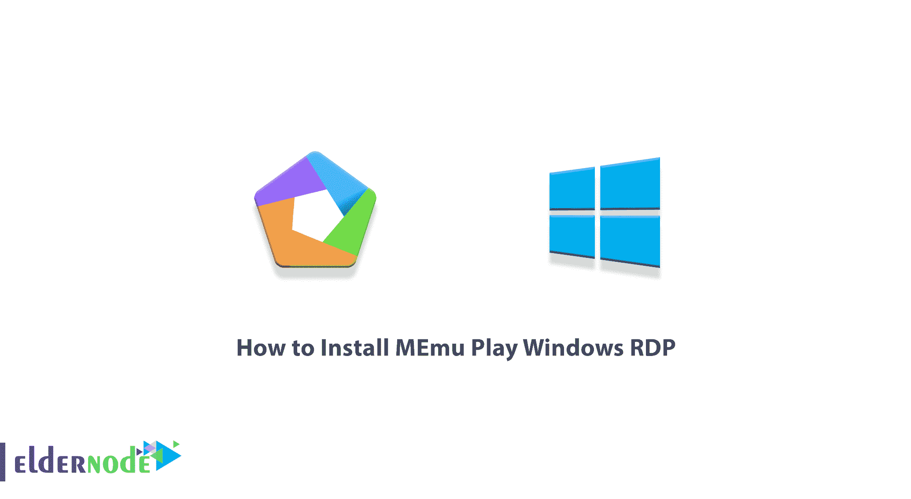
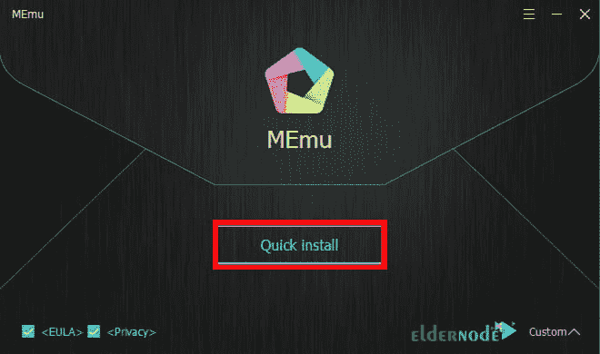

# 如何在 Windows RDP - Eldernode 上安装 MEmu Play

> 原文：<https://blog.eldernode.com/install-memu-play-on-windows/>

MEmu 是一个轻量级的软件，用于你电脑上的 Android 模拟器。有了这个软件，你可以在 MEmu 上安装和运行所有可用的 Android 应用。您还可以在这个版本的模拟器软件上轻松安装和运行游戏，而不会出现安装数据或处理游戏的问题。如果你从来没有根你的 Android 手机或你害怕根和停用你的 Android 手机保修，你可以使用这个程序来了解根故障和问题。在这篇文章中，我们将一步一步地教你如何在 Windows RDP 上安装 MEmu Play。

## **教程在 Windows 上安装 MEmu Play RDP**

MEmu 是 Windows 中的一个 Android 模拟器，让你能够在 Windows 中运行 Android 应用程序和游戏。在下一节中，我们将向您介绍 MEmu 及其功能。然后在下一步，在介绍了必要的先决条件后，我们将教你如何安装 MEmu Play Windows [RDP 管理](https://eldernode.com/buy-rdp/)。最后，我们将解释如何运行和设置它。请加入我们。

### **MEmu 及其功能介绍**

MEmu Play 是你电脑上安卓操作系统的一个流畅优秀的模拟器的名字。事实上，MEmu 是一个免费的非常棒的工具，可以在微软 [Windows](https://blog.eldernode.com/tag/windows/) 操作系统中完全模拟 Android 操作系统。与 Windows 中的 Android 模拟器相比，MEmu 软件提供了最高水平的兼容性和效率。您可以在各种 Windows 设备上试用 MEmu，如台式机、笔记本电脑或 Windows 平板电脑。

在 MEmu 的帮助下，你可以在你的 Windows 和新窗口中运行完全专业的 Android 体验。如果你愿意，你可以调整任何你想要的项目，如 CPU，RAM，内存，屏幕分辨率等。，根据你的需要。

该软件能够轻松地在 Windows 之间共享文件，使您能够在两个操作系统之间快速传输文件。您甚至不再需要闪存盘来传输数据！你可以通过拖拽的方式在 MEmu 中轻松安装 APK 应用和游戏。

在这一节，我们想提一下 MEmu Play 的一些功能。这些功能包括:

–相对更好的程序处理和更轻松的程序执行

–利用系统显卡

–利用信息存储

–连接到现有软件帐户

–为初学者提供简单流畅的环境

–Wifi 支持

### **在 Windows RDP 上安装 MEmu Play 的先决条件**

在开始安装 MEmu Play 之前，您必须提供它的先决条件。这些先决条件是:

**_ Windows RDP:** 2012，2016，2019

**_ 处理器:**英特尔奔腾 4 酷睿 i3

**_ 系统内存:** 3GB DDR 3

**_ 显卡:** 512 ~ 1 GB

**_ 硬盘:** 2GB 免费硬盘

## **在 Windows 上安装 MEmu Play RDP**

在这一节，我们想一步步教你如何在 [windows 虚拟服务器](https://eldernode.com/windows-vps/)上安装 MEmu Play。为此，只需遵循以下步骤。

若要开始，您需要在第一步中打开远程桌面连接。然后在打开的窗口中输入你想要进入的 IP 地址[**Windows RDP**](https://eldernode.com/services/windows-remote-desktop/)环境点击**连接**。

下一步，你需要打开你最喜欢的浏览器[下载 MEmu Play](http://www.memuplay.com/) 如下图:

*

然后转到下载文件的位置。双击安装程序开始 MEmu 安装过程。

在打开的窗口中，点击**快速安装**。

请稍等片刻，直到 MEmu Play 安装完成。

一旦程序安装完成，您可以通过点击**启动**按钮来运行它。

### **如何使用 MEmu 播放 Windows RDP**

在上一节中，我们教你如何在 Windows RDP 上安装 MEmu Play。在本节中，我们将一起回顾如何使用它。

第一步，你可以在**开始菜单**的**窗口 RDP** 中搜索 **MEmu Play** 来运行它。点击 MEmu Play 图标运行程序。

然后你需要登录你在谷歌 Play 商店的 Google Play 账户。

您可以在下一步中点击**登录**以登录谷歌 Play 商店。

要登录您的帐户，您必须输入您的**电子邮件地址**，然后点击**下一个**。

下一步，您必须输入您的**电子邮件帐户密码**。然后点击**下一步**登录成功。

您必须点击**我同意**接受谷歌服务条款。

在下一步中，您应该点击**接受**来确认您对谷歌服务设置的选择。

正如您在下图中看到的，您已经成功登录到您的帐户。现在你可以搜索应用和游戏了。

## 结论

MEmu 软件是 Windows 中最好的 Android 模拟器之一，让你能够在 Windows 中运行 Android 程序和游戏。这个程序有极高的执行速度。在这篇文章中，在全面介绍了 MEmu 及其特性之后，我们试图教你如何在 Windows RDP 上安装和运行 MEmu Play。

[yasr _ visitor _ votes size = " medium "]