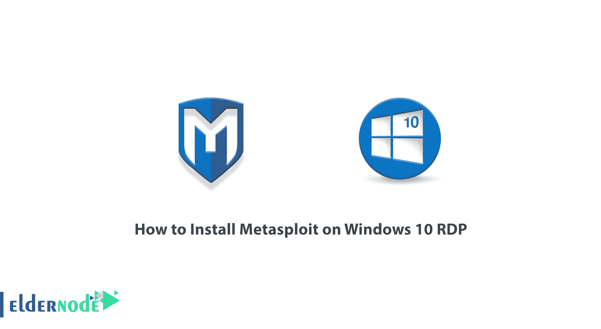
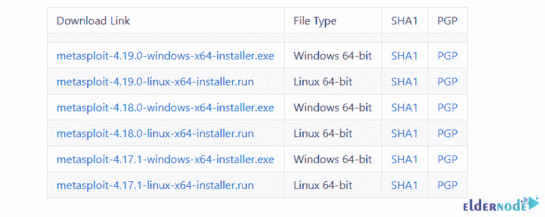
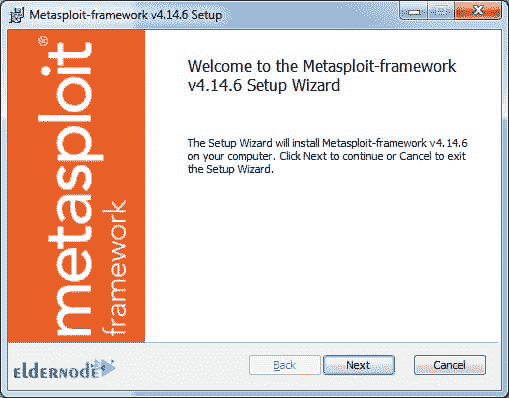
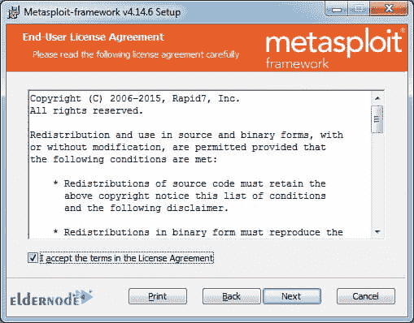
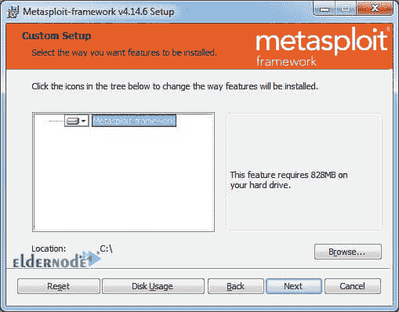
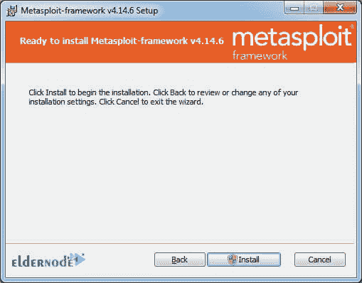
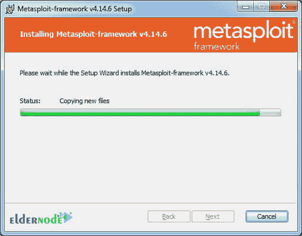
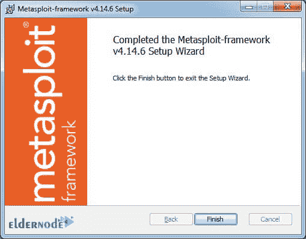
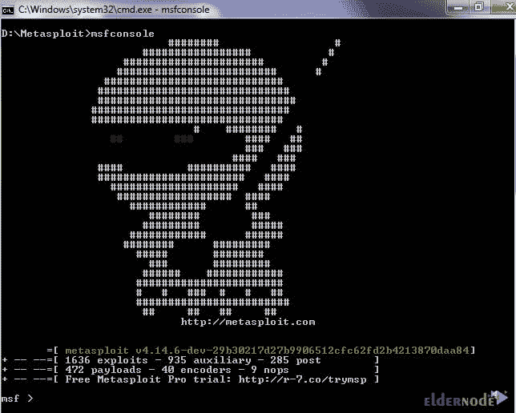

# 如何在 Windows 10 上安装 Metasploit RDP-elder node 博客

> 原文：<https://blog.eldernode.com/install-metasploit-on-windows-10/>

Metasploit 是一个计算机安全项目，它提供有关安全漏洞的信息，并帮助进行 IDS 入侵测试和签名开发。这个程序是用 Ruby 编程语言编写的。Metasploit 是一个开源框架，专门为黑客、安全研究人员和其他网络安全活动家编写。您可以使用该框架来利用各种系统、网络和软件中的漏洞，并渗透到这些系统中。默认情况下，这个应用程序有许多漏洞，但是除此之外，您可以创建自己的漏洞并添加到其中。在本文中，我们将教你如何在 Windows 10 RDP 上安装 Metasploit。需要注意的是，你可以访问 [Eldernode](https://eldernode.com/) 中提供的包来购买一台 **[Windows VPS](https://eldernode.com/windows-vps/)** 服务器。

## **教程在 Windows 10 上安装 Metasploit RDP**

该漏洞是黑客为安全漏洞编写的恶意代码。例如，基本上，当发现一个漏洞时，你必须执行 10 个步骤并输入不同的代码才能利用该漏洞。但是当您编写漏洞利用时，您简化了任务，并且您可以通过几个简单的步骤来利用漏洞。

黑客编写漏洞有两个原因:

1-漏洞证明

2-其他安全研究人员利用该漏洞的可能性

处理某些漏洞需要专业知识。但是 Metasploit 完全解决了这个问题。Metasploit 在其核心的不同领域有许多漏洞，您只需根据受害系统选择所需的漏洞，然后开始渗透测试操作。

在下一节中，我们将讨论 Metasploit 的模块。然后我们会教你如何在 [Windows](https://blog.eldernode.com/tag/windows/) 10 RDP 上安装 Metasploit。请加入我们。

### **Metasploit(MSF)模块**

在 Metasploit 中，模块嵌入到我们想要检查的各种类别中:

**1-漏洞利用**

漏洞是攻击者可以用来获得漏洞系统访问权限的代码。

**2-有效载荷**

有效载荷是漏洞利用中常用的模块。这些代码实际上就是我们想要利用漏洞做的事情。例如，如果我们想要向系统添加一个用户，我们必须使用与在 Metasploit 中添加用户相关的有效负载。

**3-** **助动词**

这些模块用于 Metasploit 中的扫描等任务。

在下一节，我们将讨论如何在 Windows 10 RDP 上安装 Metasploit。

## **在 Windows 10 上安装 Metasploit**

在本节中，我们想教您如何在 Windows 10 RDP 上安装 Metasploit。为此，只需遵循以下步骤。第一步，你需要下载[最新的 Metasploit Windows installer](https://github.com/rapid7/metasploit-framework/wiki/Downloads-by-Version) 。

成功下载文件后，转到下载安装文件的位置。双击它开始安装过程。在打开的窗口中，点击下一个的**。**

勾选**我接受条款……**，然后点击**下一步**。

接下来，您需要指定 Metasploit 框架的安装位置。再次点击**下一个**。

然后点击**安装**。

*

最后，点击 **Finish** 成功完成安装过程。

### **如何在 windows 10 上访问和使用 Metasploit RDP 管理员**

成功完成上述步骤后，在本节中，您将学习如何访问和使用 Metasploit 框架。要通过命令行做到这一点，只需按下 **Windows 键+R** 。

在 **Run** 窗口中，输入 **cmd** ，按**进入**。

现在，使用 **cd** ，导航到安装 Metasploit 框架的**文件夹/路径**。

下一步，输入 **msfconsole** 并按**回车**。通过执行该命令，您应该会看到下图:

## 结论

Metasploit 是一个渗透测试框架，允许用户管理他们的渗透测试过程，并以最好的方式执行它。事实上，Metasploit 集成了渗透测试，满足了渗透测试不同阶段对不同工具的需求。在本文中，我们试图教你如何在 Windows 10 RDP 上安装 Metasploit。