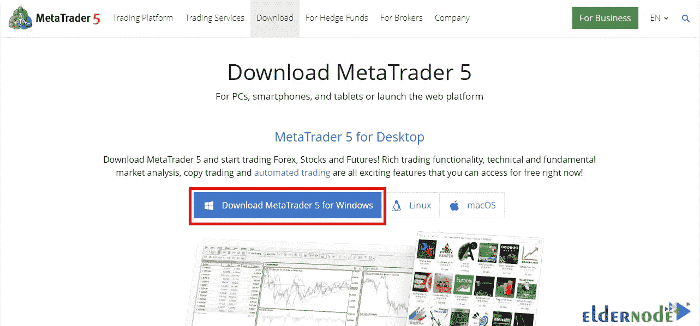

# 教程安装 MetaTrader 5:运行 MT5 的快速指南

> 原文：<https://blog.eldernode.com/install-metatrader-5-a-quick-guide-to-running-mt5/>

现在很少有人没听过 Metatrader 软件这个名字。这个软件被认为是在外汇市场进行交易的强大和领先的平台之一。安装 Metatrader 的能力对于交易者来说是一个很好的机会，可以随时携带他们的工作工具，使他们的交易比以前容易得多。如果你也是这个巨大的全球市场的新来者，我们建议你留在我们这里，直到本文结束。在本文中，我们打算教你如何一步一步地安装 MetaTrader 5。还可以在 [Eldernode](https://eldernode.com/) 网站上选购各种 [forex VPS](https://eldernode.com/forex-vps/) 服务器方案。

## **如何快速安装 meta trader 5**

### **meta trader 软件的特点**

Metatrader 因其强大的交易能力和免费的特性而被用户大量使用。下载和安装该软件以及更改其设置非常容易，并且具有用户友好的环境。Metatrader 提供对价格图表和自动交易的访问。此外，您可以在这个软件中查看您以前的交易。

另一点是这个软件的演示功能，它允许你在真实的[市场](https://blog.eldernode.com/tag/marketing/)条件下交易，而不需要存入任何资金。在演示条件下，新的市场进入者将获得足够的经验，而不会遭受损失。

## **安装 meta trader 5**

在本节中，我们将一步一步地向您展示如何在 Windows 上安装 Metatrader 5。第一步，你需要访问 [Metatrader 下载页面](https://www.metatrader5.com/en/download)。然后点击**下载 MetaTrader 5 for Windows** 开始下载该软件:

现在，您需要转到下载安装文件的位置。双击下载文件，然后点击**运行**开始安装 MetaTrader 5:

如您所见，在打开的窗口中，您必须点击“**是**”:

在此阶段，通过单击“**下一步**按钮，您同意本许可协议的条款:

最后，点击**完成**，Metatrader 5 的安装步骤就完成了:

成功安装 Metatrader 5 后，您将看到该软件的环境，如下图所示:

## 结论

俄罗斯 MetaQuotes 公司的 Metatrader 4 和 5 版本都是为想进入外汇市场的用户设计的。虽然 MetaTrader 5 是一个更新的版本，在某种程度上是 MetaTrader 4 的继任者。在本文中，我们试图教你如何安装 Metatrader 5。如果你有任何问题，请在评论区告诉我们。