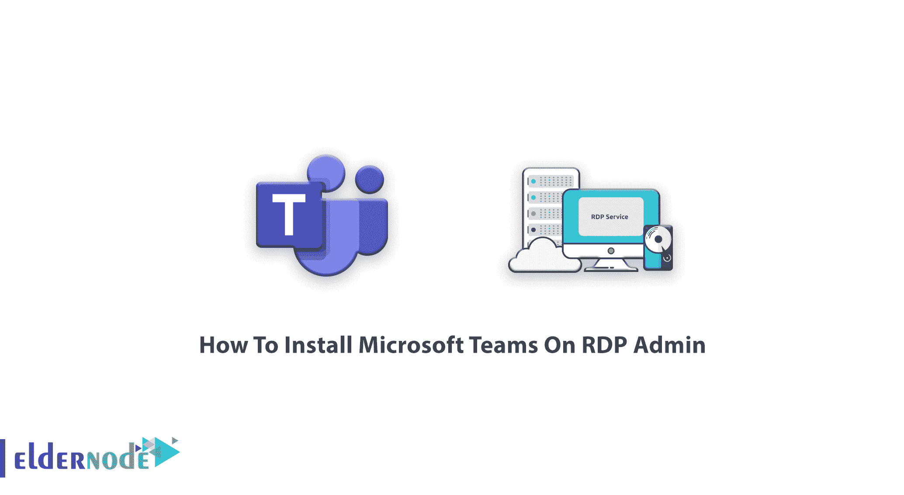
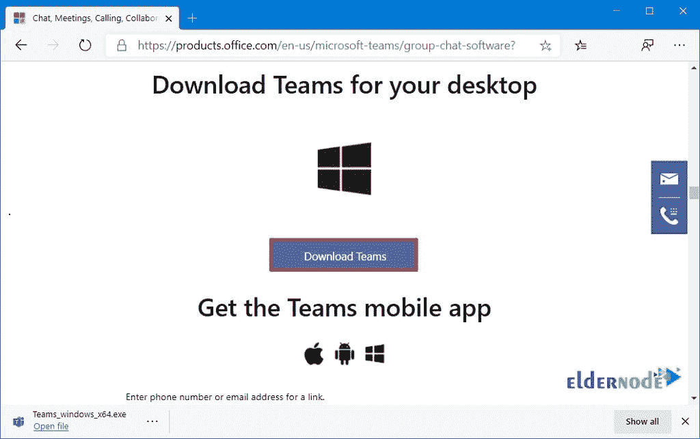
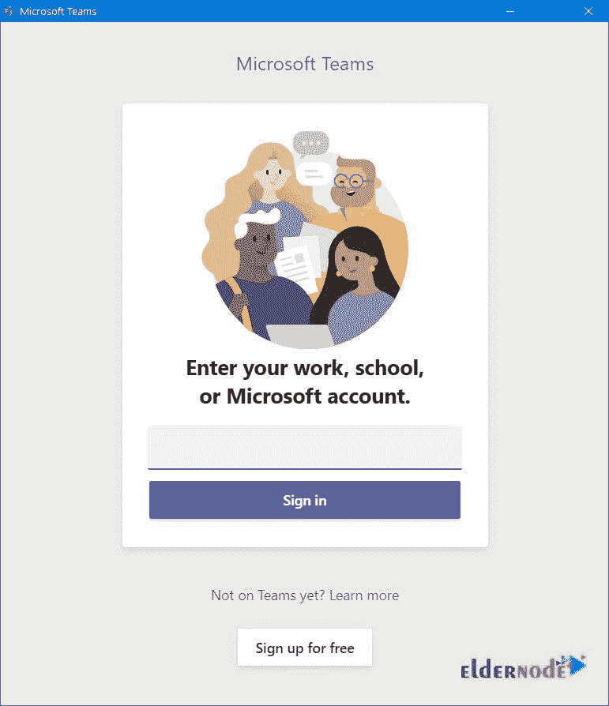
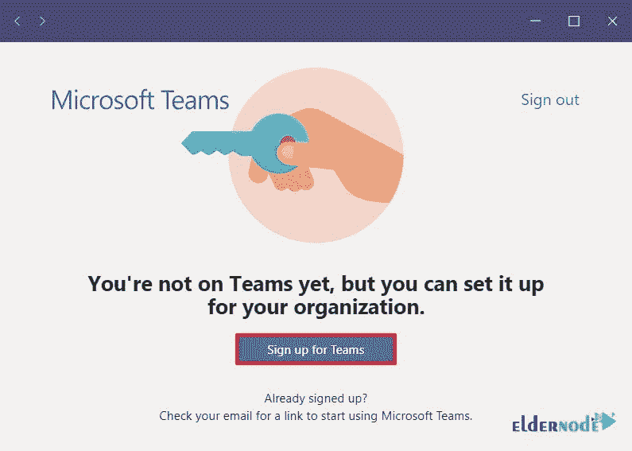
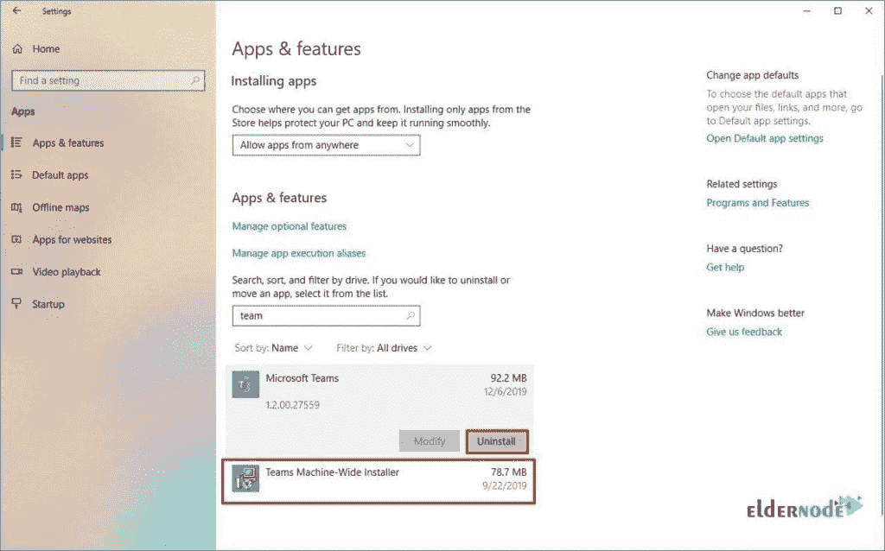

# 如何在 RDP 管理员的博客上安装微软团队

> 原文：<https://blog.eldernode.com/install-microsoft-teams-on-rdp-admin/>

在通信领域，团队合作是投资时间和未来的重要因素。在您的系统背后，您需要一个以工作空间为中心的沟通工具来获得真实的体验。在这篇文章中，你将学习如何在 RDP 管理员上**安装微软团队。你值得拥有一个合适的协作工具和一个完美的 **R** 表情 **D** esktop **P** rotocol。所以，购买你认为[的 RDP 管理](https://eldernode.com/buy-rdp/)，和我们一起学习如何在上面安装微软团队。**

## **教程在 RDP 安装微软团队管理**

无论你处理的是小生意还是大生意，你都需要一个合适的交流平台来和你的同事取得联系。以下是您如何安装 Microsoft Teams 来使用其功能和开发您的商业活动。根据微软团队规则，您不能通过个人 365 许可证访问它，您应该使用该公司的考虑许可证准备一个 Ofiice 365 帐户。因此，作为一名 IT 管理员，您应该遵守以下许可计划之一，以便在您的家庭/学校/工作场所使用微软团队协作。

**1-** 业务要点

**2-** 业务溢价

**3-** 企业 E1、E3 或 E5

**4-** 企业 E4

**注意**:如果你是用户，你需要让你的 IT 管理员为公司注册合适的 Office 365 许可证。

## 微软团队在 RDP 安装

让我们通过本指南的步骤来完成安装路径。

### 在 RDP 管理中心安装微软团队

**1-** 一如既往，建议您打开公司的[主页面](https://www.microsoft.com/en-us/microsoft-365/microsoft-teams/free?rtc=1)进行安全合法的下载。

**2-** 向下滚动点击**下载团队**按钮，如下图所示:

**3-** 根据您的考虑，您可以选择 32 位或 64 位架构。将安装程序保存到设备上后，可以通过双击 Team-Windows-X**文件开始安装。

**4-** 安装软件后的第一个动作就是用你的邮箱地址登录。根据您的需要，您可以决定使用您公司的电子邮件地址或与 Microsoft Teams 相关联的帐户进行签名，这在前言中已有说明。

**5-** 现在，你可以点击**报名组队**按钮。

到达这里，您已经在您的系统上安装了 Microsoft Teams。在下面，您可以设置帐户。

## 如何在 RDP 管理上卸载微软团队

如果您决定从您的 [Windows](https://blog.eldernode.com/tag/windows/) RDP 中删除微软团队，您可以通过以下途径永久**删除:**

打开设置>点击应用>点击应用和功能>选择微软团队项目(位于“应用和功能”部分下) >点击**卸载**按钮，如下所示:

然后，继续以下步骤:

再次点击**卸载**按钮>选择团队机器范围的安装程序项(位于“应用程序&功能”部分下)>点击**卸载**按钮**两次。**

从现在开始，Microsoft Teams 将不会在您的设备上自动重新安装，要再次使用它，您应该再次通过安装步骤。

就是这样！其他用户正等着与您远程互动！喝你的咖啡，享受你的商业成功。

## 结论

在本文中，您已经学习了如何在 RDP 管理上安装微软团队。一旦您安装了这个基于聊天的平台，您就可以开始聊天、音频聊天、视频会议、办公和其他功能，并享受其令人满意的众多其他应用程序的界面。