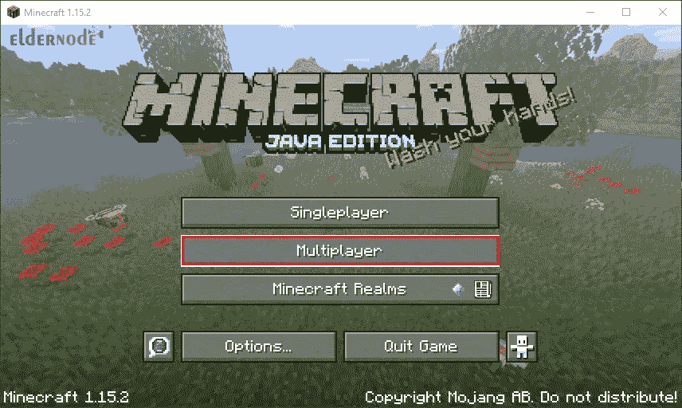

# 在 Ubuntu 22.04 上安装《我的世界》服务器的教程

> 原文：<https://blog.eldernode.com/install-minecraft-server-on-ubuntu-22-04/>


如果你是那些玩游戏是你生活中不可或缺的一部分的人之一，你肯定需要一个在线《我的世界》服务器。这些服务器会给你带来新的挑战。不同的《我的世界》服务器，无论你玩什么类型的游戏，提供比原来的游戏能提供的更多。在这篇文章中，我们将教你如何在 Ubuntu 22.04 LTS 上安装《我的世界》服务器。让我们看看如何让《我的世界》服务器运行在 Ubuntu 22.04 上。如果你想购买一台 [**Ubuntu VPS**](https://eldernode.com/ubuntu-vps/) 服务器，请访问 [Eldernode](https://eldernode.com/) 网站上提供的软件包。

## **如何在 Ubuntu 22.04 LTS 上安装《我的世界》服务器**

### **什么是《我的世界》服务器？**

《我的世界》游戏是最受欢迎的智力游戏之一，针对计算机和移动操作系统发布了不同的版本。《《我的世界》》的 pc 版于 2009 年发布为 alpha 版，在对 alpha 版进行了一系列更新后，2011 年发布了原版和最终版。

同年，游戏的 Android 和 iOS 版本发布，第二年，《我的世界》的 Xbox 360 版本作为 Xbox live 版本发布。《我的世界》的所有版本都可以定期更新。

《我的世界》服务器是一个多人游戏服务器，可以属于一个玩家，一个团队，甚至是一个完整的企业。以前，在单人游戏中，《我的世界》客户端管理所有游戏进程，服务器包括游戏的单独运行。从版本 1.3.1 开始，玩家隐式地启动一个具有特殊设置的服务器，这减少了由于单个实现而导致的错误数量。在服务器上，游戏机制的所有规则都像单人游戏一样运作。

在这篇文章的续篇中，加入我们一步步教你如何在 [Ubuntu](https://blog.eldernode.com/tag/ubuntu/) 22.04 LTS 上安装《我的世界》服务器。

### **先决条件**

->要进行设置，请遵循 Ubuntu 22.04 上的[初始服务器设置](https://blog.eldernode.com/initial-server-setup-on-ubuntu-22-04/)

->《我的世界》Java 版

## **在 Ubuntu 22.04 上安装《我的世界》服务器 LTS**

首先，你应该**安装必要的软件包**，Java 就是其中之一。你将需要 Java 来运行《我的世界》。默认情况下，新版 Java 无法在 Ubuntu 22.04 LTS 上运行最新版本的《我的世界》。您可以使用以下命令启动它:

```
sudo add-apt-repository ppa:openjdk-r/ppa
```

然后**更新**您的包来源:

```
sudo apt update
```

接下来按下“ **Y** 确认。要启动任何服务，按下**键，输入**接受默认值并继续。

最后，**安装 open JDK**17 版 Java，具体是 JRE Headless。此版本删除了对图形用户界面应用程序的支持，这使得 Java 应用程序在服务器上运行得更好:

```
sudo apt install openjdk-17-jre-headless
```

您还可以使用**屏幕**软件创建一个终端会话，并从该会话中分离出来，运行在其上启动的进程。这很重要，因为如果你设置了一个服务器，你将不得不关闭你的终端，这将导致会话崩溃并停止你的服务器。

要安装**屏幕**,运行以下命令:

```
sudo apt install screen
```

现在你需要**启用防火墙**来让流量到达《我的世界》服务器。在服务器的初始设置中，只允许 SSH 流量，但是现在您必须允许流量通过**端口 25565** (《我的世界》默认的允许连接的端口)进入。在某些情况下，UFW 使用指定的流量规则，例如 SSH，默认情况下它总是使用端口 22，但在不太常见的情况下，我们手动指定端口号。为此，您可以使用以下命令:

```
sudo ufw allow 25565
```

你现在应该使用**下载 minecraft_server 从《我的世界》网站下载最新版本的《我的世界》服务器。X.X.X.jar** 链接。

使用下面的 **wget 命令**下载服务器:

```
wget https://launcher.mojang.com/v1/objects/c8f83c5655308435b3dcf03c06d9fe8740a77469/server.jar
```

为了将来管理或升级您的《我的世界》服务器，请将下载的 **server.jar** 文件重命名为**minecraft _ server _ 1 . 18 . 2 . jar**，并将突出显示的版本号与您刚刚下载的版本相匹配:

```
mv server.jar minecraft_server_1.18.2.jar
```

下载《我的世界》jar 后，要运行它，首先**通过运行以下命令启动一个** **屏幕**会话:

```
screen
```

横幅出现后，按下**空格键**。**屏幕**给你一个终端会话，你可以在这里启动并执行一个命令。现在您可以进行初始配置了。下一个命令可能会遇到错误，但是不要担心。根据《我的世界》原则，你必须首先同意该公司的许可协议。然后你会这样做:

```
java -Xms1024M -Xmx1024M -jar minecraft_server_1.18.2.jar nogui
```

### **设置服务器的命令行参数**

**Xms1024M** :该参数将服务器配置为使用 1024MB 或 1GB 的 RAM 运行。您可以增加这个限制以获得更多内存。 **M** (兆字节)和 **G** (千兆字节)都是支持的选项。比如 **Xms2G** 用 2G 内存运行服务器。

**Xmx1024M** :该选项允许服务器最多使用 1024M 的 RAM。如果你想增加玩家的数量或者你的服务器很慢，你可以增加这个限制。Java 程序的独特之处在于，总是要求您指定允许的最大内存量。

**jar** :使用该选项指定服务器 jar 文件的执行。

**nogui** :该选项告诉服务器不要启动图形用户界面。

当您第一次运行此命令来设置服务器时，您将收到以下输出:

```
**Output** [22:05:31] [environment second]  [22:05:31] [main/ERROR]: Failed to load properties from file: server.properties  [22:05:31] [main/WARN]: Failed to load eula.txt  [22:05:31] [main/INFO]: You need to agree to the EULA in order to run the server. Go to eula.txt for more info.
```

当服务器找不到运行所需的两个文件时，会出现这些错误:

*   EULA(最终用户许可协议)，位于 **eula.txt**
*   配置文件**服务器属性**

服务器在您当前的待办事项列表中创建了这些文件，因为它找不到这些文件。这是为了确保《我的世界》，你阅读并同意 EULA。

在 **nano** 或其他文本编辑器中打开 **eula.txt** :

```
nano eula.txt
```

查看文件中的 EULA·《我的世界》链接后，复制 URL:

```
#By changing the setting below to TRUE you are indicating your agreement to our EULA (https://account.mojang.com/documents/minecraft_eula).  #Tue Mar 24 22:05:31 UTC 2020  eula=false
```

在您的 web 浏览器中打开 URL 并阅读协议。然后找到 **eula.txt** 中的最后一行，将 **eula=false** 改为 **eula=true** 。然后保存并关闭文件。

在 **nano** 中，这意味着按下 **Ctrl+X** 退出，然后在保存的同时，先按下 **Y** ，然后**进入**。

接受了 **EULA** 之后，就可以根据自己的规格配置服务器了。

在您当前的业务目录中，有一个 **server.properties** 文件，其中包含您的《我的世界》服务器的所有配置选项。您的服务器功能的完整列表可在**官方《我的世界》维基**上获得。在设置您的服务器之前，用您想要的设置修改此文件:

```
nano server.properties
```

您的文件将如下所示:

```
#Minecraft server properties  #Thu Apr 30 23:42:29 UTC 2020  spawn-protection=16  max-tick-time=60000  query.port=25565  generator-settings=  force-gamemode=false  allow-nether=true  enforce-whitelist=false  gamemode=survival  broadcast-console-to-ops=true  enable-query=false  player-idle-timeout=0  difficulty=easy  spawn-monsters=true  broadcast-rcon-to-ops=true  op-permission-level=4  pvp=true  snooper-enabled=true  level-type=default  hardcore=false  enable-command-block=false  max-players=20  network-compression-threshold=256  resource-pack-sha1=  max-world-size=29999984  function-permission-level=2  rcon.port=25575  server-port=25565  server-ip=  spawn-npcs=true  allow-flight=false  level-name=world  view-distance=10  resource-pack=  spawn-animals=true  white-list=false  rcon.password=  generate-structures=true  online-mode=true  max-build-height=256  level-seed=  prevent-proxy-connections=false  use-native-transport=true  motd=A Minecraft Server  enable-rcon=false
```

### **Server.properties 文件特性**

**难度**(默认**容易** ): 该案例的选项有**平和**、**容易**、**正常**和**困难**。

**游戏模式**(默认**生存** ): 选项有**生存**、**创意**、**冒险**和**看客**。

**关卡名称**(默认**世界** ): 这个选项决定了你的服务器出现在客户端的名称。

**motd** (默认**《我的世界》服务器** ): 《我的世界》客户端服务器列表中显示的消息。

**pvp** (默认**真** ): 此选项激活玩家对玩家的战斗。如果设置为**真**，玩家可以互相开战，互相伤害。

设置好想要的选项后，**保存**它们，关闭文件，**启动**你的服务器。

例如，让我们看看如何设置一个内存为 1024M 的服务器。如果有必要，让《我的世界》升级内存到 4G。该值可以调整，以适应服务器限制或用户需求。

```
java -Xms1024M -Xmx4G -jar minecraft_server_1.18.2.jar nogui
```

几分钟后，您的《我的世界》服务器将开始产生类似的输出:

```
**Output**  [21:08:14] [Server thread/INFO]: Starting minecraft server version 1.18.2  [21:08:14] [Server thread/INFO]: Loading properties  [21:08:14] [Server thread/INFO]: Default game type: SURVIVAL  [21:08:14] [Server thread/INFO]: Generating keypair  [21:08:15] [Server thread/INFO]: Starting minecraft server on *:25565
```

设置服务器后，您将看到以下输出:

```
**Output**  [21:15:37] [Server thread/INFO]: Done (30.762s)! For help, type "help"
```

您的服务器现在启动了，您可以看到服务器管理控制面板。尝试键入 **help** :

```
help
```

然后，您将看到以下输出:

```
**Output**  [21:15:37] [Server thread/INFO]: /advancement (grant|revoke)  [21:15:37] [Server thread/INFO]: /ban <targets> [<reason>]  [21:15:37] [Server thread/INFO]: /ban-ip <target> [<reason>]  [21:15:37] [Server thread/INFO]: /banlist [ips|players]  ...
```

如果您希望服务器在从 SSH 会话断开后仍能运行，请遵循以下说明:

如果您之前使用过**屏幕**，您可以通过按下 **Ctrl+A+D** 来**退出会话**。现在，您应该返回到原来的 shell:

```
**Output**  ​​[[email protected]](/cdn-cgi/l/email-protection):~$ screen  [detached from 3626.pts-0.minecraft-2204]  $
```

运行此命令**查看所有屏幕会话**:

```
screen -list
```

然后，您将收到一个输出，其中包含您必须恢复的会话 ID:

```
**Output**  There is a screen on:  3626.pts-0.minecraft-2204 (03/02/22 22:56:33) (Detached)  1 Socket in /run/screen/S-root.
```

向**屏幕**命令发送 **-r** 标志，然后输入您的会话 ID 以恢复会话:

```
screen -r 3626
```

要退出终端，使用 **Ctrl+A+D** 退出会话，然后注销。

设置好服务器后，您可以连接到它并作为《我的世界》客户端进行游戏。

运行《我的世界》Java 版，从菜单中选择**多人游戏**:



接下来点击**添加服务器**按钮:


在**编辑服务器信息**屏幕上，为您的服务器命名并输入服务器的 IP 地址(您用于通过 SSH 连接的地址):


你现在将被带回到**多人游戏**画面，这里会列出你的服务器。从现在开始你可以从这个列表中选择你的服务器并点击**加入服务器**:


您的现在位于服务器上，您可以开始玩了:


## 结论

《我的世界》是一款沙盒风格的视频游戏。沙盒是一种游戏风格，其中游戏者有完全的行动自由，可以选择如何以及在什么条件下继续游戏。在这篇文章中，我们学习了如何在 Ubuntu 22.04 LTS 上安装《我的世界》服务器。所以你可以和你的朋友一起玩。现在你可以享受这个新世界了。