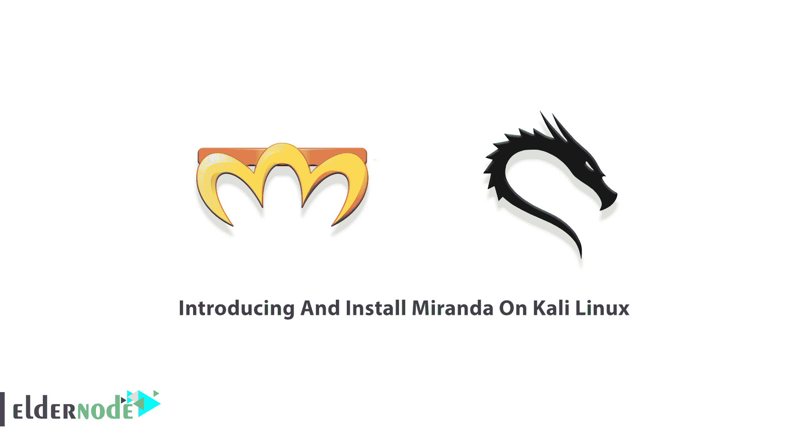

# 在 Kali Linux - Eldernode 博客上介绍和安装 Miranda

> 原文：<https://blog.eldernode.com/install-miranda-on-kali-linux/>



Miranda 是一个基于 Python 的**U**universal**P**lug-**N**–**P**lay 客户端应用程序，在麻省理工学院的许可下，旨在发现、查询 UPNP 设备，尤其是互联网网关设备，并与之交互。因为它是用 Python 编写的，所以大多数功能应该适用于任何 Python 支持的平台。当路由器功能 UPNP 是，有一个相应的漏洞，可以通过渗透米兰达控制。MirandaUPNP 是实现各种智能设备、无线设备和个人电脑全球对等网络连接(P2P)的结构。本文是**介绍并在 Kali Linux** 上安装 Miranda。要购买您自己的 [Linux VPS](https://eldernode.com/linux-vps/) ，请通过访问 [Eldernode](https://eldernode.com/) 的各种软件包来订购您需要的东西。

## **卡莉 Linux 上的米兰达简介**

Miranda 是在 Linux 系统上构建的，并且已经在带有 Python 2.5 的 Linux 2.6 内核上进行了测试。Miranda 测试了来自不同供应商的 igd，包括 Linksys、D-Link、Belkin 和 ActionTec。所有 Python 模块都默认安装在 Linux Mint 5 (Ubuntu 8.04)测试系统上。

### **什么是米兰达，它是如何工作的？**

Miranda 被动或主动地发现 UPnP 主机，并且可以用一个命令枚举主机的所有报告的设备类型、服务、动作和变量。服务状态变量自动地与它们的关联动作相关联，并识别每个动作的输入或输出变量。

由于 Miranda 将所有主机的所有主机信息存储在一个数据结构中，您将能够直接遍历该数据结构并直接查看其所有内容。

### **米兰达特征**

让我们在下面的列表中回顾一下 Miranda 的一些主要特性:

1-具有选项卡完成和命令历史的交互式外壳

2-被动和主动发现 UPNP 设备

3-可定制的 MSEARCH 查询(针对特定设备/服务的查询)

4-完全控制应用程序设置，如 IP 地址、端口和标头

5-简单列举 UPNP 设备、服务、动作和变量

6-输入/输出状态变量与服务动作的相关性

7-能够向 UPNP 服务/设备发送操作

8-能够将数据保存到文件中，以供以后分析和协作

9-命令日志记录

## **如何在卡莉 Linux 上安装米兰达**

在这一节中，我们将讨论如何在 Kali Linux 上安装 Miranda。你只需运行一条命令就可以在 [Kali Linux](https://blog.eldernode.com/install-and-configure-kali-linux-on-vps/) 上安装米兰达。因此，使用以下命令来安装它:

```
sudo apt-get install miranda
```

### **如何在卡莉 Linux 上使用米兰达**

在上一节中，我们教了您如何在 Kali Linux 上安装 Miranda。现在，你可以用两种方法使用米兰达:

1 个图形用户界面

双端

要从 **GUI 方法**开始，您需要遵循以下路径:

应用>> Kali Linux > >信息收集> >实时主机识别> > Miranda

要在终端上使用 **Miranda，只需打开终端并键入 Miranda，然后点击**回车**。**

现在，回顾一下可以在 Kali Linux 上运行的命令及其功能，以便使用 Miranda。

1- " ***msearch*** "命令用于主动定位 UPNP 主机。

2- " ***主机列表*** "命令用于显示所有发现的 UPnP 主机列表和每个主机的索引号。

3- " ***主机获取 0*** 命令用于获取索引号为 0 的主机广告的所有 UPnP 信息。

4-***主机信息 0*** 命令允许我们遍历米兰达的内部主机数据结构并查看它存储的所有信息。

5- " ***主机信息 0 设备列表*** "命令用于显示在主机上找到的设备名称。

6- " ***主机摘要 0*** 命令就是用来查看这个结构中的大量数据。

***注意** :* 如果您只想查看特定主机的数据摘要，请运行“**主机摘要**命令。

7- " ***保存信息 0*** "命令用于将其保存到文件并在文本编辑器中查看，这可以通过“保存信息 0”命令完成。

您还可以保存 Miranda 存储的所有已被发现的主机的数据，以便以后在新的会话中将其加载回 Miranda。

## 结论

在本文中，我们试图在第一部分向您介绍 Miranda 及其工作原理。然后我们提到了它的一些基本特性。最后，我们教你如何在 Kali Linux 上安装 Miranda。如果你愿意，可以参考文章[在 Kali Linux](https://blog.eldernode.com/introducing-and-install-metasploit-on-kali/) 上介绍和安装 Metasploit。