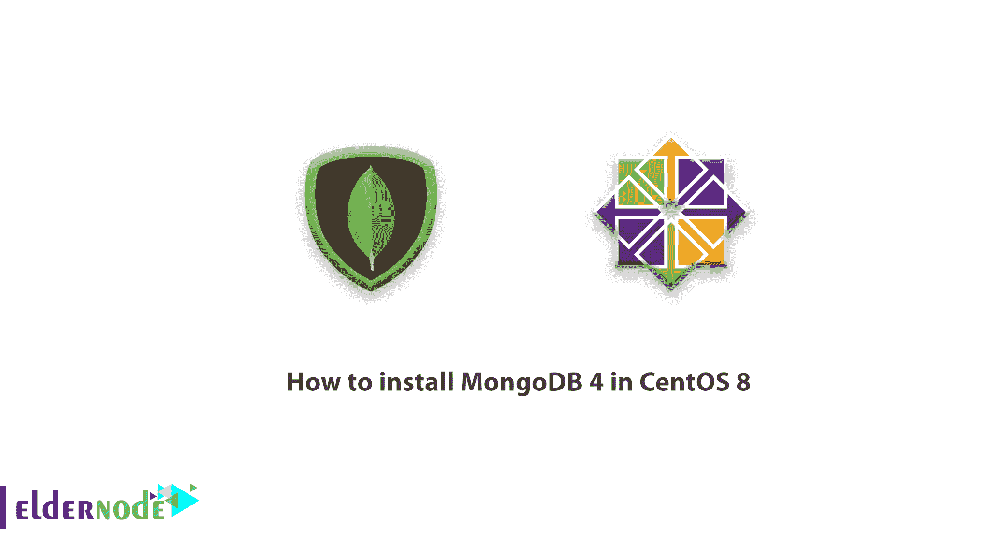
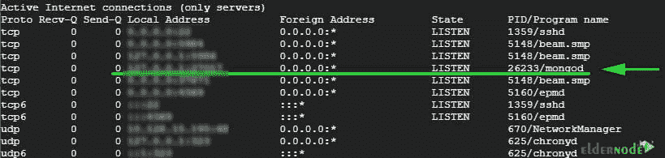
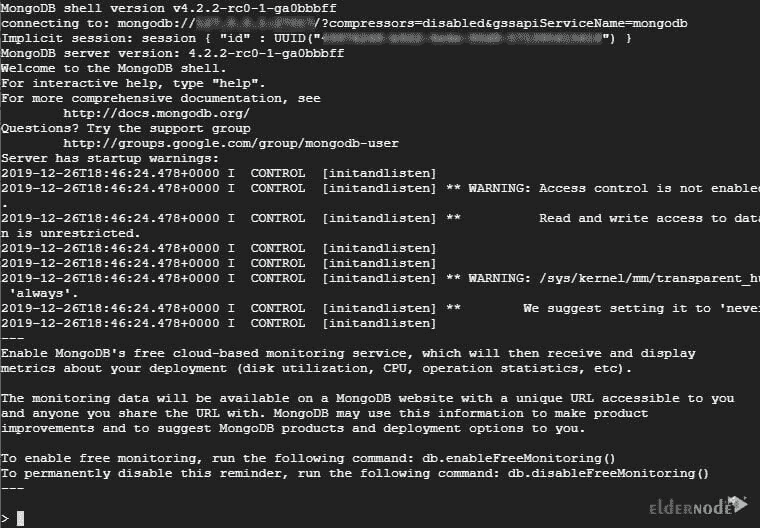
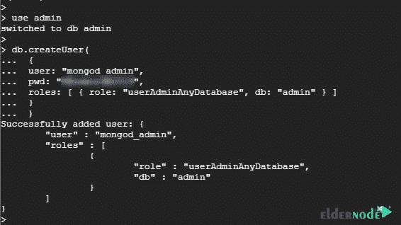
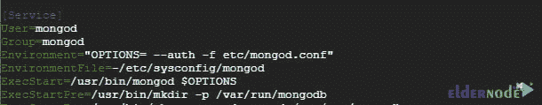
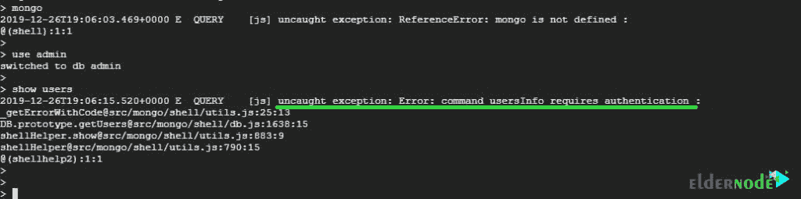
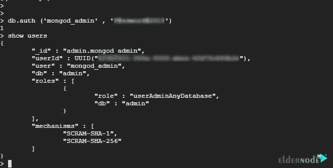

# 如何在 CentOS 8 - Eldernode 博客中安装 MongoDB 4

> 原文：<https://blog.eldernode.com/install-mongodb-4-centos-8/>



[更新日期:2021-01-16] MongoDB 是一个流行的基于文档的通用 NoSQL 数据库引擎，它以 [JSON](https://en.wikipedia.org/wiki/JSON#:~:text=JavaScript%20Object%20Notation%20(JSON%2C%20pronounced,or%20any%20other%20serializable%20value).) 格式存储数据。MongoDB 是免费和开源的，附带了一组很酷很棒的特性，比如文件存储、数据复制、特别查询和负载平衡等等。一些蓝筹公司已经将 MongoDB 整合到他们的应用程序中，包括 Adobe、脸书、谷歌、易贝和比特币基地。在本文中，我们将向您**学习如何在 CentOS 8** 中安装 MongoDB 4。您可以访问 [Eldernode](https://eldernode.com/) 中提供的包来购买 [CentOS VPS](https://eldernode.com/centos-vps/) 服务器。

## **教程在 CentOS 8 中安装 MongoDB 4**

在本文中，您将学习如何在 CentOS 8 中安装 MongoDB 4。加入我们来检查细节。

### 如何添加 MongoDB 库

由于 **MongoDB** 在 [CentOS](https://blog.eldernode.com/tag/centos/) **8** 默认库中不存在，需要手动添加。首先，创建一个存储库文件，如图所示。

```
vi /etc/yum.repos.d/mongodb.repo 
```

粘贴下面的配置并**保存**文件。

```
[mongodb-org-4.2]  name=MongoDB Repository  baseurl=https://repo.mongodb.org/yum/redhat/$releasever/mongodb-org/development/x86_64/  gpgcheck=1  enabled=1  gpgkey=https://www.mongodb.org/static/pgp/server-4.2.asc
```

### 在 CentOS 8 中安装 MongoDB | CentOS 7

一旦存储库被启用，您就可以使用下面的 **dnf** 命令安装 **MongoDB** :

```
dnf install mongodb-org
```

然后，通过运行以下命令，启动 MongoDB 并使其在引导时启动:

```
systemctl start mongod 
```

```
sudo systemctl enable mongod
```

使用以下命令验证 MongoDB 的状态:

```
systemctl status mongod 
```

此外，为了确认 **Mongod** 服务确实在监听:

```
netstat -pnltu
```



### 如何访问 MongoDB Shell

现在只需发出以下命令就可以访问 MongoDB 的 shell 了:

```
mongo
```

**输出**将类似于下面的截图



### 如何创建 MongoDB 管理员用户

现在让我们换个方式，创建一个管理员用户。创建一个具有提升权限的管理员用户来执行提升的任务总是一个好建议。为此，首先访问 MongoDB 的 shell:

```
mongo
```

要切换到数据库管理，请键入下面的命令。

```
**>** use admin 
```

现在，通过运行下面的代码创建一个新的 MongoDB 用户。

```
**>** db.createUser(   {   user: "mongod_admin",   pwd: "[[email protected]](/cdn-cgi/l/email-protection)@2019",   roles: [ { role: "userAdminAnyDatabase", db: "admin" } ]   } 
```

当一切正常时，您将获得下面的**输出**。

```
Successfully added user: {  	"user" : "mongod_admin",  	"roles" : [  		{  			"role" : "userAdminAnyDatabase",  			"db" : "admin"  		}  	]  } 
```



接下来，运行以下命令来列出创建的 MongoDB 用户。

```
show users 
```

### 如何为 MongoDBT3 配置认证

正如您所看到的，所有用户都可以访问 shell 并执行任何命令，出于安全考虑，我们不建议这样做。因此，您需要为我们刚刚创建的管理员用户创建身份验证，以防止其他用户未经授权运行命令。

为了使认证能够编辑**/lib/systemd/system/mongod . Service**文件，在**【服务】**部分下，找到并编辑环境参数，如下所示:

```
Environment="OPTIONS= --auth -f /etc/mongod.conf" 
```



现在，您可以**保存**并退出配置文件。

为了使更改生效，重新加载系统并重启 **MongoDB** 。

```
systemctl daemon-reload
```

```
systemctl restart mongod
```

如果您现在尝试列出未经身份验证的用户，您应该会得到如下所示的错误:



要进行身份验证，只需传递如下所示的凭证。

```
**>** db.auth('mongod_admin', '[[email protected]](/cdn-cgi/l/email-protection)@2019') 
```

现在，您可以运行之后的任何命令。让我们再次尝试列出用户:

```
**>** show users
```

这一次，由于提供了身份验证凭证，一切进展顺利。



运行以下命令退出数据库引擎:

```
exit
```

## **结论**

在本文中，您成功地学习了如何在 CentOS 8 中安装 MongoDB4，从现在开始，我们希望您能够轻松地在 CentOS 8 系统上安装 MongoDB 4，并开始一些必要的步骤。可以参考文章[如何在 Debian 10 上安装 MongoDB 4](https://blog.eldernode.com/install-mongodb-debian/)和[如何在 Windows 上安装 MongoDB](https://blog.eldernode.com/install-mongodb-on-windows/)。