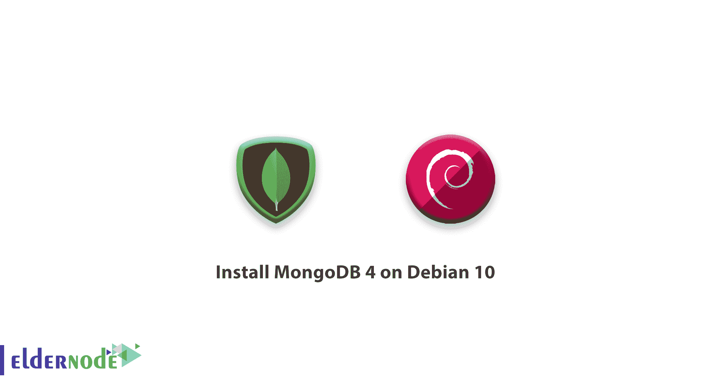

# 如何在 Debian 10 上安装 MongoDB 4-MongoDB 4 安装

> 原文：<https://blog.eldernode.com/install-mongodb-debian/>



在接下来的 [Debian 10](https://eldernode.com/tag/learning-debian-10/) 教程中，在这篇文章中，我们将向你**学习如何在 Debian 10** 上安装 MongoDB 4。但是首先， **MongoDB** 基本上是什么？ **MongoDB** 是由 **MongoDB Inc.** 开发的开源、跨平台的 NoSQL 数据库服务器，它使用 **JSON** 来存储数据。此外，由于其可伸缩性、高可用性和高性能，它在处理大量数据时很受欢迎。

## 如何在 Debian 10 上安装 MongoDB 4

让我们通过本指南的 5 个步骤来学习如何在 **Debian 10** [Linux 发行版](https://en.wikipedia.org/wiki/Linux_distribution)上安装 **MongoDB 4** 。

### 1-在 Debian 上导入 MongoDB GPG 密钥

首先，为您的 **Debian** 系统导入 **MongoDB** 存储库所需的 **GPG** 密钥。请考虑这对于在安装之前测试包是至关重要的。

要更新您的系统软件包:

```
sudo apt update 
```

要导入 **MongoDB** GPG 密钥:

```
sudo apt-key adv --keyserver hkp://keyserver.ubuntu.com:80 --recv 9DA31620334BD75D9DCB49F368818C72E52529D4 
```

**[购买 Linux 虚拟专用服务器](https://eldernode.com/linux-vps/)**

### 2-在 Debian 上安装 MongoDB 4 APT 库

如果你找不到官方的 **Debian 10 的软件包库，**在 **Debian 10 (Buster)** 上添加 **Debian 9** **(Stretch)** 的软件包库来弥补。

在 **Debian 10 Buster** 上添加 **Debian 9** 的 **MongoDB 4** 包库:

```
echo "deb http://repo.mongodb.org/apt/debian stretch/mongodb-org/4.0 main" | sudo tee /etc/apt/sources.list.d/mongodb-org.list 
```

并在 **Debian 10 Buster:** 上添加 **Debian 9** 的官方库

```
echo "deb http://deb.debian.org/debian/ stretch main" | sudo tee /etc/apt/sources.list.d/debian-stretch.list 
```

然后，更新 **APT** 存储库:

```
sudo apt update 
```

### 3-在 Debian 上安装 lib curl 3

在这一步中，您会看到包 **libcurl3** 是 **mongodb-org-server** 所需要的，您稍后将安装这个包。安装 **libcurl3** 的原因是为了防止试图安装 **MongoDB** 时出错。

**注** :在本指南中，我们添加了 **Debian 9** 的官方库， **libcurl3** 包将从添加的库中安装。但是 **Debian 10** 用的是 **libcurl4** 。

安装 **libcurl3:**

```
sudo apt install libcurl3 
```

### 4-在 Debian 上安装 MongoDB 4 服务器

在安装了所需的存储库和 **libcurl3** 包之后，现在可以开始安装 **MongoDB 4** 服务器了。

```
sudo apt install mongodb-org -y 
```

使用以下命令检查安装的 **MongoDB** 的版本。

```
sudo apt info mongodb-info 
```

由于默认情况下 **MongoDB** 运行在端口 **27017** 上，请通过键入以下命令进行验证:

```
sudo netstat -pnltu 
```

接下来，编辑位于 **/etc/mongodb.conf** 的配置文件，更改默认的 **MongoDB** 端口和其他参数。

### 5-管理 MongoDB 4 服务器

确保你已经成功安装了 **MongoDB 4** 服务器，让你启动它。

```
sudo systemctl start mongod
```

要检查 **MongoDB** 服务的状态:

```
sudo systemctl status mongod 
```

然后，要使能 **MongoDB** 在启动时启动:

```
sudo systemctl enable mongod 
```

接下来，简单地登录到 **MongoDB 4** :

```
mongo 
```

并停止 **MongoDB** :

```
sudo systemctl stop mongod 
```

**好样的** ！至此，你已经学会了如何在 Debian 10 上安装 **MongoDB 4** 。

亲爱的用户，我们希望本教程能对你有所帮助，如有任何问题或想查看我们的用户关于本文的对话，请访问 [提问页面](https://eldernode.com/ask) 。也是为了提高自己的见识，准备了这么多有用的教程给 [Eldernode 培训](https://eldernode.com/blog/) 。

**不要错过相关文章:**

**[如何在 Windows 上安装 MongoDB](https://eldernode.com/install-mongodb-debian/)**

**[如何在 CentOS 8 安装 MongoDB 4](https://eldernode.com/install-mongodb-4-centos-8/)**

**和**

**[如何在 Ubuntu 20.04 上安装 MongoDB](https://eldernode.com/install-mongodb-ubuntu-20/)**