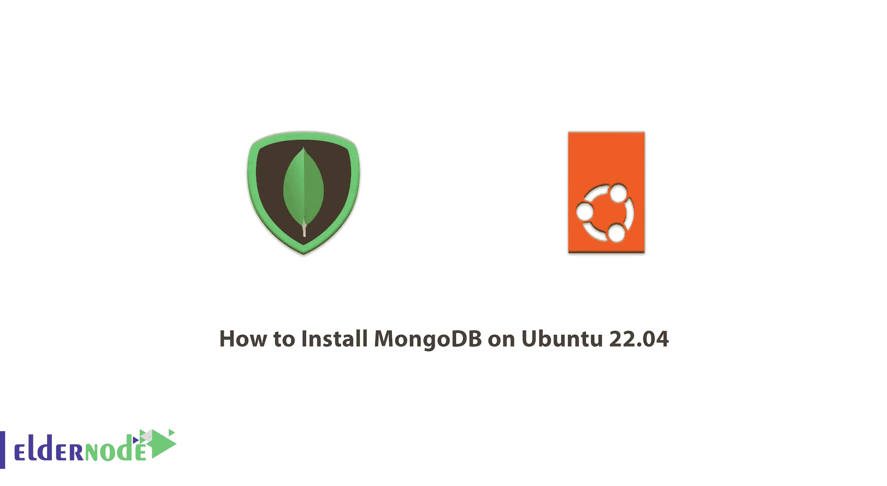
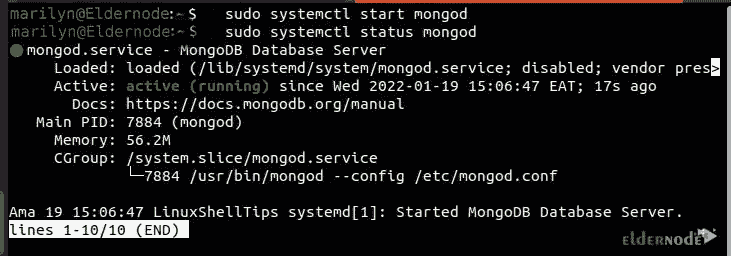
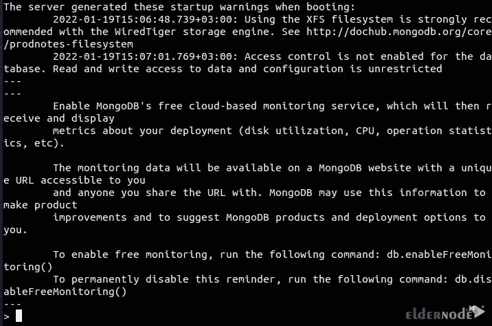
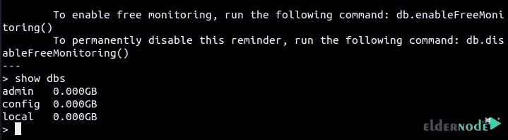

# 如何在 Ubuntu 22.04 - Eldernode 博客上安装 MongoDB

> 原文：<https://blog.eldernode.com/install-mongodb-on-ubuntu-22-04/>



数据在技术中起着关键作用。由于世界范围内数据量的增加，非关系数据库或 NoSQL 数据库的使用也增加了。企业和组织倾向于使用替代工具和系统进行数据库管理。其中一个工具是 MongoDB，这是一个引人注目的数据库。在本文中，我们将教你**如何在 Ubuntu 22.04** 上安装 MongoDB。如果你想购买一台 [**Ubuntu VPS**](https://eldernode.com/ubuntu-vps/) 服务器，你可以访问 [Eldernode](https://eldernode.com/) 网站上的软件包。

## **教程在 Ubuntu 上设置 MongoDB 22**

### **什么是 MongoDB？**

MongoDB 是一个开源的、灵活的、可伸缩的数据库系统，它使用非结构化的查询语言。它是目前最强大的 NoSQL 数据库和系统之一。NoSQL 数据库对于处理大型数据集和分布式数据非常有用。需要注意的是，MongoDB 是一种用于存储大量数据的 NoSQL 数据库系统。MongoDB 支持不同类型的数据。MongoDB 数据库是一个可以管理基于文档的信息以及提取和存储信息的工具。

这个数据库不是像关系数据库或经典数据库那样存储表数据，而是用 JSON 结构存储数据，而没有特定的模式。这个数据库目前被 MTV Networks、Craigslist、Foursquare 和 UIDAI Aadhaar 等公司使用。该数据库目前正在为 Windows、Macintosh、 [Linux](https://blog.eldernode.com/tag/linux/) 和 Solaris 操作系统开发。

### **MongoDB 特性**

**1。索引 :** 在 MongoDB 数据库中，每个字段都在文档中用主索引和次索引进行索引，这样更容易检索或搜索数据，花费的时间也更少。

**2。无模式数据库 :** 在 MongoDB 数据库中，一个集合可以保存多个具有不同字段、大小和内容的文档。

**3。可伸缩性 :** MongoDB 可以使用分片进行水平伸缩。开发人员选择决定数据在集合中如何分布的分段键。根据分段关键字将数据分成不同的区间，并分布在不同的部分。

**4。高性能 :** MongoDB 的性能和数据持久性因其特性而非常高。

**5。面向文档 :** 在 MongoDB 中，所有数据都存储在文档中而不是表中，每个文档都包含自己唯一的对象 ID。在这些文档中，数据存储在字段中，而不是行和列中，这个特性使数据更加灵活。

**6。复制 :** MongoDB 具有复制提供的高访问和冗余，复制创建数据的多个副本，并将这些副本发送到另一台服务器，以便在服务器出现故障时从另一台服务器检索数据。

**7。聚合 :** 对分组后的数据进行运算，借助聚合得到计算结果。它还提供了不同的聚合，包括聚合管道、map-reduce 函数和单一用途的聚合方法。

## **在 Ubuntu 22.04 上安装 MongoDB**

在执行任何操作之前，**借助以下命令更新您的系统包**:

```
sudo apt update
```

并通过输入以下命令安装所需的实用程序包:

```
sudo apt install wget curl gnupg2 software-properties-common apt-transport-https ca-certificates lsb-release
```

首先，您需要在 APT 资源中包含 MongoDB 专有包存储库。为此，参考其稳定版本的**最新发布版本**输入 GPG MongoDB 的公钥，运行以下命令:

```
curl -fsSL https://www.mongodb.org/static/pgp/server-5.0.asc | sudo apt-key add -
```

MongoDB 的 APT 查询 **sources.list.d 目录**下载安装目标包的源码，现在需要配置。在此之前，创建一个名为 mongodb-org-6.0.list 的文件:

```
echo “deb [ arch=amd64,arm64 ] https://repo.mongodb.org/apt/ubuntu jammy/mongodb-org/6.0 multiverse” | sudo tee /etc/apt/sources.list.d/mongodb-org-6.0.list
```

接下来，你需要**再次更新你的 Ubuntu 系统**。这允许 APT 包管理器知道从哪里获取 MongoDB 包以供下载和安装。为此，请运行以下命令:

```
sudo apt update
```

现在是时候在您的系统上安装 MongoDB 了。您可以通过输入以下命令来完成此操作:

```
sudo apt install mongodb-org -y
```

您可以使用以下命令安装特定版本的 MongoDB:

```
sudo apt-get install -y mongodb-org=<version> mongodb-org-database=<version> mongodb-org-server=<version> mongodb-org-shell=<version> mongodb-org-mongos=<version> mongodb-org-tools=<version>
```

下载完成后，**使用以下命令启动 MongoDB** 服务:

```
sudo systemctl start mongod
```

您可以使用以下命令检查 **MongoDB 状态**:

```
sudo systemctl status mongod
```



现在**用下面的命令启用 MongoDB 数据库**。这将使 MongoDB 数据库即使在系统重新启动后也能成功运行:

```
sudo systemctl enable mongod
```

您可以通过输入以下命令来测试与 MongoDB 数据库的连接:

```
mongo --eval 'db.runCommand({connectionStatus: 1})'
```

请注意，您应该在上述命令的输出中获得数据库的端口、地址、版本和激活。

输入以下命令**来访问 MongoDB shell** :

```
mongo
```

然后，您应该会看到以下界面:



最后，您可以访问任何与数据库相关的目标:



## 结论

MongoDB 是许多现代应用程序中使用的任何数据库项目的补充。我们首先介绍了 MongoDB，并列出了它的特性。在本文中，我们将 MongoDB 存储库添加到我们的 apt 实例中，并教您如何在 Ubuntu 22.04 上安装 MongoDB。我希望这篇教程对你有用。