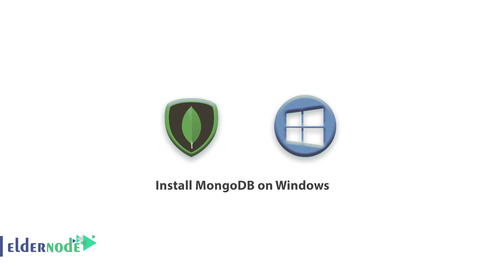
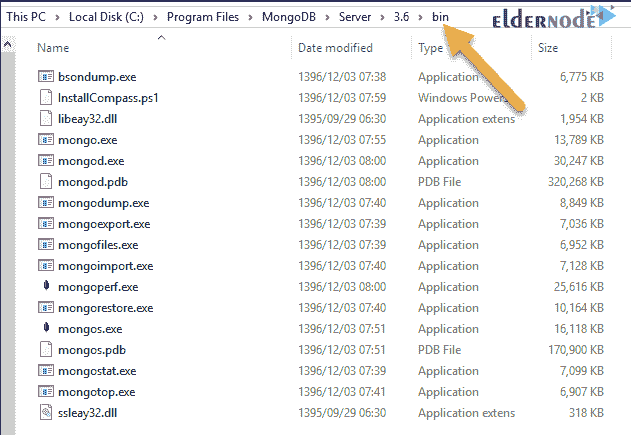
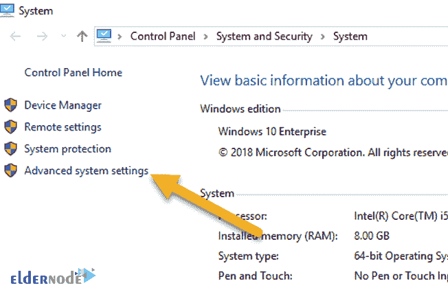
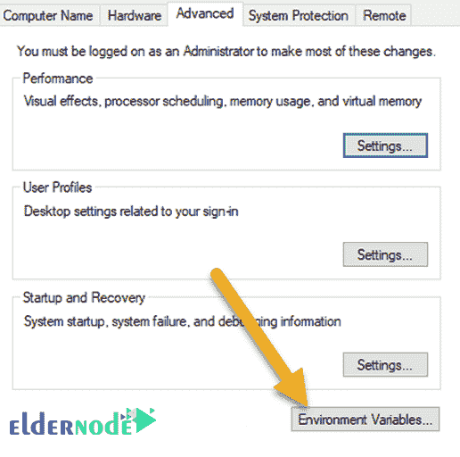
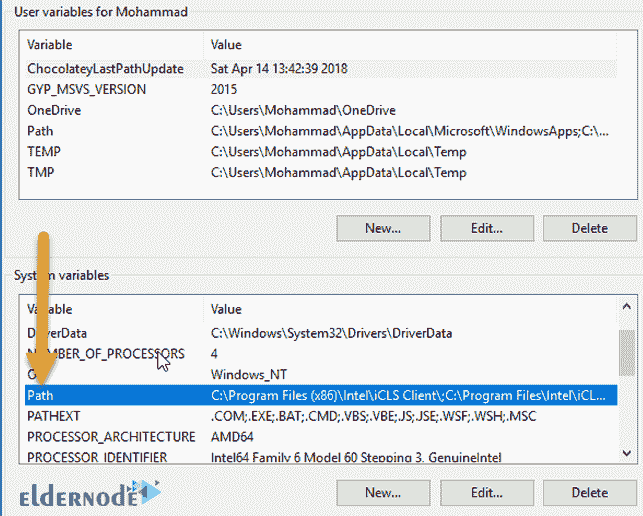
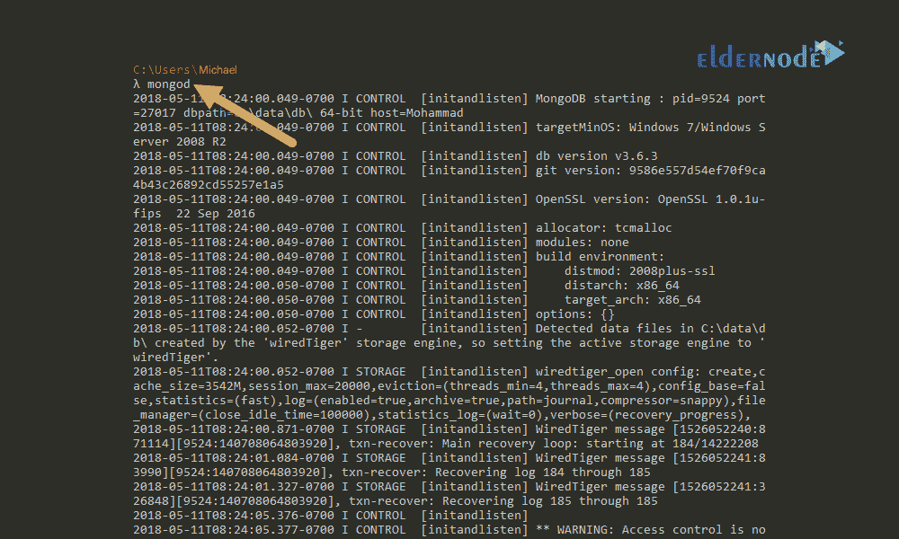
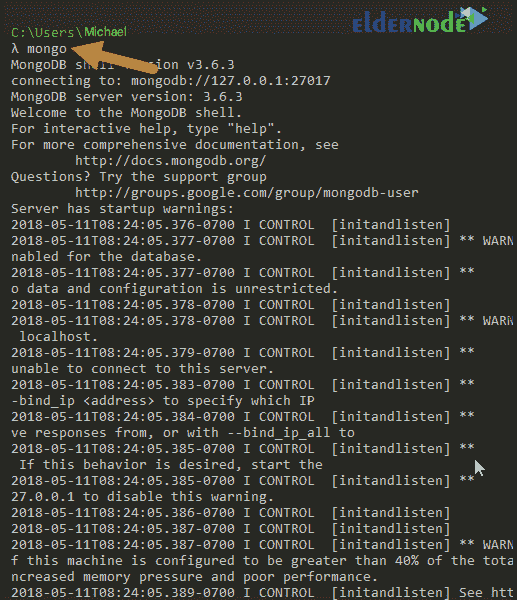
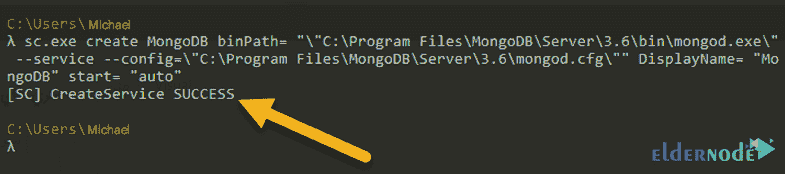
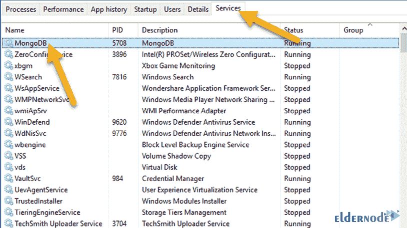

# 如何在 Windows 上安装 MongoDB-教程安装 MongoDB

> 原文：<https://blog.eldernode.com/install-mongodb-on-windows/>



如何在 Windows 上安装 MongoDB？MongoDB 是一个非常强大的数据库，用于更高层次的软件开发和编程。它还有简单的查询，对于那些在各种编程项目中有专业经验的人来说并不难使用。

在这篇文章中，我们想教你如何在 Windows 上安装 MongoDB ，这样你就可以利用这个数据库的强大功能。

如你所知， MongoDB 是最受欢迎的 [NoSQL 数据库](https://en.wikipedia.org/wiki/NoSQL)之一，它有很多优点，为用户提供了非常好的特性。

[购买 Windows 虚拟专用服务器](https://eldernode.com/windows-vps/)

## 第一步:安装 MongoDB

**1。** 安装该数据库，首先进入 [MongoDB 站点](https://www.mongodb.com/)的下载页面，下载最新版本。

**2。** 下载完毕后，双击所需文件上的**。**

****3。** 接受其条款和条件并点击下一步。**

****4。** 下一步，选择完成模式，点击安装。**

****5。** 点击 **结束** 结束。**

****不要错过相关文章:****

****[如何在 Debian 10 上安装 MongoDB 4](https://eldernode.com/install-mongodb-debian/)****

****[如何在 CentOS 8 安装 MongoDB 4](https://eldernode.com/install-mongodb-4-centos-8/)****

****和****

****[如何在 Ubuntu 20.04 上安装 MongoDB](https://eldernode.com/install-mongodb-ubuntu-20/)****

## **第二步:将 MongoDB 添加到全局变量**

**进入驱动器 C 以测试安装是否正确执行。然后打开程序文件 **文件夹**。您会看到添加了一个名为 MongoDB 的新文件夹。**

**现在为了更快地启动，最好将 MongoDB 添加到 Windows 的全局变量中。这样无论你在哪里使用**命令行**或 **CMD** ，你都可以打开和操作数据库。**

**为此，您需要复制 MongoDB 中 bin 文件夹的路径。**

****

**在控制面板中，点击高级系统设置，在**底部**，点击环境变量:**

****

*****

****

**现在**双击路径上的**:**

**打开路径信息后，点击新建。然后输入复制的路径，点击确定。**

****例如** 这个路径:C:\ Program Files \ MongoDB \ Server \ 3.6 \ bin。**

****

## **第三步:创建数据文件夹**

**在这一步中，您必须在驱动器 C 的根目录下为数据创建一个文件夹，并将两个文件夹 db 和 log 放在这个文件夹中。**

**MongoDB 默认情况下在这些文件夹中存储想要的信息。**

## **第四步:运行服务器并连接到服务器**

**运行MongoDB 服务器。为此，打开 **CMD** ，键入 mongod ，按 Enter :**

****

**你会看到 MongoDB 服务器正在运行，现在你需要打开 CMD 并从其他地方连接到它并使用它。**

**为此，您可以使用 mongo 命令从另一个 CMD 连接到这个服务器并使用数据库。也可以用 **[Robo Mongo](https://eldernode.com/install-robomongo-on-windows/)** 等各种软件来做到这一点。**

**这里我们选择第一种方式，打开另一个 **CMD** ，输入 mongo ，按回车:**

****

## **第五步:创建 mongod.cfg 配置文件**

**在本节中，您需要创建一个 MongoDB 服务。通过创建这个服务，每次启动您的 Windows 时，MongoDB 服务器也会作为 Windows 服务启动。**

**通过这样做，数据库总是活动的，您可以使用它。**

**为此，输入安装 MongoDB 的路径。**

**如C:\ Program Files \ MongoDB \ Server \ 3.6。然后创建一个名为 mongod.cfg 的文件，并将以下代码放入其中:**

```
systemLog:  destination: file  path: c:\data\log\mongod.log  storage:  dbPath: c:\data\db
```

**您可以看到，我们在这里的数据中指定了创建的文件夹的路径。**

## **第六步:构建 MongoDB 服务**

**启动一个 CMD as **以管理员**身份运行，并在其中输入以下代码，按 Enter :**

```
`sc.exe create MongoDB binPath= "\"C:\Program Files\MongoDB\Server\3.6\bin\mongod.exe\" --service --config=\"C:\Program Files\MongoDB\Server\3.6\mongod.cfg\"" DisplayName= "MongoDB" start= "auto"`
```

****

**服务成功创建。**

## **第七步:启动 MongoDB 服务**

**为此，在打开的同一个 CMD 中输入以下命令:**

```
`net start MongoDB`
```

**在这里，如果您正确地完成了步骤，您将看到 MongoDB 服务已经成功启动。**

**现在，如果您打开任务管理器并进入服务部分，您将看到如下所示的 MongoDB:**

****

**服务状态为 **运行** 。因此，每次系统启动时，MongoDB 也会自动启动。然后你可以在连接，以任何你想要的方式工作。**

**使用以下命令**停止**和**删除**该服务:**

```
 // Stop serrvice  net stop MongoDB    // Delete service  sc.exe delete MongoDB 
```

****亦作，见:****

**[如何在 Windows 上安装 robo mongo](https://eldernode.com/install-robomongo-on-windows/)**

****尊敬的用户**，我们希望您能喜欢这个[教程](https://eldernode.com/category/tutorial/)，您可以在评论区提出关于本次培训的问题，或者解决[老年人节点培训](https://eldernode.com/blog/)领域的其他问题，请参考[提问页面](https://eldernode.com/ask)部分，并尽快提出您的问题。腾出时间给其他用户和专家来回答你的问题。**

**如何在 Windows 上安装 MongoDB？**

**好运。**