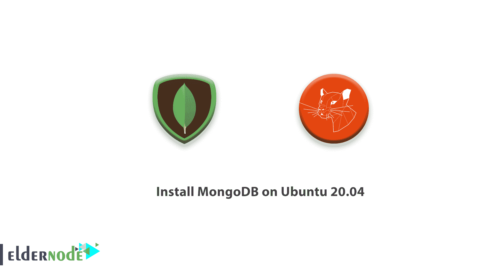

# 如何在 Ubuntu 20.04 - Eldernode 上安装 MongoDB

> 原文：<https://blog.eldernode.com/install-mongodb-ubuntu-20/>



MongoDB，也称为 Mongo，是许多现代 web 应用程序中使用的开源文档数据库。它被归类为 [NoSQL 数据库](https://en.wikipedia.org/wiki/NoSQL)，因为它不依赖于传统的基于表的关系数据库结构。

相反，它使用带有动态模式的类似 JSON 的文档，这意味着，与关系数据库不同，在向数据库添加数据之前，MongoDB 不需要预定义的模式。您可以根据需要随时更改模式，而不必用更新的模式建立新的数据库。联系 Eldernode 团队作为 [VPS](https://eldernode.com/vps/) 提供商，拥有自己的 [Linux 虚拟服务器](https://eldernode.com/linux-vps/)。

为了让本教程更好地发挥作用，请考虑以下**先决条件**:

拥有 sudo 权限的**非 root** 用户。

一台 Ubuntu 20.04 服务器，按照我们在 Ubuntu 20.04 上设置的[初始服务器](https://eldernode.com/initial-server-setup-on-ubuntu-20/) [进行设置。](https://eldernode.com/initial-server-setup-on-ubuntu-20/)

## 如何在 Ubuntu 20.04 上安装 MongoDB

加入我们向你展示如何**在 Ubuntu 20.04** 上安装 MongoDB。至此，您将在 Ubuntu 20.04 服务器上安装 MongoDB，测试它，并学习如何将其作为 **systemd** 服务进行管理。

### 步骤 1–如何安装 MongoDB

首先，要获得该软件的最新版本，您必须将 MongoDB 的专用包存储库包含到您的 APT 源代码中。然后，您将能够安装 mongodb-org，这是一个元包，它总是指向 mongodb 的最新版本。首先，导入 MongoDB 最新稳定版本的公共 GPG 密钥。您可以通过导航到 MongoDB 密钥服务器并找到包含最新稳定版本号并以. asc 结尾的文件来找到合适的密钥文件。

要继续，请右键单击该文件，然后选择复制链接地址。然后，将该链接粘贴到以下 curl 命令中。

***注*** :不要忘记替换“https://www . MongoDB . org/static/PGP/server-4.4 . ASC”的网址

```
curl -fsSL https://www.mongodb.org/static/pgp/server-4.4.asc | sudo apt-key add -
```

**更详细地解释一下**，cURL 是许多操作系统上都有的命令行工具，用于传输数据。它读取存储在传递给它的 URL 上的任何数据，并将内容打印到系统的输出。在下面的例子中，cURL 打印 GPG 密钥文件的内容，然后通过管道将它传输到下面的**sudo apt-key add–**命令，从而将 GPG 密钥添加到可信密钥列表中。

**请考虑**这个 **curl** 命令使用了选项 **-fsSL** ，这两个选项合在一起，本质上是告诉 curl 无声地失败。这意味着，如果由于某种原因 cURL 无法联系 GPG 服务器或 GPG 服务器宕机，它不会意外地将结果错误代码添加到您的可信密钥列表中。

如果添加成功，该命令将返回 **OK** :

输出

```
OK
```

如果您需要再次检查是否正确添加了密钥，可以使用以下命令:

```
apt-key list
```

输出

```
/etc/apt/trusted.gpg  --------------------  pub   rsa4096 2019-05-28 [SC] [expires: 2024-05-26]        2069 1EEC 3521 6C63 CAF6  6CE1 6564 08E3 90CF B1F5  uid           [ unknown] MongoDB 4.4 Release Signing Key <[[email protected]](/cdn-cgi/l/email-protection)>  . . . 
```

当你的 APT 安装还不知道去哪里找 **mongodb-org** 包的时候你需要安装最新版本的 mongodb。

但是在你的服务器上有两个地方**APT 会在那里寻找下载和安装软件包的在线资源:**

**sources.list** 文件和 **sources.list.d** 目录。 **sources.list** 是一个列出 APT 数据活动源的文件，每行一个源，最优先的源列在最前面。**sources . list . d**目录允许您将此类 **sources.list** 条目添加为单独的文件。

使用下面的命令，在 sources.list.d 目录中创建一个名为 mongodb-org-4.4.list 的文件。这个文件中唯一的内容是一行文字，写着【https://repo.mongodb.org/apt/ubuntu】deb[arch = amd64，arm 64]focal/MongoDB-org/4.4 multiverse:

```
echo "deb [ arch=amd64,arm64 ] https://repo.mongodb.org/apt/ubuntu focal/mongodb-org/4.4 multiverse" | sudo tee /etc/apt/sources.list.d/mongodb-org-4.4.list
```

```
Now attention to this single line, which tells APT everything it needs to know about what the source is and where to find it:
```

deb:这意味着源条目引用了常规的 Debian 架构。在其他情况下，这一行的这一部分可能读作 deb-src，这意味着 source 条目代表 Debian 发行版的源代码。

【arch = amd64，arm 64】:指定 APT 数据应该下载到哪个架构。在这种情况下，它指定 amd64 和 arm64 架构。

https://repo.mongodb.org/apt/ubuntu:这是一个 URI，代表可以找到 APT 数据的位置。在这种情况下，URI 指向官方 MongoDB 存储库所在的 HTTPS 地址。

focal/MongoDB-org/4.4:Ubuntu 库可以包含几个不同的版本。这表明您只希望 mongodb-org 包的 4.4 版本可用于 Ubuntu 的 focal 发行版(“Focal Fossa”是 Ubuntu 20.04 的代码名称)。

多元宇宙(multiverse):这部分指向四个主要 Ubuntu 库之一。在这种情况下，它指向多元宇宙库。

运行这个命令后，更新您的服务器的本地包索引，以便 APT 知道在哪里可以找到 mongodb-org 包:

```
sudo apt update
```

同样，您可以安装 MongoDB:

```
sudo apt install mongodb-org
```

要确认你要安装软件包，按下 Y 然后输入

当该命令完成时，MongoDB 将安装在您的系统上。然而，它还不能使用。接下来，您将启动 MongoDB 并确认它工作正常。

### 步骤 2–如何启动 MongoDB 服务并测试数据库

到目前为止，您已经了解了上一步中描述的安装过程会自动将 MongoDB 配置为由 systemd 控制的守护进程，这意味着您可以使用各种 systemctl 命令来管理 MongoDB。但是，此安装过程不会自动启动该服务。运行下面的 systemctl 命令来启动 MongoDB 服务:

```
sudo systemctl start mongod.service
```

接下来，检查服务的状态。请注意，该命令不包括。服务文件定义中的服务。如果这个后缀不存在的话，systemctl 会自动将它附加到您传递的任何参数上，所以没有必要包含它:

```
sudo systemctl status mongod
```

输出

```
● mongod.service - MongoDB Database Server       Loaded: loaded (/lib/systemd/system/mongod.service; disabled; vendor preset: enabled)       Active: active (running) since Tue 2020-06-09 12:57:06 UTC; 2s ago         Docs: https://docs.mongodb.org/manual     Main PID: 37128 (mongod)       Memory: 64.8M       CGroup: /system.slice/mongod.service               └─37128 /usr/bin/mongod --config /etc/mongod.conf
```

在确认服务按预期运行后，**启用**MongoDB 服务以在引导时启动:

```
sudo systemctl enable mongod
```

通过连接到数据库服务器并执行诊断命令，可以进一步验证数据库是否可运行。以下命令将连接到数据库并输出其当前版本、服务器地址和端口。它还将返回 MongoDB 的内部连接状态命令的结果:

```
mongo --eval 'db.runCommand({ connectionStatus: 1 })'
```

**连接状态**是做什么的？它将检查并返回数据库连接的状态。响应中的 ok 字段的值为 **1** 表示服务器工作正常:

输出

```
MongoDB shell version v4.4.0  connecting to: mongodb://127.0.0.1:27017/?compressors=disabled&gssapiServiceName=mongodb  Implicit session: session { "id" : UUID("1dc7d67a-0af5-4394-b9c4-8a6db3ff7e64") }  MongoDB server version: 4.4.0  {      "authInfo" : {          "authenticatedUsers" : [ ],          "authenticatedUserRoles" : [ ]      },      "ok" : 1  }
```

***注*** :数据库运行在 **127.0.0.1** 端口 **27017** 上，本地环回地址代表 **localhost** 。这是 MongoDB 的默认端口号。

### 步骤 3–如何管理 MongoDB 服务

如前所述，步骤 1 中描述的安装过程将 MongoDB 配置为作为一个 **systemd** 服务运行。这意味着你可以使用标准的 **systemctl** 命令来管理它，就像你管理其他 Ubuntu 系统服务一样。

如您所知， **systemctl status** 命令检查 **MongoDB** 服务的状态。

```
sudo systemctl status mongod
```

您可以随时使用以下命令停止该服务。

```
sudo systemctl stop mongod
```

此外，要在服务停止时启动它，请使用下面的命令。

```
sudo systemctl start mongod
```

如果您需要重启已经运行的服务器:

```
sudo systemctl restart mongod
```

`**注意**:在第 **2** 步中，你启用了 **MongoDB** 与服务器自动启动。如果您希望**禁用**该自动启动，请键入:`

```
`sudo systemctl disable mongod`
```

`然后为了**重新启用**使其在开机时启动，再次运行 **启用** 命令:`

```
`sudo systemctl enable mongod`
```

## `结论`

`在本文中，通过完成本指南的步骤，您学习了如何在 Ubuntu 20.04 上安装 MongoDB，现在您将官方的 MongoDB 存储库添加到 APT 实例中，并安装了 MongoDB 的最新版本。然后您测试了 Mongo 的功能，并练习了一些 systemctl 命令。如果你有兴趣了解更多关于这个主题的内容，请关注我们的相关文章[如何在 Debian 10 上安装 MongoDB 4](https://blog.eldernode.com/install-mongodb-debian/)和[如何在 CentOS 8 上安装 MongoDB 4](https://blog.eldernode.com/install-mongodb-4-centos-8/)。`