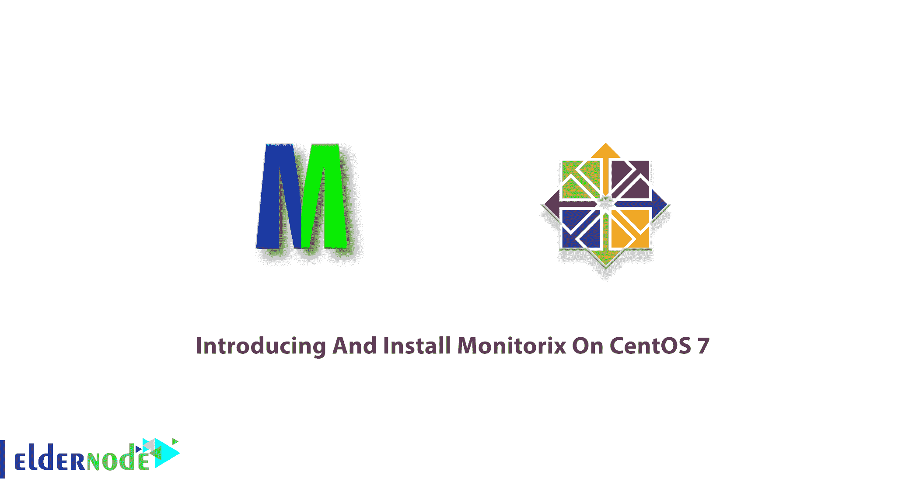
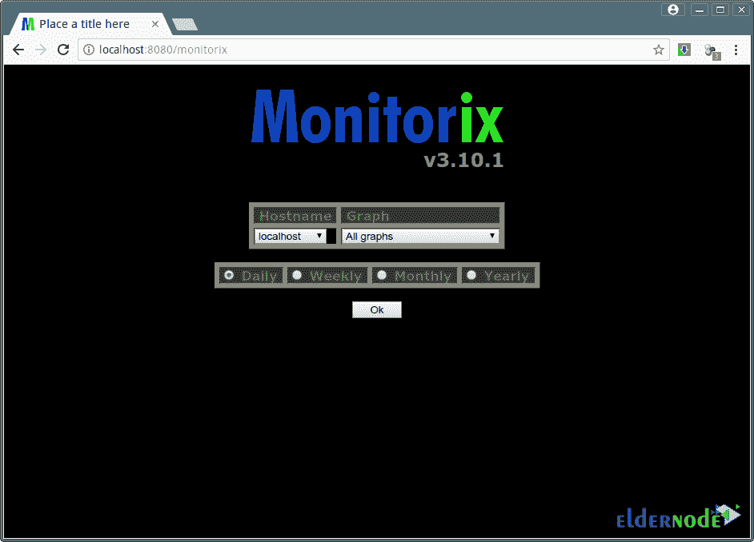

# 在 CentOS 7 - Eldernode 博客上介绍和安装 Monitorix

> 原文：<https://blog.eldernode.com/install-monitorix-on-centos-7/>



Monitorix 是一个免费的开源系统监控工具，可以在所有主要的 Linux 服务器发行版上运行。这款轻量级的小型软件旨在监控服务和系统资源。由于 Monitorix 3.0 包括自己的 HTTP 服务器，您不必安装第三方 web 服务器来使用它，远程 Linux 服务器监控很容易实现。使用 Monitorix 有助于您定期收集系统数据，并使用 web 界面以图表形式显示信息。然后，您可以自动化 Linux 监控工具收集的一些数据。Monitorix web 界面还可以监控多个 Linux 服务器。本文是**在 CentOS 7** 上介绍和安装 Monitorix。要订购您喜欢的套餐，请访问 [Eldernode](https://eldernode.com/) 并购买您自己的 **[CentOS VPS](https://eldernode.com/centos-vps/)** 。

## **介绍 Monitorix**

Monitorix 是一款免费的系统监控工具。它最初是为 Red Hat Enterprise Linux 操作系统家族、 [Fedora](https://blog.eldernode.com/tag/fedora/) 和 [CentOS](https://blog.eldernode.com/tag/centos/) Linux 系统设计的。现在，根据 GNU 通用公共许可证第 2 版(GPLv2)的条款获得许可，并在不同的 GNU/Linux 发行版上运行。Monitorix 由两部分组成。首先是一个收集器，叫做 **Monitorix** 。这个 Perl 守护进程像任何其他系统服务一样自动启动。Monitorix 守护进程默认将其日志文件存储到 **/var/log/monitorix** 。而这个工具的第二个程序是一个 CGI 脚本， **monitorix.cgi** *。*

它是为在生产 [Linux](https://blog.eldernode.com/tag/linux/) /UNIX 服务器下使用而创建的，但由于其较小的尺寸和简单的设计，它可以在嵌入式设备上使用。Monitorix 正在跟踪 Linux 服务器元素，如整体系统负载、文件系统活动和全局内核使用情况。该软件还跟踪硬件数据，如子系统温度、电池状态和 UPS 统计数据。

您可以使用 **Monitorix** 来监控流行的第三方 Linux 程序，如邮件服务器、基于 libvirt 的虚拟机以及 MySQL、 [Nginx](https://blog.eldernode.com/installation-nginx-on-centos-8/) 和 MongoDB 数据库。它还会监视您的系统性能，以检测瓶颈、故障、异常长的响应时间和其他异常情况。

### **Monitorix 特性**

Monitorix 的功能太多了。让我们在下面回顾一下它的主要特性:

1.系统平均负载和使用情况，如活动进程、内存分配、系统熵和系统正常运行时间

2.全局内核使用情况，包括用户、nice、系统、空闲、i/o 等待、irq、软件 irq、steal 和 guest、上下文切换、Fork 和 vfork 速率，以及 VFS 使用情况(dentries、inodes 和文件)

3.每个处理器的内核使用情况，包括用户、nice、系统、空闲、i/o 等待、irq、软件 irq、steal 和 guest

4.支持无限数量的处理器或内核

5.能够定义每行的图形数量和改变图形的大小

6.支持多达 20 个硬件温度传感器的 HP ProLiant 系统健康。

7.LM-传感器和 GPU 温度。

8.通用传感器统计

9.IPMI 传感器统计

10.环境传感器统计

11.支持多达 9 个卡的 NVIDIA 温度和使用情况

12.支持无限数量的磁盘驱动器图表的磁盘驱动器温度和运行状况

13.文件系统使用和 I/O 活动

14.支持无限数量池的 ZFS 统计

15.Netstat 统计包括 IPv4 和 IPv6 连接的统计

16.Apache、Nginx、Lighttpd、PostgreSQL、MongoDB、Varnish、 [Fail2ban](https://blog.eldernode.com/install-fail2ban-centos-8/) 、Chrony、NTP 和 MySQL 统计

17.支持监控远程服务器(多主机)

18.内置 HTTP 服务器。

19.能够以兆字节/秒或兆比特/秒显示网络指标

20.静默模式能够从脚本中检索图形

还有很多。

### **在 CentOS 7 上安装 Monitorix 的先决条件**

为了让本教程更好地工作，请考虑以下先决条件:

_ 拥有 [sudo 权限](https://blog.eldernode.com/create-new-sudo-user-centos-8/)的非 root 用户。

_ 准备好您的 CentOS 7 VPS

## **如何在 CentOS 7 上安装 Monitorix**

Monitorix 是一款计算机网络监控工具。让我们通过本指南的步骤来完成安装过程，并使用其所有功能。

*第一步:*

像往常一样，从**更新你的系统包**到它们的最新版本开始。所以，运行:

```
dnf update
```

*第二步:*

在安装之前，使用下面的命令**安装 EPEL 库**:

```
dnf install epel-release
```

现在，要**在 CentOS 7 上安装最新的 Monotorix** ，请键入:

```
dnf install monitorix
```

要查看安装的 Monitorix 的**状态，运行:**

```
dnf info monitorix
```

此外，您可以通过运行以下命令来安装其他所需的 **Perl 依赖项**:

```
dnf install perl-CGI perl-HTTP-Server-Simple perl-rrdtool perl-Config-General perl-LWP-Protocol-https perl-LWP-Protocol-http10 perl-libwww-perl
```

然后，使用以下命令验证 Monitorix 的安装版本:

```
monitorix -v
```

### **如何在 CentOS 7 上运行 Monitorix**

一旦在 CentOS 7 系统上安装了 Mmonitorix 并检查了状态，就可以开始运行 monitorix 了。

要启动并使其能够在系统引导时运行，请运行:

```
systemctl enable --now monitorix
```

然后，您可以使用以下命令检查状态:

```
systemctl status monitorix
```

### **如何在 CentOS 7 上配置 Monitorix**

默认的 Monitorix 配置文件是**/etc/monitor IX/monitor IX . conf**是默认值。让我们根据您的系统详细信息进行一些配置调整，并准备好使用 Monitorix 运行系统监控。

*第一步:*

首先，要编辑 Monitorix 配置文件，请打开它:

```
vim /etc/monitorix/monitorix.conf
```

第二步:

然后，运行下面的命令来设置服务器的描述、位置、公司名称等:

```
title = YourDomain.com Monitorix
```

接下来，运行以下命令来设置主机的主机名:

```
hostname = monitorix.YourDomain.com
```

***注意* :** 不要忘记根据您的环境更换设置。

第三步:

现在，您可以**重启**Monitorix 服务来修改配置:

```
systemctl restart monitorix
```

第四步:

由于 Monitorix 默认监听 TCP 端口 8080，因此您需要将防火墙配置为允许 8080 端口，以便您可以从外部机器访问 Monitorix 仪表板。首先，通过运行以下命令进行验证:

```
ss -altnp | grep 8080
```

然后，如果 firewalld 正在运行，打开它的 8080/TCP 端口:

```
firewall-cmd --add-port=8080/tcp --permanent
```

```
firewall-cmd --reload
```

最后，您可以将 Monitorix 服务添加到系统启动中，并**启动**该服务:

```
chkconfig --level 35 monitorix on
```

```
service monitorix start
```

```
systemctl start monitorix
```

## **如何在 CentOS 7 上使用 Monitorix**

在本节中，您可以访问 Monitorix web 界面。打开浏览器，使用地址**http://IP-address:8080/Monitorix**访问 monitor IX。



## 结论

在本文中，向您介绍了 Monitorix，您了解了如何在 CentOS 7 上安装 Monitorix。登录后，单击所需的任何图表，即可在新窗口中看到该图表。您还需要安装 terminus-font，因为如果没有安装兼容的字体，Monitorix 图形将不会包含任何文本。向您在 [Eldernode Community](https://community.eldernode.com/) 上的朋友询问他们使用什么监控工具，并分享您的经验。