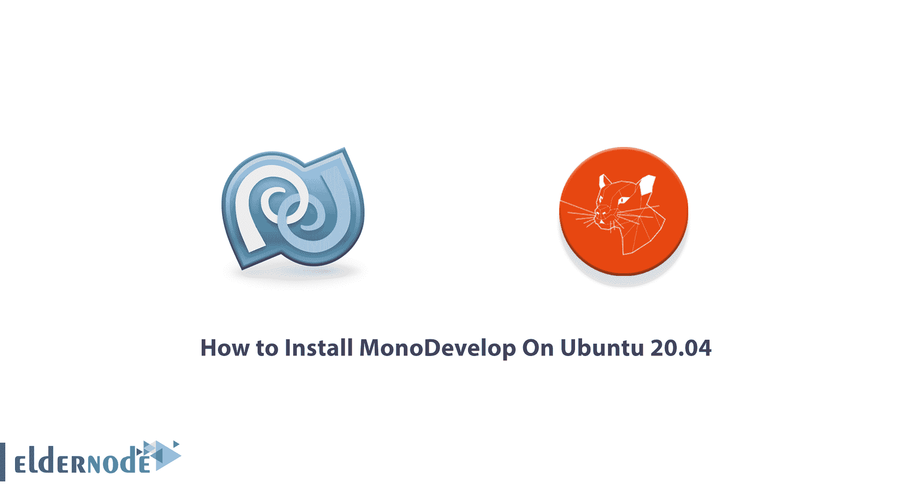

# 如何在 Ubuntu 20.04 - Eldernode 博客上安装 MonoDevelop

> 原文：<https://blog.eldernode.com/install-monodevelop-on-ubuntu/>



MonoDevelop 是一个集成的开源软件开发环境，可用于 Linux、Mac OS X 和 Microsoft Windows 开发针对 mono 和这两种软件之一的应用程序。NET 框架。MonoDevelop 提供了类似于 NetBeans 和 Microsoft Visual Studio 的特性，比如自动完成、版本控制、图形用户界面和 web 设计器。在本文中，我们将一步一步地教你如何在 Ubuntu 20.04 上安装 MonoDevelop。如果你想购买一台 **[Ubuntu VPS](https://eldernode.com/ubuntu-vps/)** 服务器，你可以访问 [Eldernode](https://eldernode.com/) 中提供的软件包。

## **教程在 Ubuntu Linux 上安装 MonoDevelop**

MonoDevelop 使开发人员能够跨多个平台快速创建桌面和 web 应用程序。它还允许开发人员在 Linux 和 macOS 上维护用 Visual Studio 创建的网络应用程序，并为所有操作系统创建一个单一的源代码数据库。

在下一节中，我们将提到 MonoDevelop 的一些特性。然后我们将解释如何将 Apt 添加到 MonoDevelop 中。下一步，添加 Apt 后，我们将教你如何在 [Ubuntu](https://blog.eldernode.com/tag/ubuntu/) 20.04 上完整安装 MonoDevelop。同样在最后一步，我们将通过一个简单的例子展示如何使用 MonoDevelop。

### **MonoDevelop 特性**

在这一部分，我们将讨论 MonoDevelop 的 8 个特性。这些功能包括:

**1。多平台:**支持 [Linux](https://blog.eldernode.com/tag/linux/) ，Windows，macOS。

**2。高级文本编辑:**对 C#的代码补全支持，代码模板，代码折叠。

**3。可配置工作台:**完全可定制的窗口布局，用户自定义的按键绑定，外部工具

**4。多语言支持:** C#，F#，Visual Basic。网，瓦拉

**5。集成调试器:**用于调试单声道和本机应用程序

**6。GTK#视觉设计师:**轻松构建 GTK#应用程序

7 .**。ASP。NET:** 在 Mono web 服务器 XSP 上创建具有完整代码完成支持和测试的 web 项目。

**8。其他工具:**源代码控制，makefile 集成，单元测试，打包，部署，本地化

下一节，我们将解释如何在 Ubuntu 20.04 上安装 MonoDevelop。请继续关注本文的其余部分。

### **如何为 MonoDevelop** 添加 APT

在这一节，我们将解释如何在 Ubuntu 20.04 上为 MonoDevelop 添加 APT。为此，只需遵循以下步骤。

在第一步中，您必须使用以下命令来更新和升级系统软件包:

```
sudo apt update && upgrade
```

然后，您需要通过运行以下命令来安装 mono 的基本组件:

```
sudo apt install dirmngr gnupg apt-transport-https ca-certificates software-properties-common
```

在下一步中，您需要使用以下命令**提取密钥**，然后将存储库及其密钥放在 Ubuntu 服务器上:

```
sudo apt-key adv --keyserver hkp://keyserver.ubuntu.com:80 --recv-keys 3FA7E0328081BFF6A14DA29AA6A19B38D3D831EF
```

现在，您可以使用以下命令将目录添加到服务器中:

```
sudo apt-add-repository 'deb https://download.mono-project.com/repo/ubuntu stable-bionic main
```

注意，按照这些步骤，您可以访问 MonoDevelop 存储库。

## **在 Ubuntu 20.04 上安装 MonoDevelop |**Ubuntu 21.04

在这一节，我们将教你如何在 Ubuntu 20.04 上安装 MonoDevelop。为此，只需遵循以下步骤。

安装 MonoDevelop 之前的第一步是使用以下命令更新包:

```
sudo apt update
```

您现在可以使用以下命令轻松地安装 MonoDevelop :

```
sudo apt install mono-complete
```

应该注意的是，如果您想通过 IDE 开发方法来构建您的项目，您可以使用以下命令:

```
sudo apt install monodevelop
```

最后一点是使用以下命令验证 mono 软件的性能:

```
mono -V
```

### **如何在 Ubuntu 20.04 上使用 MonoDevelop**

在这一节，我们将向你展示如何在 Ubuntu 20.04 上使用 MonoDevelop。为了确保一切设置正确，我们计划创建一个程序来打印" **Hello World** "消息。所以你需要打开你的文本编辑器，创建一个名为 **hello.cs** 的文件，内容如下:

```
using System;    public class HelloWorld  {  public static void Main(string[] args)  {  Console.WriteLine ("Hello World!");  }  }
```

请注意，您必须使用 CSC 编译器来构建程序。您将看到，执行以下命令将创建一个名为 hello.exe 的可执行文件:

```
csc hello.cs
```

现在运行以下命令:

```
mono hello.exe
```

上述命令的输出如下所示:

```
Hello, World
```

现在，您可以设置一个可执行标志，只需键入程序名即可执行该程序:

```
chmod +x hello.exe
```

您现在可以通过键入以下命令来运行 hello.exe 文件:

```
./hello.exe
```

## 结论

在本文中，在介绍 MonoDevelop 及其特性之后，我们试图教您如何为 MonoDevelop 添加 APT。然后我们一步步教你如何在 Ubuntu 20.04 上安装 MonoDevelop。同样，在最后一步，我们用一个例子解释了如何使用 MonoDevelop。