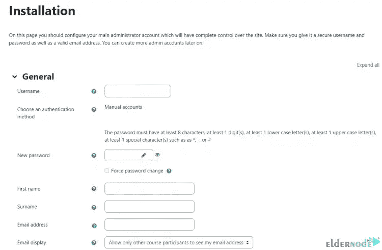

# 在 AlmaLinux 上安装 Moodle 的 5 个步骤

> 原文：<https://blog.eldernode.com/install-moodle-on-almalinux/>


Moodle 是第一批在为用户重建在线环境方面做得非常出色的软件公司之一。这家公司通过提供能够调整和增强全球在线教育的软件，在这一领域发挥了重要作用。Moodle 能够向其他公司展示教育不仅仅依赖于传统的智力教育方法。本文将教你在 AlmaLinux 上安装 Moodle 的 5 个步骤。如果你打算购买一台 [Linux VPS](https://eldernode.com/linux-vps/) 服务器，请查看 [Eldernode](https://eldernode.com/) 网站上提供的软件包。

## **什么是 Moodle？**

[Moodle](https://blog.eldernode.com/setup-moodle-on-a-dedicated-server/) 代表模块化面向对象的动态学习环境，是一个开源免费的学习管理系统。它为电子学习提供了一个平台，并在 GNU 通用公共许可证下发布。您可以在学校、大学、工作场所和其他部门使用它进行混合学习、远程教育、翻转课堂和其他在线学习项目。事实上，Moodle 是最受欢迎的学习管理系统，适合所有的组织类型。

### **要求在 AlmaLinux 上安装 Moodle**

在进行任何操作之前，您需要安装以下要求:

1->[在 AlmaLinux 上安装 PHP 7.4 和 PHP 8](https://blog.eldernode.com/install-php-7-4-and-php-8-on-almalinux/)

2->[在 AlmaLinux 上安装 SQL Server](https://blog.eldernode.com/install-and-use-sql-server-on-almalinux/)

3 –>如果尚未安装基本实用程序包，请安装它们:

```
sudo dnf install wget curl nano unzip yum-utils -y
```

### **1-在 AlmaLinux 上配置防火墙**

第一步，您应该配置防火墙。为此，请使用以下命令检查防火墙的状态:

```
sudo firewall-cmd --state
```

您可以列出防火墙上的活动服务和端口，如下所示:

```
sudo firewall-cmd --permanent --list-services
```

现在，您需要通过运行以下命令来打开 HTTP 和 HTTPS 端口。因为 Moodle 需要它们来运行:

```
sudo firewall-cmd --add-service=http --permanent
```

```
sudo firewall-cmd --add-service=https --permanent
```

最后，重新加载防火墙以应用更改，如下所示:

```
sudo firewall-cmd --reload
```

### **2-在 AlmaLinux 上安装 Nginx**

在这一步，你可以通过下载官方的 Nginx 库来安装最新的 Nginx 版本。

现在您应该创建官方的 Nginx 存储库。为此，创建一个用您想要的文本编辑器打开的**/etc/yum . repos . d/nginx . repo**文件:

```
sudo nano /etc/yum.repos.d/nginx.repo
```

打开文件后，在其中添加以下代码:

```
[nginx-stable]  name=nginx stable repo  baseurl=http://nginx.org/packages/centos/$releasever/$basearch/  gpgcheck=1  enabled=1  gpgkey=https://nginx.org/keys/nginx_signing.key  module_hotfixes=true    [nginx-mainline]  name=nginx mainline repo  baseurl=http://nginx.org/packages/mainline/centos/$releasever/$basearch/  gpgcheck=1  enabled=0  gpgkey=https://nginx.org/keys/nginx_signing.key  module_hotfixes=true
```

按下 **Ctrl+X** 到**保存**文件。

是时候安装 Nginx 服务器了，如下所示:

```
sudo dnf install nginx
```

如果您想要验证安装，以下命令可以帮助您:

```
nginx -v
```

## **3-在 AlmaLinux 上安装和配置 Moodle**

首先，您需要为 Moodle 创建公共目录:

```
sudo mkdir /var/www/html/moodle
```

为了让登录用户能够访问该目录，您必须允许如下内容:

```
sudo chown -R $USER:$USER /var/www/html/moodle
```

并切换到公共目录:

```
cd /var/www/html/moodle
```

Moodle 需要 Git 来抓取应用程序文件。为了**安装 Git** ，运行下面的命令:

```
sudo dnf install git
```

现在，您应该克隆 Moodle Github 存储库，如下所示:

```
git clone https://github.com/moodle/moodle.git
```

如果要检查可用分支列表，请运行以下命令:

```
git branch -a
```

然后创建一个名为 **MOODLE_400_STABLE** 的本地分支，并将其设置为跟踪远程分支，如下所示:

```
git branch --track MOODLE_400_STABLE origin/MOODLE_400_STABLE
```

运行以下命令切换到新创建的本地分支:

```
git checkout MOODLE_400_STABLE
```

现在，您应该使用以下命令为 Moodle 创建一个数据目录:

```
sudo mkdir /var/moodledata
```

接下来，给 Moodle 数据目录适当的权限，如下所示:

```
sudo chown -R nginx /var/moodledata
```

```
sudo chmod -R 775 /var/moodledata
```

并授予对 Moodle 目录的写权限:

```
sudo chmod -R 755 /var/www/html/moodle
```

是时候配置 Moodle 了。为此，请导航至 Moodle 目录:

```
cd /var/www/html/moodle
```

现在您应该创建 Moodle 配置文件。为此，请复制示例配置文件:

```
cp config-dist.php config.php
```

打开配置文件进行编辑:

```
nano config.php
```

找到数据库配置部分并配置数据库，所有 Moodle 数据将存储如下:

```
CFG->dbtype = 'mysqli'; // 'pgsql', 'mariadb', 'mysqli', 'auroramysql', 'sqlsrv' or 'oci'  CFG->dblibrary = 'native'; // 'native' only at the moment  CFG->dbhost = 'localhost'; // eg 'localhost' or 'db.isp.com' or IP  CFG->dbname = 'moodledb'; // database name, eg moodle  CFG->dbuser = 'moodleuser'; // your database username  CFG->dbpass = 'YourPassword23!'; // your database password  CFG->prefix = 'mdl_'; // prefix to use for all table names
```

现在您需要配置 Moodle 域名和数据目录的位置:

```
CFG->wwwroot = 'https://moodle.sample.com';
```

```
CFG->dataroot = '/var/moodledata';
```

最后，保存文件并关闭它。

### **4-在 AlmaLinux 上安装 SSL 和配置 Nginx**

首先，安装 Certbot 工具，使用下面的命令加密 API 来生成 SSL 证书:

```
sudo dnf install certbot
```

现在生成 SSL 证书，如下所示。请注意，以下代码会将证书下载到服务器上的**/etc/lets encrypt/live/Moodle . example . com**目录中:

```
sudo certbot certonly --standalone --agree-tos --no-eff-email --staple-ocsp --preferred-challenges http -m [[email protected]](/cdn-cgi/l/email-protection) -d moodle.sample.com
```

运行以下命令生成 Diffie-Hellman 组证书:

```
sudo openssl dhparam -out /etc/ssl/certs/dhparam.pem 4096
```

然后，您应该为“让我们加密自动续订”创建一个质询 web 根目录，如下所示:

```
sudo mkdir -p /var/lib/letsencrypt
```

现在需要创建 Cron 作业来更新 SSL。为此，创建**/etc/cron . daily/cert bot-renew**文件，并使用您想要的文本编辑器打开它:

```
sudo nano /etc/cron.daily/certbot-renew
```

向其中添加以下代码:

```
#!/bin/sh  certbot renew --cert-name moodle.sample.com --webroot -w /var/lib/letsencrypt/ --post-hook "systemctl reload nginx"
```

**保存**文件并关闭。

然后，通过更改任务文件的权限使其可执行，如下所示:

```
sudo chmod +x /etc/cron.daily/certbot-renew
```

是时候配置 Nginx 了。为此，创建/**etc/nginx/conf . d/Moodle . conf**，并使用您想要的文本编辑器打开它:

```
sudo nano /etc/nginx/conf.d/moodle.conf
```

并向其中添加以下代码:

```
# Redirect all non-encrypted to encrypted  server {      listen 80;      listen [::]:80;      server_name moodle.example.com;      return 301 https://$host$request_uri;  }    server {      listen 443 ssl http2;      listen [::]:443 ssl http2;            server_name moodle.example.com;      root   /var/www/html/moodle;      index  index.php;        ssl_certificate     /etc/letsencrypt/live/moodle.example.com/fullchain.pem;      ssl_certificate_key /etc/letsencrypt/live/moodle.example.com/privkey.pem;      ssl_trusted_certificate /etc/letsencrypt/live/moodle.example.com/chain.pem;      ssl_session_timeout 1d;      ssl_session_cache shared:MozSSL:10m;      ssl_session_tickets off;      ssl_stapling on;      ssl_stapling_verify on;      ssl_dhparam /etc/ssl/certs/dhparam.pem;            ssl_protocols TLSv1.2 TLSv1.3;      ssl_ciphers ECDHE-ECDSA-AES128-GCM-SHA256:ECDHE-RSA-AES128-GCM-SHA256:ECDHE-ECDSA-AES256-GCM-SHA384:ECDHE-RSA-AES256-GCM-SHA384:ECDHE-ECDSA-CHACHA20-POLY1305:ECDHE-RSA-CHACHA20-POLY1305:DHE-RSA-AES128-GCM-SHA256:DHE-RSA-AES256-GCM-SHA384;        access_log /var/log/nginx/moodle.access.log main;      error_log  /var/log/nginx/moodle.error.log;            client_max_body_size 25M;        location / {          try_files $uri $uri/ /index.php?$query_string;      }            location ~ ^(.+\.php)(.*)$ {          fastcgi_split_path_info ^(.+\.php)(.*)$;          fastcgi_index index.php;          fastcgi_pass unix:/run/php-fpm/www.sock;          include /etc/nginx/mime.types;          include fastcgi_params;          fastcgi_param  PATH_INFO  $fastcgi_path_info;          fastcgi_param  SCRIPT_FILENAME $document_root$fastcgi_script_name;      }            # Hide all dot files but allow "Well-Known URIs" as per RFC 5785  	location ~ /\.(?!well-known).* {      	return 404;  	}     	# This should be after the php fpm rule and very close to the last nginx ruleset.  	# Don't allow direct access to various internal files. See MDL-69333  	location ~ (/vendor/|/node_modules/|composer\.json|/readme|/README|readme\.txt|/upgrade\.txt|db/install\.xml|/fixtures/|/behat/|phpunit\.xml|\.lock|environment\.xml) {       	deny all;  	    return 404;  	}  }
```

**保存**文件并关闭。

在这种情况下，用您想要的文本编辑器打开 **/etc/nginx/nginx.conf** 文件:

```
sudo nano /etc/nginx/nginx.conf
```

并在/etc/nginx/conf.d/*之前添加下面一行。conf 线路:

```
server_names_hash_bucket_size 64;
```

记得保存文件。

您应该验证 Nginx 配置文件的语法，如下所示:

```
sudo nginx -t  nginx: the configuration file /etc/nginx/nginx.conf syntax is ok  nginx: configuration file /etc/nginx/nginx.conf test is successful
```

接下来，通过使用以下命令启动 Nginx 服务来启用新配置:

```
sudo systemctl enable nginx --now
```

***注意:*** 如果得到“nginx:[emerg]open()"/var/run/Nginx . PID " failed(13:Permission denied)”错误，输入以下命令修复，并再次启动 Nginx:

```
sudo ausearch -c 'nginx' --raw | audit2allow -M my-nginx 
```

```
sudo semodule -X 300 -i my-nginx.pp
```

您应该更改 Moodle 的 web 和数据目录的文件安全上下文，如下所示:

```
sudo semanage fcontext -a -t httpd_sys_rw_content_t '/var/www/html/moodle'
```

```
sudo semanage fcontext -a -t httpd_sys_rw_content_t '/var/moodledata'
```

```
sudo restorecon -Rv '/var/www/html/moodle'
```

```
sudo restorecon -Rv '/var/moodledata'
```

最后，您需要通过运行以下命令来配置 SELinux，以允许来自 Moodle 的网络连接:

```
sudo setsebool -P httpd_can_network_connect on
```

### **5-访问 Moodle**

首先，导航到以下 URL:

```
https://moodle.sample.com
```

您应该会看到欢迎屏幕。点击**继续**:


现在安装人员检查系统要求，按**继续**继续:


接下来按**继续**安装文件并设置数据库:


在这一步中，您应该创建一个管理员帐户。为此，填写账户详情，完成后，按**更新档案**:



***


现在你应该配置 Moodle 的首页设置了。配置完成后，点击**保存更改**:


您将进入 Moodle 仪表板，要求您向公司注册您的 Moodle 网站。如果您不想注册，可以点击跳过:


就是这样！

结论

## 在本文中，我们向您介绍了 Moodle，并教您在 AlmaLinux 上安装 Moodle 的 5 个步骤。我希望这篇教程对你有用，并能帮助你在 AlmaLinux 上安装 Moodle。如果你面临任何问题或有任何疑问，可以在评论区联系我们。

In this article, we introduced you to Moodle and taught you 5 steps to install Moodle on AlmaLinux. I hope you found this tutorial useful and that it helps you to install Moodle on your AlmaLinux. You can contact us in the Comments section if you face any problems or have any questions.