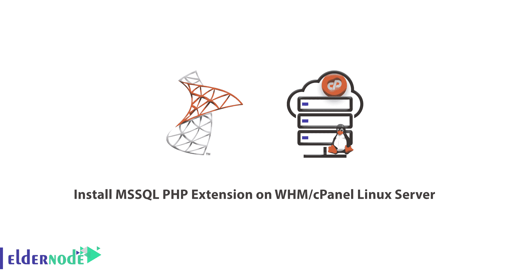

# 如何在 WHM/cPanel Linux 服务器上安装 MSSQL PHP 扩展- Eldernode

> 原文：<https://blog.eldernode.com/install-mssql-php-extension/>



教程在 WHM/cPanel Linux 服务器上安装 MSSQL PHP 扩展。

为了启用 MSSQL PHP 扩展，我们不能使用 EasyApache。我们需要安装 FreeTDS 并在服务器上配置它。目前，没有可以直接下载 MSSQL 的脚本，没有办法通过 [cPanel](https://blog.eldernode.com/tag/cpanel/) 本身来启用 MSSQL，因为这不是 EasyApache 的一部分。您可以按照这里提到的步骤尝试手动安装 MSSQL。

### 在 Linux 服务器上安装 MSSQL PHP 扩展

在安装 MSSQL 之前，您需要在服务器上安装以下模块:

*   1) unixODBC
*   2)免费
*   3) mssql.so

使用以下步骤安装 MSSQL:

1)使用以下命令安装 unixODBC 软件包。

```
wget http://www.unixodbc.org/unixODBC-2.2.14-p2.tar.gz  tar -xvf unixODBC-2.2.12.tar.gz  cd unixODBC-2.2.12  ./configure -prefix=/usr/local -enable-gui=no  make  make install 
```

2)使用下面的命令安装 freeTDS 包。

从 FTP://FTP . free TDS . org/pub/free TDS/old/0.82/free TDS-0.82 . tar . gz 下载

```
wget ftp://ftp.freetds.org/pub/freetds/old/0.82/freetds-0.82.tar.gz  tar -xvf freetds-0.82.tar.gz  ./configure -with-tdsver=8.0 -with-unixODBC=/usr/local  make  make install 
```

3)配置 FreeTDS

FreeTDS 是一组与 UnixODBC 驱动程序相结合的库函数，允许您的 [Linux 服务器](https://eldernode.com/)和应用程序支持 MSSQL server。

在服务器中找到 freetds.conf 配置文件，默认位置是/usr/local/etc/freetds.conf

```
[MSHOSTNAME]  host = MSHOSTNAME  port = 1433  tds version = 8.0 
```

4)在 cPanel 服务器中，大多数扩展文件位于/home/cpeasyapache/src/PHP-x . x . x/ext。因此，导航到该文件夹并执行以下命令来安装 MSSQL。

```
cd /home/cpeasyapache/src/php-x.x.x/ext/mssql  phpize  ./configure  make  make install 
```

以上命令将在服务器上安装 MSSQL，并在已安装的扩展目录中安装 mssql.so 的副本。检查并确保 mssql.so 存在，并使用下面的命令将以下内容添加到 php.ini 中。

```
php -i | grep php.ini 
```

配置文件(php.ini)路径= >/opt/cpanel/ea-PHP 56/root/etc

加载的配置文件= >/opt/cpanel/ea-PHP 56/root/etc/PHP . ini

```
vi /opt/cpanel/ea-php56/root/etc/php.ini    extension=”mssql.so” 
```

重新启动 httpd 以启用更改:

服务 httpd 重新启动

使用以下命令检查安装的模块:

```
php -m | grep mssql  mssql 
```