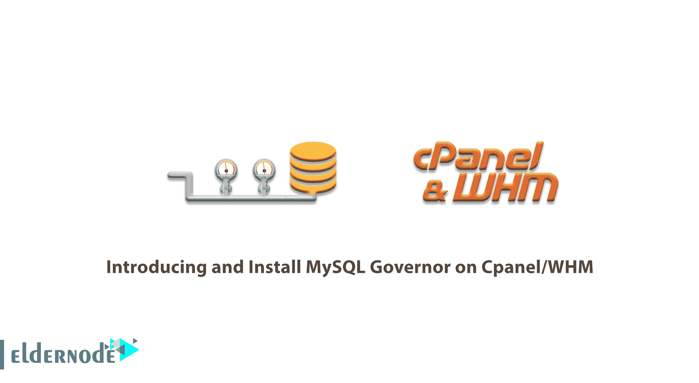

# 介绍并在 CPanel/WHM -埃尔德节点上安装 MySQL Governor

> 原文：<https://blog.eldernode.com/install-mysql-governor-on-cpanel/>



MySQL Governor 是一款软件，用于在共享托管环境中监控和限制 MySQL 的使用。Governor 监控 MySQL 的使用和 throttle 滥用者，防止他们使服务器过载，从而提高整体稳定性和性能。它允许您自动检测和扼制滥用者，并保持您的服务器高性能。由于保持 MySQL 的稳定很困难，这可能是共享主机公司的一个问题。所以，MySQL Governor 在这里发挥了它的作用。在本文中，您将学习**在 cPanel/WHM** 上介绍和安装 MySQL Governor。您可以访问 [Eldernode](https://eldernode.com/) 中的可用包，并购买一台 [VPS 托管](https://eldernode.com/vps-hosting/)服务器。

## **在 CPanel 上介绍 MySQL Governor/WHM**

### **什么是 MySQL 总督？**

MG (MySQL Governor)使用 dbtop 实用程序来查看每个客户的使用情况，并确保系统管理员了解发生的情况。dbtop tool 是一个 CL 包，它可以让系统管理员查看每个系统用户在 MySQL 级别发生了什么，非常类似于经典的 mytop Unix 实用程序。MySQL Governor 跟踪每个用户的系统使用情况，如果发现，它会限制 MySQL 查询。

### **MySQL 调控器特性:**

1-稳定、简单的限值被视为 LVE 限值的一部分。

2-自动检测和删除长时间运行的查询。

3- MySQL 5.1-5.7 支持

4-支持 MariaDB 5.x 和 10.x

***注意** :* MariaDB 10.4 和 10.5 *不被 CPanel 支持*。

### **MySQL 调速器多种模式**

根据配置的不同，MySQL Governor 有多种操作模式:

在仅监控模式下工作，使用不同的节流方案。将所有达到限制的用户放入一个预定义的 LVE 中。

***注意:*** 将 MySQL 查询放入用户的 LVE，或者仅当达到 MySQL 调控器限制时将用户放入其 LVE，这是默认的操作模式。

## **如何在 CPanel 上安装 MySQL 调速器**

你可以安装 MySQL Governor，因为它与 [cPanle](https://blog.eldernode.com/tag/cpanel/) 、 [DirectAdmin](https://blog.eldernode.com/tag/directadmin/) 、 [Plesk](https://blog.eldernode.com/tag/plesk/) 、ISPManager、InterWorx 兼容，甚至与没有控制面板的普通服务器兼容。这些说明应该适用于上述任何类型的服务器，它是在基于 cPanel 的机器上测试的。建议您在安装 MySQL 调控器之前创建一个完整的数据库备份，包括系统表。

要对所有 MySQL 数据库和用户权限进行完整备份，请运行:

```
mysqldump --all-databases > /root/all_databases.sql
```

在开始安装 MySQL Governor 之前，您需要删除以前安装的软件包，如果您正在运行 MySQL Server。

```
yum remove db-governor db-governor-mysql
```

### **在 cPanel / WHM** 上安装 MySQL Governor

让我们通过这个指南的步骤来学习和完成它。

首先，要安装 governor-mysql 包，请运行以下命令:

```
yum install governor-mysql -y
```

然后，要完成安装，请运行以下 python 脚本:

```
/usr/share/lve/dbgovernor/mysqlgovernor.py --install
```

现在，如果您正在运行 MariaDB，请改用以下命令:

```
yum install governor-mysql
```

接下来，当您运行下面的命令时，请确保将“mariadbXX”替换为您正在运行的正确的 MariaDB 版本。

*例如:*

1)对于 MariaDB v5.5，55

2)对于 MariaDB v10.0，100

3)对于 MariaDB v10.1，101

*点*:Maria db 10.4 版本还不支持 CloudLinux 6。

```
/usr/share/lve/dbgovernor/db-select-mysql --mysql-version=mariadbXX
```

```
/usr/share/lve/dbgovernor/mysqlgovernor.py --install
```

从现在开始，你的 CloudLinux 系统使用 MySQL governor 来监控和限制你的 MySQL 脚本滥用者。

### **如何在 WHM 上配置 MySQL 调速器**

MySQL 调控器配置位于下面:

```
/etc/container/mysql-governor.xml
```

当您想要手动编辑其配置时，建议您使用官方的 dbctl 实用程序。当您看到一切正常时，重新启动系统服务以应用更改:

```
service db_governor restart
```

还可以使用 dbctl 或通过更改配置文件来指定操作模式。dbuser-map 文件位于*/etc/container/dbuser-map*中。

**启动和停止**

首先:

```
service db_governor start
```

要停止:

```
service db_governor stop
```

### **卸载 MySQL 总督**

使用以下命令删除 MySQL 调控器:

```
/usr/share/lve/dbgovernor/mysqlgovernor.py --delete
```

## 结论

本文向您介绍了在 Cpanel/WHM 上介绍和安装 MySQL Governor。可以设置不同时间段(1.5 秒或 1.5 分钟)的不同限值，例如电流、短、中和长。如果您有兴趣了解更多信息，请找到我们关于 MySQL 查询故障排除的文章[并在](https://blog.eldernode.com/mysql-queries-troubleshooting/) [Eldernode 社区](https://community.eldernode.com/)与您的朋友讨论。