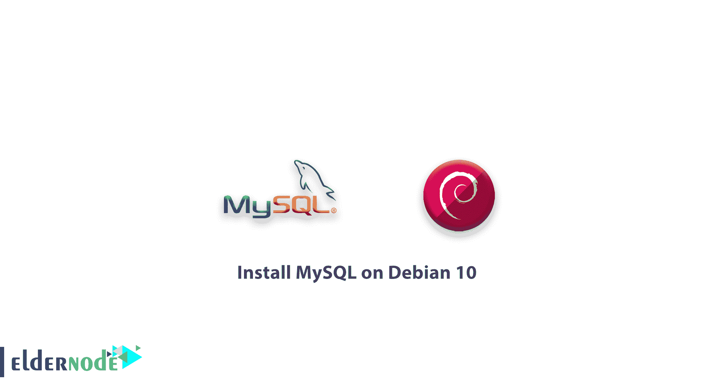

# 如何在 Debian 10 上安装 MySQL——在 Debian 10 上安装最新的 MySQL

> 原文：<https://blog.eldernode.com/install-mysql-on-debian-10/>



我们带着新的安装教程回来了，在这篇文章中，你将学习如何在 Debian 10 上安装 MySQL。 [MySQL](https://www.mysql.com/) 是一个开源的数据库管理系统，用户可以存储和检索各种应用程序的数据。正如你所猜测的，MySQL 是*灯*栈中的 M。在接下来的内容中，您将看到 MySQL 最新版本的安装，您将添加这个存储库，安装 MySQL 软件本身，保护安装，最后，您将测试 MySQL 是否正在运行并响应命令。

**先决条件**

如果您知道以下内容，本教程可能会更有用:

## 如何在 Debian 10 上安装 MySQL

### 1- 添加 MySQL 软件库

要处理配置和安装 MySQL 软件库，您可以使用。deb 包。在建立了存储库之后，你将能够使用 Debian 的标准 apt 命令来安装软件。

```
sudo apt update
```

然后你需要安装必备的 [GnuPG](https://gnupg.org/) 包。

```
sudo apt install gnupg 
```

apt 在确认安装后会安装 GnuPG 及其依赖项。那么你应该下载 MySQL 。deb 用 wget 打包，然后用 dpkg 命令安装。使用 wget 下载文件后，记得将您刚刚复制的地址粘贴到下面突出显示的部分:

```
cd /tmp  wget https://dev.mysql.com/get/mysql-apt-config_0.8.13-1_all.deb 
```

列出文件，确保文件已经下载到当前目录中。

```
ls 
```

应显示文件名列表。

输出

```
mysql-apt-config_0.8.13-1_all.deb  . . .
```

然后，就可以安装了。

```
sudo dpkg -i mysql-apt-config*
```

要使新软件包可用，请刷新您的 apt 软件包缓存，因为软件包现在将完成添加存储库。

```
sudo apt update 
```

添加 MySQL 存储库后，您就可以安装实际的 MySQL 服务器软件了。您可以运行sudo dpkg-reconfigure MySQL-apt-config来更新这些存储库的配置。T o 刷新你的包缓存，只需选择一个新选项然后 sudo apt-get 更新。

[购买 Linux 虚拟主机](https://eldernode.com/linux-hosting/)

### 2- 安装 MySQL

要安装最新的 MySQL 服务器包，现在可以使用 apt 。

```
sudo apt install mysql-server 
```

apt 所做的是查看所有可用的 mysql-server 包，并确定该包所提供的 mysql 是最新和最好的候选包。键入 y 然后回车安装软件。在安装的配置阶段，您将被要求设置一个 **root** 密码。确保选择一个[安全密码](https://eldernode.com/how-to-create-strong-password/)以继续。

要检查 MySQL 的安装和运行，请键入以下命令。

```
sudo systemctl status mysql 
```

```
mysql.service - MySQL Community Server     Loaded: loaded (/lib/systemd/system/mysql.service; enabled; vendor preset: enabled)     Active: active (running) since Thu 2019-07-25 17:20:12 UTC; 3s ago       Docs: man:mysqld(8)             http://dev.mysql.com/doc/refman/en/using-systemd.html    Process: 2673 ExecStartPre=/usr/share/mysql-8.0/mysql-systemd-start pre (code=exited, status=0/SUCCESS)   Main PID: 2709 (mysqld)     Status: "Server is operational"      Tasks: 39 (limit: 4915)     Memory: 378.4M     CGroup: /system.slice/mysql.service             └─2709 /usr/sbin/mysqld    Jul 25 17:20:10 sammy systemd[1]: Starting MySQL Community Server...  Jul 25 17:20:12 sammy systemd[1]: Started MySQL Community Server. 
```

当 Active: active (running) 行出现时，您可以确保 MySQL 安装并运行。

**建议改为**

[教程在 Ubuntu 上安装 MySQL 20](https://eldernode.com/installing-mysql-on-ubuntu-20/)

### 3- 保护 MySQL

要在新安装的系统上执行一些与安全相关的更新，您可以运行以下命令。

```
mysql_secure_installation 
```

### `4- 测试 MySQL`

`要连接到服务器并输出一些版本和状态信息，请键入:`

```
`mysqladmin -u root -p version`
```

`如果您收到以下输出，您可以确保 MySQL 服务器正在运行。`

``输出``

```
``mysqladmin  Ver 8.0.17 for Linux on x86_64 (MySQL Community Server - GPL)  Copyright (c) 2000, 2019, Oracle and/or its affiliates. All rights reserved.    Oracle is a registered trademark of Oracle Corporation and/or its  affiliates. Other names may be trademarks of their respective  owners.    Server version      8.0.17  Protocol version    10  Connection      Localhost via UNIX socket  UNIX socket     /var/run/mysqld/mysqld.sock  Uptime:         3 min 9 sec    Threads: 2  Questions: 10  Slow queries: 0  Opens: 128  Flush tables: 3  Open tables: 48  Queries per second avg: 0.052``
```

``**总之**，上面的输出确认您已经成功安装并保护了最新的 MySQL 服务器，它应该可以为许多流行的应用程序工作。``

``亲爱的用户，我们希望这篇教程能对你有所帮助，如果你有任何问题或想查看我们的用户关于这篇文章的对话，请访问[提问页面](https://eldernode.com/ask)。也为了提高你的知识，有这么多有用的教程为[老年节点培训](https://eldernode.com/blog/)准备。``