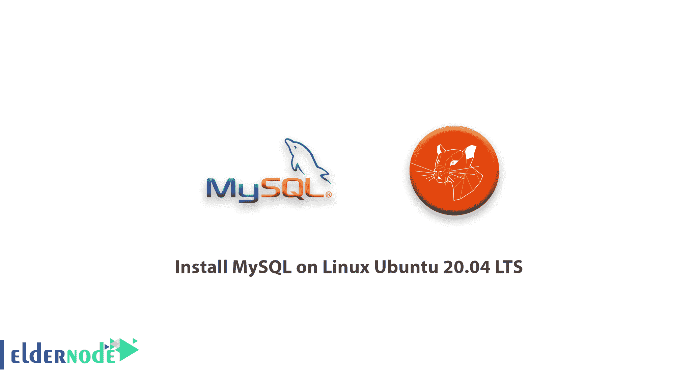

# 如何在 Linux Ubuntu 20.04 上安装 MySQL LTS-elder node

> 原文：<https://blog.eldernode.com/install-mysql-on-linux-ubuntu-20-04/>



在本教程中，我们将通过 5 个步骤来讲述如何在 [Linux](https://blog.eldernode.com/tag/linux/ "Linux") Ubuntu 20.04 LTS 上安装 MySQL，并向您展示如何在 Linux Ubuntu 20 [Linux 服务器](https://eldernode.com/linux-vps/ "Linux server")上安装 [MySQL](https://www.mysql.com/) 。

注意:您需要 root 访问权限才能安装。

## 教程在 Linux Ubuntu 20.04 LTS 上安装 MySQL

### 步骤 1–安装 MySQL 服务器

以 root 用户身份登录到您的服务器后，更新 apt，并使用下面的命令运行安装包。此外，使用以下命令安装 MySQL 服务器:

```
sudo apt update  sudo apt install mysql-server 
```

完成 MySQL 安装后，Mysql 服务会自动启动。您可以使用以下命令检查服务状态:

```
sudo systemctl status mysql 
```

### 步骤 2–保护 MySQL 服务器

现在，我们需要保护 MySQL 服务器。为了保护 MySQL，您应该以 root 用户身份运行以下命令:

```
sudo mysql_secure_installation 
```

现在，按照屏幕上的说明完成向导。

```
Securing the MySQL server deployment.  Connecting to MySQL using a blank password.  VALIDATE PASSWORD COMPONENT can be used to test passwords  and improve security. It checks the strength of password  and allows the users to set only those passwords which are  secure enough. Would you like to setup VALIDATE PASSWORD component?  Press y|Y for Yes, any other key for No: y  There are three levels of password validation policy:  LOW Length >= 8  MEDIUM Length >= 8, numeric, mixed case, and special characters  STRONG Length >= 8, numeric, mixed case, special characters and dictionary file  Please enter 0 = LOW, 1 = MEDIUM and 2 = STRONG: 2  Please set the password for root here.  New password:  Re-enter new password:  Estimated strength of the password: 100  Do you wish to continue with the password provided?(Press y|Y for Yes, any other key for No) : y  By default, a MySQL installation has an anonymous user,  allowing anyone to log into MySQL without having to have  a user account created for them. This is intended only for  testing, and to make the installation go a bit smoother.  You should remove them before moving into a production  environment.    Remove anonymous users? (Press y|Y for Yes, any other key for No) : y  Success.  Normally, root should only be allowed to connect from  'localhost'. This ensures that someone cannot guess at  the root password from the network.  Disallow root login remotely? (Press y|Y for Yes, any other key for No) : y  Success.  By default, MySQL comes with a database named 'test' that  anyone can access. This is also intended only for testing,  and should be removed before moving into a production  environment.  Remove test database and access to it? (Press y|Y for Yes, any other key for No) : y  - Dropping test database...  Success.  - Removing privileges on test database...  Success.  Reloading the privilege tables will ensure that all changes  made so far will take effect immediately.  Reload privilege tables now? (Press y|Y for Yes, any other key for No) : y  Success.  All done! 
```

### 步骤 3–管理 MySQL 服务

要停止 MySQL 服务，请运行以下命令:

```
sudo systemctl stop mysql 
```

对于启动 MySQL 服务，运行以下命令:

```
sudo systemctl start mysql 
```

要重启 MySQL，请运行以下命令:

```
sudo systemctl restart mysql 
```

查看 MySQL 服务的状态:

```
sudo systemctl status mysql 
```

### 步骤 4–连接 MySQL 服务器

到目前为止，您已经在 Ubuntu 20.04 上安装了 MySQL 数据库服务器。现在，您应该在命令行上使用以下命令连接到您的数据库服务器。

```
mysql -u root -p 
```

输入 MySQL root 用户密码进行连接:

```
Enter password:  Welcome to the MySQL monitor. Commands end with ; or \g.  Your MySQL connection id is 20  Server version: 8.0.19-0ubuntu5 (Ubuntu)  Copyright (c) 2000, 2020, Oracle and/or its affiliates. All rights reserved.  Oracle is a registered trademark of Oracle Corporation and/or its  affiliates. Other names may be trademarks of their respective  owners.  Type 'help;' or '\h' for help. Type '\c' to clear the current input statement.  mysql> 
```

### 步骤 5–创建 MySQL 用户和数据库

现在，使用以下命令在 MySQL 上创建一个数据库。

```
CREATE DATABASE mydb;  CREATE USER 'myuser'@'localhost' IDENTIFIED by 'Pa$$w0rd';  GRANT ALL on mydb.* to 'myuser'@'localhost'  FLUSH PRIVILEGES 
```

恭喜您，您已经成功完成了在 Linux 上安装 MySQL[Ubuntu 20.04 LTS](https://eldernode.com/introducing-ubuntu-20/ "Ubuntu 20.04 LTS")步骤。