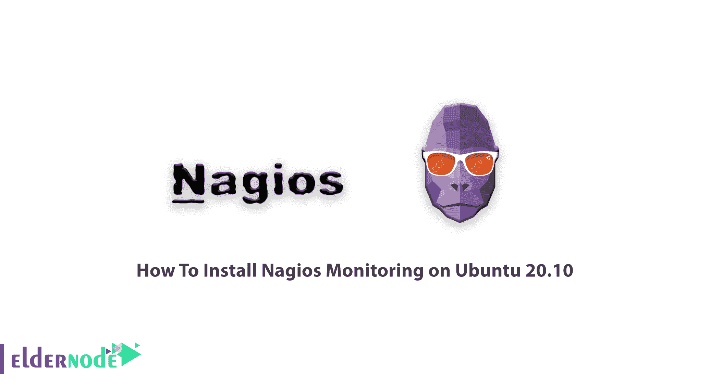
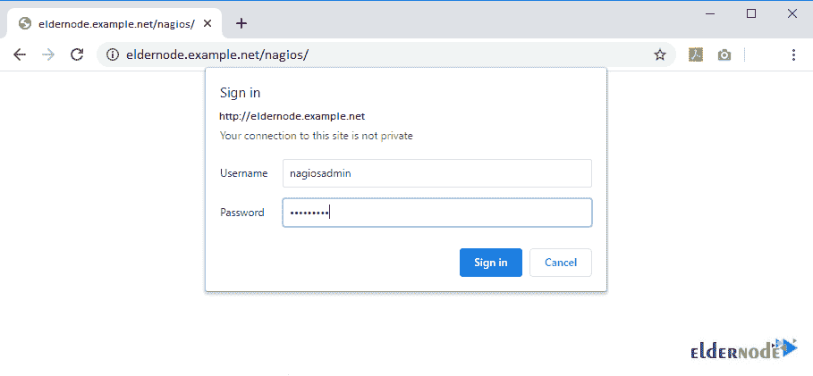
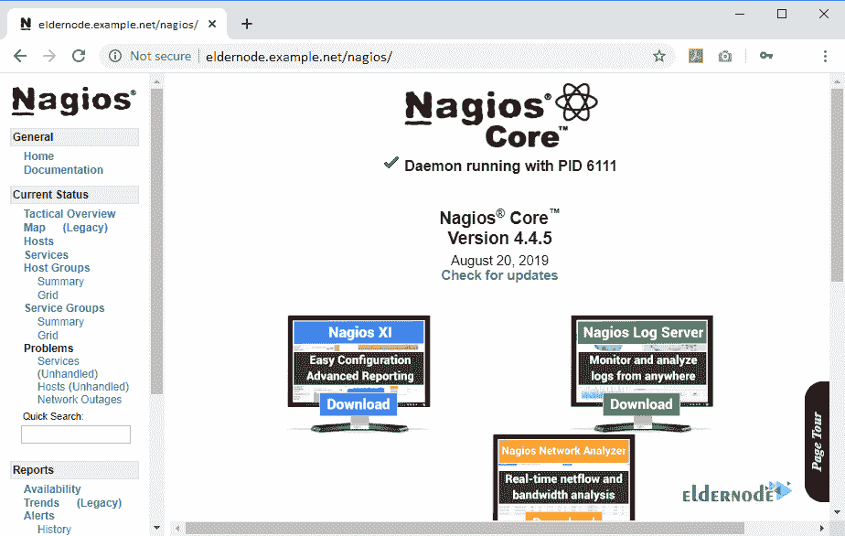

# 如何在 Ubuntu 20.10 - Eldernode 博客上安装 Nagios 监控

> 原文：<https://blog.eldernode.com/install-nagios-monitoring-on-ubuntu-20-10/>



在接下来的[监控工具](https://blog.eldernode.com/website-and-server-monitoring-tools/)教程中，我们将展示 Nagios 安装指南。在任何 Linux 操作系统上，都可以运行这个开源的网络监控系统。因为 Nagios 提供了关键参数的概述，所以您更喜欢在[命令行](https://blog.eldernode.com/linux-server-monitoring-commands/)界面或基于 web 的图形界面中工作。一旦确定了能够修复检测到的网络或服务器问题的关键级别，管理员就会收到电子邮件和文本消息作为警报通知。准备好你自己的 [Linux VPS](https://eldernode.com/linux-vps/) ，继续和我们一起学习如何在 Ubuntu 20.10 服务器上安装 Nagios Monitoring。

为了让本教程更好地发挥作用，请考虑下面的**先决条件** :
一个拥有 sudo 权限的非根用户。

## 教程在 Ubuntu 20.10 上安装 Nagios 监控

为了维护系统和服务的安全性和可用性，您需要监控工具的帮助，以防止对您的业务产生任何负面影响。使用 TCP 端口、SMTP、POP3、HTTP、NNTP、PING 等，Nagios 能够监视网络细节。准备好一个 [Ubuntu VPS](https://eldernode.com/ubuntu-vps/) 之后，你就可以下载并安装 Nagios 了。让我们通过这个指南的步骤来学习和完成它。

### 如何更新您的系统

出于一些安全考虑，最好更新您的系统:

```
sudo apt-get update
```

注意:如果你最近安装了 Ubuntu 系统，你需要 [Apache](https://blog.eldernode.com/apache-web-server-ubuntu-20/) 和 [PHP](https://blog.eldernode.com/install-and-configure-php-on-ubuntu-20-04/) 。运行以下命令来安装它们:

```
sudo apt-get install wget build-essential unzip openssl libssl-dev
```

```
sudo apt-get install apache2 php libapache2-mod-php php-gd libgd-dev
```

### 如何创建 Nagios 用户

安装前的第一步是在您的系统中为 Nagios 创建一个新的用户帐户。使用下面的命令在您的系统中创建一个:

```
sudo adduser nagios
```

要将您创建的用户添加到一个组中，您需要首先为 Nagios 设置“nagcmd”创建一个组。然后，将您的“nagios”用户添加到 Apache 组。

```
sudo groupadd nagcmd
```

```
sudo usermod -a -G nagcmd nagios
```

```
sudo usermod -a -G nagcmd www-data
```

### 如何安装 Nagios 核心服务

是时候安装 Nagios 核心了。可以从[官方网站](https://www.nagios.org/downloads/)免费领取最新版本的 Nagios core。

```
cd /opt/
```

```
wget https://assets.nagios.com/downloads/nagioscore/releases/nagios-4.4.5.tar.gz
```

然后，要将文件移动到您选择的位置，通过运行以下命令提取文件:

```
tar xzf nagios-4.4.5.tar.gz
```

解压缩完成后，使用下面的命令导航到“nagios”源目录并安装。这样就可以用 Ubuntu 编译 Nagios 了。

```
cd nagios-4.4.5
```

```
sudo ./configure --with-command-group=
```

```
sudo make all
```

```
sudo make install
```

```
sudo make install-init
```

```
sudo make install-daemoninit
```

```
sudo make install-config
```

```
sudo make install-commandmode
```

```
sudo make install-exfoliation
```

要为 Nagios web 界面创建多个事件触发器，请在 libexec 目录下复制事件处理程序脚本。

### 如何设置 Apache 认证

要为 Nagios 服务器创建 Apache 配置文件，请运行:

```
sudo vi /etc/apache2/conf-available/nagios.conf
```

为了防止对配置进行更多的更改，请为用户 nagiosadmin 设置 apache 身份验证:

```
htpasswd -c /usr/local/nagios/etc/htpasswd.users nagiosadmin
```

然后，要使新设置生效，请启用 Apache 配置并重新启动 Apache 服务:

```
sudo a2enconf nagios
```

```
sudo a2enmod cgi rewrite
```

```
sudo service apache2 restart
```

### 如何更新您的电子邮件地址

您只需要运行下面的命令来编辑位于目录 usr/local/nagios/etc/objects 中的“contacts.cfg”文件，以包含我们希望接收通知的电子邮件地址。

```
sudo gedit /usr/local/nagios/etc/objects/contacts.cfg
```

### 如何安装 Nagios 插件

在这一步，您应该下载最新的 nagios-plugins 源代码并安装。要执行此运行，请执行以下操作:

```
cd /opt
```

```
wget http://www.nagios-plugins.org/download/nagios-plugins-2.2.1.tar.gz/pre>
```

```
tar xzf nagios-plugins-2.2.1.tar.gz/pre>
```

```
cd nagios-plugins-2.2.1
```

要编译和安装 Nagios 插件，请键入:

```
sudo ./configure --with-nagios-user=nagios --with-nagios-group=nagios --with-openssl/pre>
```

```
sudo make/pre>
```

```
sudo make install
```

### 如何验证设置

要验证 Nagios 安装和配置文件，运行以下命令，然后就可以启动 Nagios 核心服务了。

```
/usr/local/nagios/bin/nagios -v /usr/local/nagios/etc/nagios.cfg
```

```
service nagios start
```

要让 Nagios 在系统引导时自动启动，请通过运行以下命令来配置 Nagios:

```
sudo systemctl enable nagios
```

## 如何在 Ubuntu 上使用 Nagios

您可以通过运行以下命令来确保配置是否正确可见:

```
sudo /usr/local/nagios/bin/nagios -v
```

### 如何访问 Nagios Web 界面

如果您访问 nagios 服务器，就可以访问您的 nagios 设置。为此，您需要使用主机名或 ip 地址后跟/nagios。

```
http://eldernode.example.net/nagios/
```

这样，您已经验证了 Apache。用户名可以是 nagiosadmin，密码是您在设置 Apache 的身份验证步骤时创建的。



登录后，您可以查看如下所示的 Nagios 界面。也可以使用侧边栏按钮查看主机、服务和警报。



## 结论

在本文中，您学习了如何在 Ubuntu 20.10 上安装 Nagios Monitoring。从现在开始，您可以使用这个最流行的工具来监控和解决您的服务器性能问题。如果您有兴趣了解更多信息，可以找到关于[的相关文章，介绍用于 Linux 的 Nagios 监控系统](https://blog.eldernode.com/nagios-monitoring-system-for-linux/)。