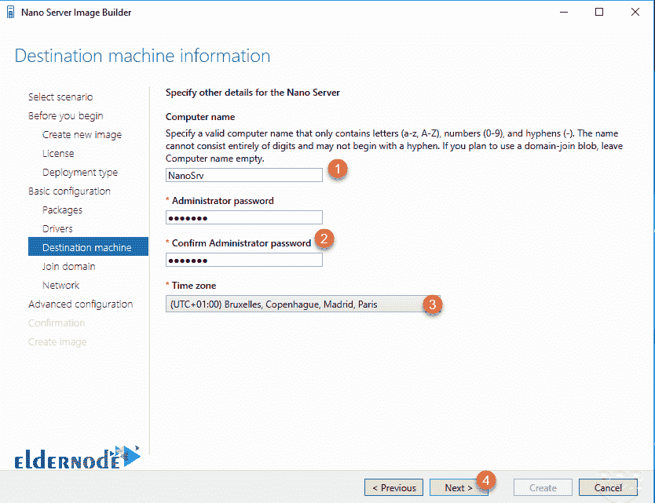

# 如何安装纳米服务器-教程在物理服务器上安装纳米服务器

> 原文：<https://blog.eldernode.com/install-nano-server/>


如何安装 Nano 服务器？ [微软](https://www.microsoft.com/en-us/)提供了一个软件包，通过它你可以图形化地准备和安装一个纳米服务器。Nano Server 是一个没有终端或图形用户界面的无头操作系统。因此，安装的条件和方法是不同的。

要在物理系统或[虚拟服务器](https://eldernode.com/vps/)上安装 Nano 服务器，必须在 PowerShell 中键入各种命令来创建 VHD 、 VHDx 或 Wim 文件。

**注意:** 在本教程中，您不需要输入 PowerShell 命令，您将构建自己的 nano 服务器，而无需输入命令。

本教程包含 3 个一般步骤，如下:

**1。** 纳米服务器安装先决条件

**2。** 构建纳米服务器安装文件

**3。** 在所需系统上安装 Nano 服务器

## 如何安装纳米服务器

### 安装纳米服务器的先决条件

**1。** 您必须先下载并安装以下文件:

[**下载纳米服务器构建文件**](https://www.microsoft.com/en-us/download/details.aspx?id=54065)

[**下载 Windows 评估和部署套件**](https://developer.microsoft.com/en-us/windows/hardware/windows-assessment-deployment-kit)

准备 Nano 服务器创建文件的过程是由一个强大而专业的软件负责的，这个软件叫做 ADK 。 大多数微软专家都熟悉这个软件，知道 ADK 构建专用 Windows 的能力非常高。

**2。** 下载完以上文件后，安装它们，等待 ADK 下载安装想要的文件。

### 构建纳米服务器安装文件

**1。**首先，**打开**纳米服务器镜像构建器软件。

**2。**第一步，点击创建一个新的 Nano 服务器镜像。

**3。**下一步，点击下一步。


**4。**在此处输入 **Windows Server 2016** 的 ISO 地址，点击下一步。 

**注意，您必须挂载ISO 并输入创建的驱动器的地址。**


**5。**检查许可协议并进入下一步。


**6。**在这一部分中，首先指定是将 nano 服务器安装在虚拟机上还是安装在物理机上。

然后输入一个**路径**到保存创建的图像。

**注意:** 如果选择虚拟机镜像，可以输出 VHD 或者 VHDx 文件。 如果您选择了物理机镜像，您也可以获得 Wim 输出。

最后一部分，进入报告文件(Log)的路径，进入下一个步骤。


**7。**在检测目的地… 部分，您必须选择一个闪存盘来复制 **Nano Server** 文件，并进行 flash boot 来将 Nano Server 安装在 **物理机** 上。

选择 Flash ，点击 Create 准备 Flash。

#### 修复 PowerShell 脚本执行错误

当点击创建选项时，如果直到 flash 制作结束都没有问题，则进入下一步，但如果出现错误，则必须小心遵循以下步骤。

出现错误，以管理员权限打开你的 Windows PowerShell ，输入以下命令:

```
Set-ExecutionPolicy Unrestricted
```

输入上述命令后，脚本执行策略发生变化，使用以下命令，可以看到作用域列表及其设置。

```
Get-Executionpolicy -list
```


再次点击创建，闪存启动后进入下一步。

**8。**在继续第 7 步时，点击下一步开始与您的个人纳米服务器相关的设置。

**9。**选择需要的版本，然后选择需要默认安装在 Nano 服务器上的角色。


**10。**在这一步，您可以添加与您的系统相关的硬件驱动程序。


**11。**设置您机器的规格，包括系统名、管理员密码和时区。



**12。**如果纳米服务器要连接到域，输入其名称。


**13。**进行网络相关设置，如静态 IP 、 vLAN 和 WinRM 设置，进入下一步。


**14。**在这个部分，你将有权选择两个不同的选项:

**–****创建基本的纳米服务器镜像**:开始创建纳米服务器镜像。

**–****继续配置高级设置**:在安装 Nano 服务器之前进入高级设置。


### 高级纳米服务器配置设置

在这些步骤中，你有能力添加 PowerShell 脚本到**运行**，**添加服务包**，**远程控制设置**等。才能进入验证阶段。

**15。**在这一步，你会看到一份你到目前为止所做设置的报告，如果你确认，点击创建。


> **等待您的定制 nano 服务器映像被创建。**

**16。**完成 Nano 服务器镜像的构建后，就可以完成本节的步骤了。

你也可以点击创建 USB 来创建 **flash boot** 来安装 Nano 服务器。


### 打造纳米服务器 flash boot

**–**首先选择想要的闪光灯。


**–**然后选择 UEFI 或 BIOS 类型，点击下一步。

闪存分区将在此部分完成，您可以根据需要进行编辑。


**–**您将收到一份完成设置的报告，如果确认，点击创建。

**等待你的闪开机制作。**

**–**完成后，您可以将闪存连接到系统，并在其上安装纳米服务器。


**亦作，见:**

[如何连接到 Nano 服务器](https://eldernode.com/connect-to-nano-server)

**尊敬的用户**，我们希望您能喜欢这个[教程](https://eldernode.com/category/tutorial/)，您可以在评论区提出关于本次培训的问题，或者解决[老年人节点培训](https://eldernode.com/blog/)领域的其他问题，请参考[提问页面](https://eldernode.com/ask)部分，并尽快提出您的问题。腾出时间给其他用户和专家来回答你的问题。

好运。