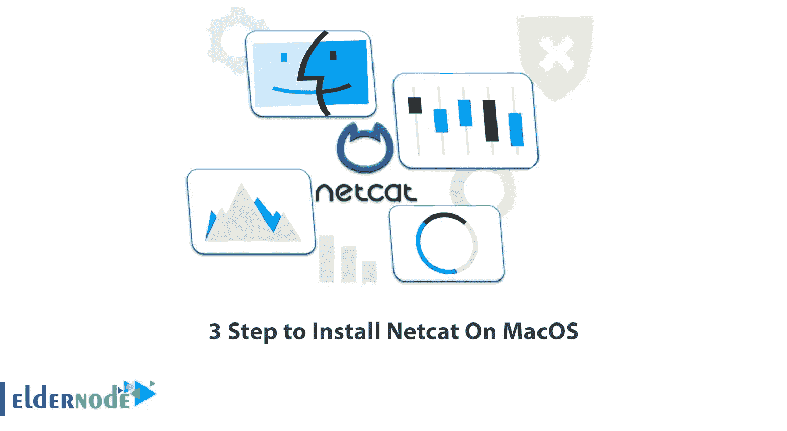

# 在 MacOS 上安装 Netcat 的 3 个步骤

> 原文：<https://blog.eldernode.com/install-netcat-on-macos/>



Netcat 是一个通过 TCP 和 UDP 端口的通信工具。使用这个工具，您可以在两个操作系统之间建立连接。Netcat 工具被认为是 pentesters 中的一个重要工具，有很多用途。有趣的是，Netcat 工具非常有用，每个黑客(Pentester)都应该知道如何使用这个神奇的工具。这种工具被称为多功能瑞士军刀，并被称为指挥数控。这个工具可以安装在 Windows 和 Linux 上。在本文中，我们将教你在 MacOS 上安装 Netcat 的 3 个步骤。如果你想[购买 VPS](https://eldernode.com/vps/) 服务器，你可以访问 [Eldernode](https://eldernode.com/) 网站上提供的套装。

## **教程在 MacOS 上安装 Netcat**

### **Netcat**简介

端口扫描是 [Netcat](https://blog.eldernode.com/install-and-use-netcat-on-kali-linux/) 最常见的用途之一。您可以扫描一个端口或一系列端口。通过创建基本的客户机/服务器模型，Netcat 可用于将数据从一台主机路由到另一台主机。这是通过设置 Netcat 使用接收主机上的特定端口，然后从另一台主机建立常规 TCP 连接并通过它发送文件来实现的。您还可以使用 Netcat 向远程服务器发送各种请求。

## **在 MacOS 上安装 Netcat**

正如我们在第一部分中所解释的，您可以很容易地在 Windows、Linux 和 Mac 操作系统上安装 Netcat。下面，我们将教大家如何在 [MacOS](https://blog.eldernode.com/tag/mac/) 上安装 Netcat。

### **1)** 在 MacOS 中打开终端

要打开终端，第一步可以轻松按 command+space。这样做之后，你需要键入**终端**，然后点击**回车**:

```
command+space
```

### **2)在 MacOS 上安装自制软件**

打开终端后，在此阶段您必须键入以下命令，然后运行它。这样你就可以在 MacOS 上安装自制软件了。请注意，安装 Homebrew 需要安装 netcat:

```
/bin/bash -c "$(curl -fsSL https://raw.githubusercontent.com/Homebrew/install/HEAD/install.sh)"
```

执行上述命令后，您将被要求输入密码。请注意，在这个阶段，您必须输入 Mac 的密码，然后按 enter 键。

现在，您可以轻松地运行以下命令来使 brew 可用:

```
echo 'eval "$(/opt/homebrew/bin/brew shellenv)"' >> ~/.zprofile
```

### **3)安装 netcat**

成功完成上述步骤后，您现在可以通过运行以下命令在 MacOS 上简单地安装和使用 Netcat:

```
brew install netcat
```

## 结论

您可以使用 Netcat 来调试和监控网络连接、扫描开放的端口、传输数据、充当代理等等。在本文中，我们试图教你在 MacOS 上安装 Netcat 的 3 个步骤。如果你有任何问题，你可以在评论区和我们分享。