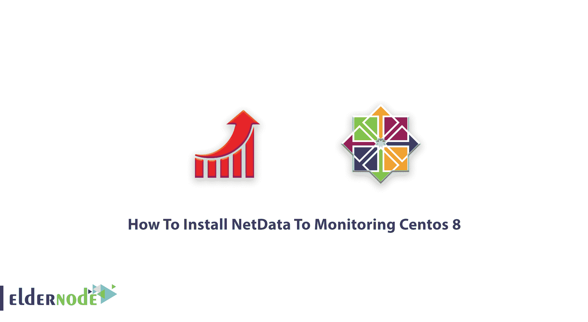

# 如何将 NetData 安装到监控 Centos 8 - Eldernode 博客

> 原文：<https://blog.eldernode.com/install-netdata-to-monitoring-centos-8/>



作为 IT 专业人员、系统管理员、SRE 或 DevOps 工程师，您需要 Netdata 来帮助您从系统和应用程序中收集所有可能的指标，实时可视化这些指标，并解决复杂的性能问题。在本文中，我们尝试教您如何**将 NetData 安装到 Monitoring Centos 8** 。同样，需要一台完美的 [Centos VPS](https://eldernode.com/centos-vps/) 服务器的人可以使用 [Eldernode](https://eldernode.com/) 的最佳服务。

## 教程将 NetData 安装到监控中心 8

[**NetData**](https://blog.eldernode.com/netdata-monitoring-system-for-linux/) 之所以受欢迎，是因为虽然它使用简单，但您会发现它对于每个监控、可视化和故障排除都非常灵活。您可以使用 NetData 执行一些活动，例如收集、可视化、监控、故障排除、存储、导出和流式传输。Netdata 是免费的开源软件，目前运行在 T4 的 Linux、FreeBSD 和 macOS 上。通过这篇文章来了解 NetData 的**安装。**

### 【NetData 监控什么

这款面向应用和基础架构系统的强大实时分布式运行状况和性能监控工具监控的内容如下:

**1-** 总的和每个内核的 CPU 使用率、中断、软中断和频率。

**2-** 总内存、RAM、交换和内核使用量。

**3-** 磁盘 I/O(每个磁盘:带宽、操作、积压、利用率等)。

**4-** 监控网络接口，包括带宽、数据包、错误、丢弃等。

**5-** 监控 Netfilter / iptables Linux 防火墙连接、事件、错误等。

**6-** 流程(运行、阻塞、分叉、活动等)。

**7-** 具有进程树的系统应用(CPU、内存、交换、磁盘读/写、线程等)。

**8-** MySQL 数据库监控:查询、更新、锁、问题、线程等。

**9-** Postfix 邮件服务器消息队列。

**10-** Squid 代理服务器带宽和请求监控。

**11-** 硬件传感器(温度、电压、风扇、电源、湿度等)。

**12-** SNMP 设备

**13-** 用 mod_status 进行 Apache 和 Nginx 状态监控。

## 将 NetData 安装到监控中心 8

让我们回顾一下以下步骤，以学习并完成本指南。

**1-如何更新系统**

首先，让我们确保你的系统是最新的。

```
sudo dnf clean all
```

```
sudo dnf update
```

```
sudo dnf install git zlib
```

```
–devel libuuid–devel libmnl gcc make git autoconf automake pkgconfig curl findutils
```

接下来，您应该检查是否安装了所有依赖项，或者是否登录到您的服务器运行以下命令:

```
sudo dnf -y install git zlib-devel libuuid-devel libmnl gcc make git autoconf automake pkgconfig curl findutils
```

接下来是从 Github 克隆 Netdata 代码。之后，安装后应自动启动 Netdata 服务。

```
git clone [https://github.com/netdata/netdata.git](https://github.com/netdata/netdata.git) --depth=100
```

完成后，要开始构建和安装，请运行:

```
cd netdata/ sudo ./netdata-installer.sh
```

**2-如何访问 Netdata 用户界面**

当 NetData 监听端口 19999 上的所有 IP 时，如果您有 [firewalld](https://blog.eldernode.com/configure-firewalld-on-centos-8/) 服务，您可以允许在局域网内访问该端口。

```
sudo firewall-cmd --permanent --add-rich-rule 'rule family="ipv4"
```

```
source address="192.168.122.0/24" port protocol="tcp" port="19999" accept'
```

**3-如何为 Netdata 配置防火墙。**

如果服务器没有暴露在互联网上，请随意允许从任何 IP 访问。

```
sudo firewall-cmd --add-port=19999/tcp --permanent
```

您应该重新加载 firewalld 以应用更改。

```
sudo firewall-cmd --reload
```

这样，您就可以访问 Netdata Web dashboard 上的服务器 IP 地址和端口 **19999** 。

## 结论

在本文中，您了解了如何将 NetData 安装到 Monitoring Centos 8。从现在开始，通过启动这个快速有效的工具，您已经提供了一个帮助您构建非凡基础设施的环境。