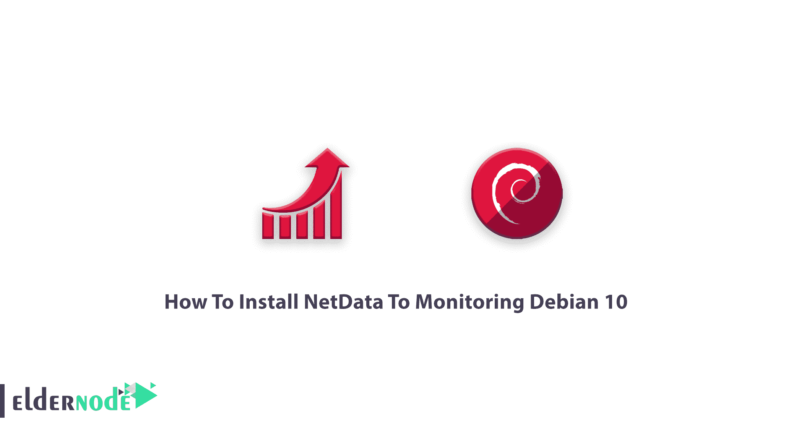

# 如何安装 NetData 来监控 Debian 10 - Eldernode 博客

> 原文：<https://blog.eldernode.com/install-netdata-to-monitoring-debian-10/>



在接下来的服务器监控工具教程中，你将学习如何在 Debian 10 上安装 NetData。在讨论这个工具之前，看看在 [Eldernode](https://eldernode.com/) 上提供的完美的 [Linux VPS](https://eldernode.com/linux-vps/) 包，并购买一个以使这个指南更好地工作，并享受我们的支持团队服务和最优惠的价格。如果您需要可视化系统上的流程和服务，NetData 是免费的、简单的，并且易于与可扩展的 web 仪表板一起使用。此外，作为 IT 专业人员或服务器管理员，您需要监控 CPU、RAM、磁盘 I/O 和网络流量的使用情况。NetData 将在不中断系统核心功能的情况下为您提供帮助。

## 教程安装 NetData 来监控 Debian 10

为了让本教程更好地工作，请考虑下面的**先决条件:**

**1-** 您系统上安装的 Debian 10 台式机/服务器

**2-** 作为拥有 sudo 权限的非根用户通过 [SSH](https://blog.eldernode.com/ssh-keys-debian-10/) 连接

**3-** 按照 Debian 10 的[初始设置进行设置](https://blog.eldernode.com/initial-setup-with-debian-10/)

由于 NetData 被设计为安装在每一个 Linux 系统上，所以请阅读本文，了解如何将这个开源工具和监控代理安装到监控 Debian 10 上，以了解您的

[Linux](https://blog.eldernode.com/tag/linux/)

.

## 安装 NetData 来监控 Debian 10

让我们通过本指南的 7 个步骤来学习并完成它。

### 如何更新系统

一如既往，出于某种安全目的，第一步尝试更新您的系统:

```
sudo apt-get update
```

```
sudo apt-get upgrade
```

### 如何安装依赖关系

要安装 NetData，您需要安装依赖项。要安装所有必需的依赖项，请运行:

```
sudo apt-get install zlib1g-dev uuid-dev libmnl-dev gcc make git autoconf autoconf-archive autogen automake pkg-config curl
```

### 如何安装 Netdata

在此步骤中，官方安装脚本将帮助您开始安装 NetData。为了确保这一点，您为您的 shell 运行了 **bash** ，键入:

```
bash
```

然后，您可以直接从 GitHub 源代码安装 Netdata:

```
git clone https://github.com/firehol/netdata.git --depth=1 ~/netdata
```

键入以下命令，将目录更改为克隆目录:

```
cd netdata
```

运行以下命令，使用 netdata-installer.sh 脚本安装 Netdata:

```
sudo ./netdata-installer.sh
```

在安装过程运行时，不要忘记按 Enter 键开始安装。然后，您会看到 Netdata 守护程序将会启动。此外，为了能够启动、停止和获取 Netdata 服务的状态，请使用以下命令:

```
sudo systemctl start netdata
```

```
sudo systemctl stop netdata
```

```
sudo systemctl status netdata
```

### 如何配置防火墙

当 NetData 在端口 19999 上运行时，您应该允许它通过 [UFW](https://blog.eldernode.com/set-up-firewall-ufw-debian-10/) 防火墙。请注意，Debian 10 中默认不安装 UFW，您需要使用以下命令来安装它:

```
sudo apt-get install ufw -y
```

要在安装后启用 UFW，请运行:

```
sudo ufw enable
```

现在，您应该允许端口 19999 使用 UFW 防火墙:

```
sudo ufw allow 19999/tcp
```

最后，要重新加载防火墙以应用所有更改，请键入:

```
sudo ufw reload
```

没有延迟配置 UFW 后，您就可以开始访问 NetData web 界面了。

### 如何访问 Netdata Web 界面

要查看监控界面，您需要在 web 浏览器中键入 URL**http://your-server-IP:19999**以重定向到 Netdata 仪表板。

```
http://<your-server-IP>:19999
```

然后，您可以编辑 NetData 配置文件以提供更多配置:

```
sudo vi /etc/netdata/netdata.conf
```

最后，要查看当前配置，请运行:

```
http://<your-server-IP>:19999/netdata.conf
```

### 如何卸载 Netdata

使用以下命令从系统中删除 Netdata:

```
cd netdata
```

```
sudo /netdata-uninstaller.sh --force
```

### 如何更新网络数据

最后，运行以下命令将 Netdata 更新到最新版本:

```
cd netdata
```

```
git pull
```

```
sudo ./netdata-installer.sh
```

## 结论

在本文中，您了解了如何安装 NetData 来监控 Debian 10。从现在开始，您可以使用这个工具实时监控各种系统指标。如果您有兴趣阅读更多内容，可以找到相关文章[介绍 net data Monitoring System for Linux。](https://blog.eldernode.com/netdata-monitoring-system-for-linux/)