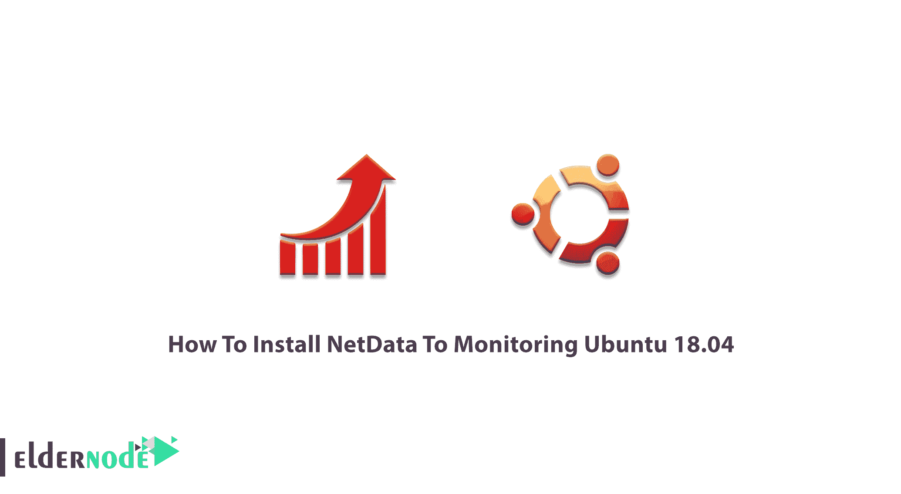

# 如何安装 NetData 来监控 Ubuntu 18.04 - Eldernode 博客

> 原文：<https://blog.eldernode.com/install-netdata-to-monitoring-ubuntu-18-04/>



之前， [NetData](https://blog.eldernode.com/netdata-monitoring-system-for-linux/) 给大家介绍过。很明显，您需要选择一个服务器监控工具来收集并向您的客户端实时发送定制的每日、每周和每月报告。NetData 是一个开源的监控工具，免费支持 Linux、macOS 和 FreeBSD。在这篇文章中，你将学习如何**安装 NetData 来监控 Ubuntu 18.04** 。如果你希望开始在你自己的 [Linux VPS](https://eldernode.com/linux-vps/) 上托管你的站点，我们完美的软件包肯定会是你的选择之一。NetData 将通过监控整个 IT 基础设施来帮助您排除 Ubuntu VPS 服务器的故障，准备一个继续本指南。

## **教程安装 NetData 来监控 Ubuntu**

为了让本教程更好地发挥作用，请考虑以下**先决条件**:

拥有 sudo 权限的非 root 用户。

要进行设置，请遵循我们在 Ubuntu 18.04 上的[初始服务器设置。](https://blog.eldernode.com/initial-setup-ubuntu-18/)

## **安装 NetData 来监控 Ubuntu 18.04**

当你使用 Linux 时，安装一个合适的工具在你的系统上运行来观察你的服务器上发生了什么并不困难。让我们通过这篇文章的步骤来学习如何在你的 Ubuntu 服务器上安装 NetData 作为一个监控工具。

### **在 Ubuntu 18.04 上安装 NetData**

第一步:按照惯例，你应该首先**更新**你的服务器。请注意，要升级内核，您必须重启服务器。所以，考虑一个不打扰你生产时间的完美时机。

```
sudo apt-get update  sudo apt-get upgrade
```

**步骤 2:** 使用下面的命令安装一些**依赖包**，这是一个必需的预安装步骤。

```
sudo apt-get install zlib1g-dev uuid-dev libmnl-dev pkg-config curl gcc make autoconf autoconf-archive autogen automake python python-yaml python-mysqldb nodejs lm-sensors python-psycopg2 netcat git -y
```

**第三步:**

要从 [Git](https://github.com/netdata/netdata) 克隆 net data 包，请键入以下命令。

```
sudo git clone https://github.com/firehol/netdata.git --depth=1 ~/netdata
```

**第四步:**

在这一步中，您可以通过运行以下命令在您的服务器上安装 Netdata:

```
sudo apt install netdata
```

**第五步:**

现在，您需要**配置** Netdata 监控。请注意，缺省情况下，Netdata 缺省配置文件位于/etc/netdata/netdata.conf。您应该打开文件，将服务器回送地址更改为您的服务器的 IP 地址。

```
sudo nano /etc/netdata/netdata.conf
```

然后，您可以保存并关闭文件，并通过运行下面的命令**应用**更改:

```
sudo systemctl restart netdata
```

此外，您可以通过键入以下命令来检查 Netdata 的**状态**；

```
sudo systemctl status netdata
```

**步骤 6:** 此安装的另一个要求是在 19999 上打开**防火墙**端口。使用以下命令允许**端口 19999** 上的流量。

```
sudo ufw allow 19999/tcp
```

要检查**防火墙状态**以验证所考虑的端口是否已启用，请键入:

```
sudo ufw status
```

**步骤 7:** 当 Netdata 已安装并监听端口 19999 时，您可以打开浏览器并键入 URL http://192.168.0.234:19999，以重定向到 Netdata 默认仪表板。它允许您访问 Netdata web 界面。

就是这样！您只需在您的服务器上开始使用这个**监控工具**即可。

## 结论

在本文中，您了解了如何安装 NetData 来监控 Ubuntu 18.04。Netdata 支持 Sendmail 作为邮件传输代理，以接收电子邮件通知，确保在您的系统上安装和配置 Sendmail。