# 在 CentOS Linux 上安装 NethServer 7 的两种方法

> 原文：<https://blog.eldernode.com/install-nethserver-7-on-centos/>

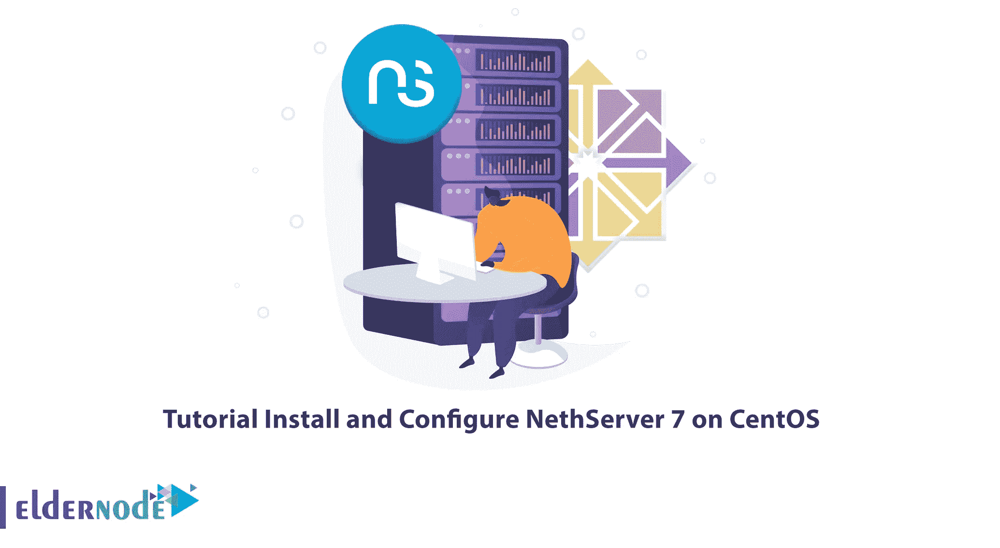

任何经营小型企业的人都需要一个名副其实的多功能内部操作系统。在这种情况下，可以满足小型企业需求的选择之一是基于 CentOS 7 的 NethServer。本文将教您如何在 CentOS 上安装和配置 NethServer 7。你可以在 [Eldernode](https://eldernode.com/) 网站上查看 **[CentOS VPS](https://eldernode.com/centos-vps/)** 服务器套装进行购买。

## **什么是 NethServer？**

NethServer 是一个基于 CentOS 的开源灵活的操作系统，适合小型企业。Distro NethServer 是作为 SME 服务器服务推出的，目的是简化服务器配置，它有一个强大的内置 web 界面，可以简化管理任务。您可以通过基于浏览器的界面部署和配置已部署服务器的几乎所有方面。它可以用来运行 Web 过滤器、邮件服务器、文件云服务器、Web 服务器、防火墙、 [VPN 服务器](https://blog.eldernode.com/setup-an-openvpn-server-on-ubuntu-22-04/)、文件共享服务器等等。你可以从官方 CentOS 库获得安全补丁和更新。

在这篇来自 [CentOS 培训](https://blog.eldernode.com/tag/centos/)系列的文章的续篇中，我们打算一步一步地教您如何在 CentOS 上安装和配置 NethServer 7。

## **在 CentOS** 上安装 NethServer 7

在接下来的部分中，我们将通过两种方式教您如何在 CentOS 上安装和配置 NethServer 7。这两种方法是:

1)使用 Yum 存储库

2)使用 ISO 文件

### **如何在 CentOS 上从 YUM 仓库** 安装 NethServer 7

首先，您应该通过输入以下命令来**启用 NethServer 7 YUM 存储库**:

```
sudo yum install -y http://mirror.nethserver.org/nethserver/nethserver-release-7.rpm
```

现在，您可以使用以下命令**安装 NethServer 7** 基本系统:

```
sudo nethserver-install
```

然后运行以下命令**安装附加模块**和基本系统:

```
sudo nethserver-install nethserver-mail nethserver-nextcloud
```

### **如何从** **ISO 文件** 在 CentOS 上安装 NethServer 7

首先进入官方 [NethServer 下载页面](https://www.nethserver.org/getting-started-with-nethserver/)，下载最新的 Nethserver 7。

现在，您需要通过输入以下命令来**创建一个可引导的 USB** 或 DVD:

```
sudo lsblk
```

```
sudo dd bs=4M if=/nethserver-7.9.2009-x86_64.iso of=/dev/sdX status=progress oflag=sync
```

**注意:**记得放 ISO 文件的适当路径，而不是 nethserver-7.9.2009-x86_64.iso，以及你的 DVD 或 u 盘的路径，而不是/dev/sdX。

创建可引导介质后，您需要将介质插入物理设备，并将引导选项更改为从该介质引导。

当系统在 NethServer 7 中引导时，您将看到下面的菜单，您必须在其中选择一种不同的安装类型。我们将选择**其他网络服务器安装方式**:

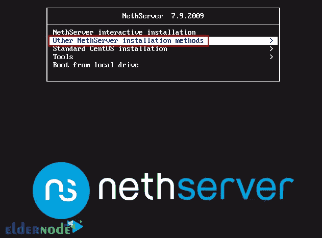

现在选择**手动安装**手动配置网络、键盘、时区、存储等:

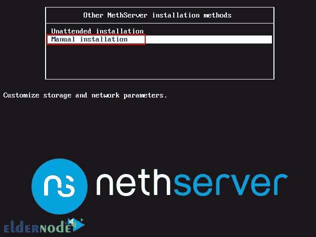

然后，您将看到下面的页面，在这里您应该开始进行所需的配置:

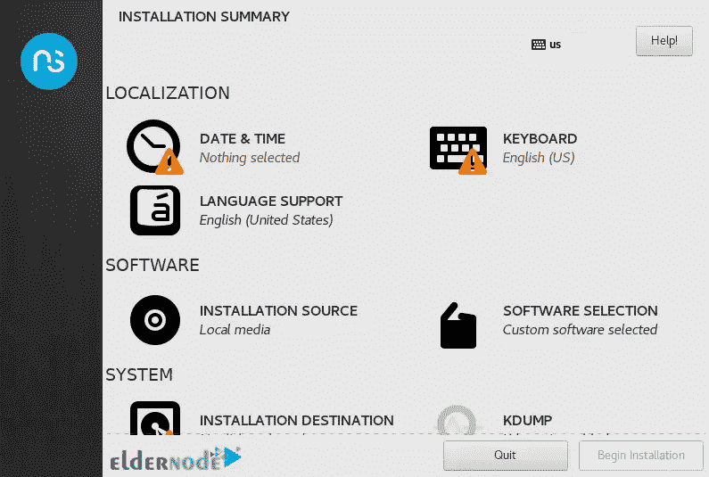

首先，我们可以**配置日期和时间**:

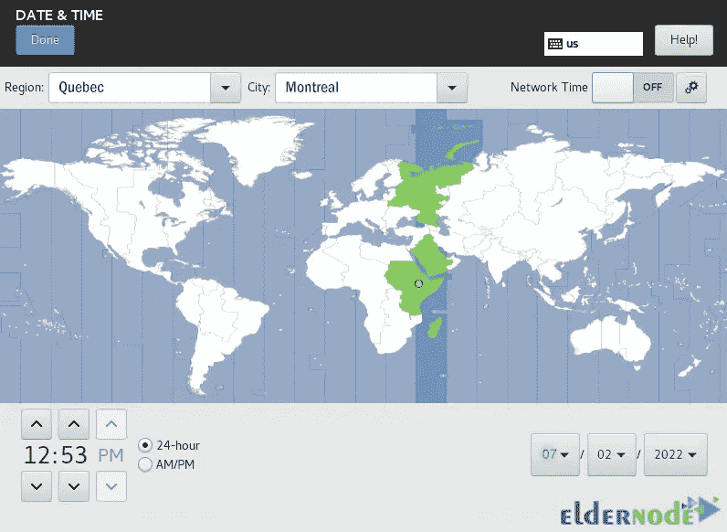

接下来，你应该**配置键盘**:

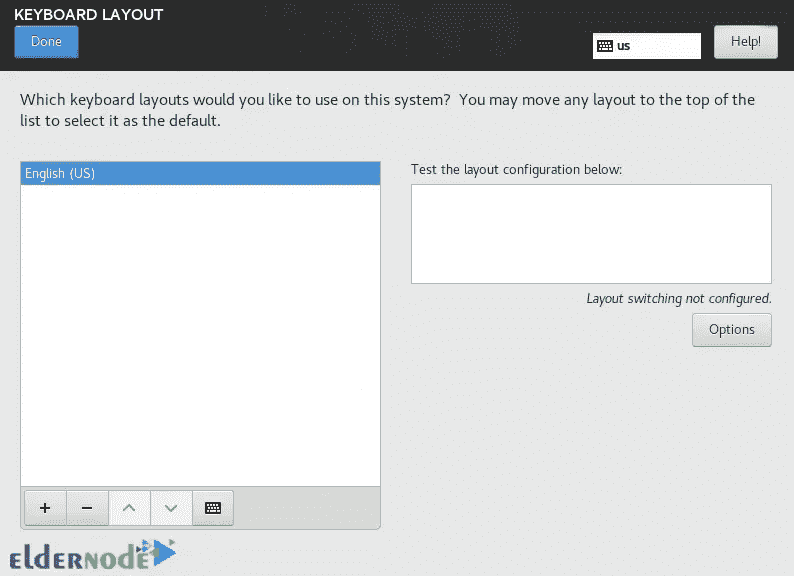

然后**配置安装目的地**:

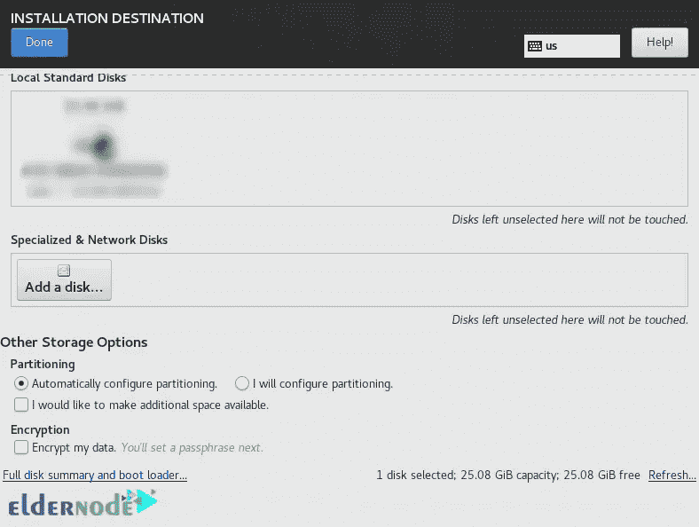

现在**如下配置网络和主机名**，并确保网络接口已连接:

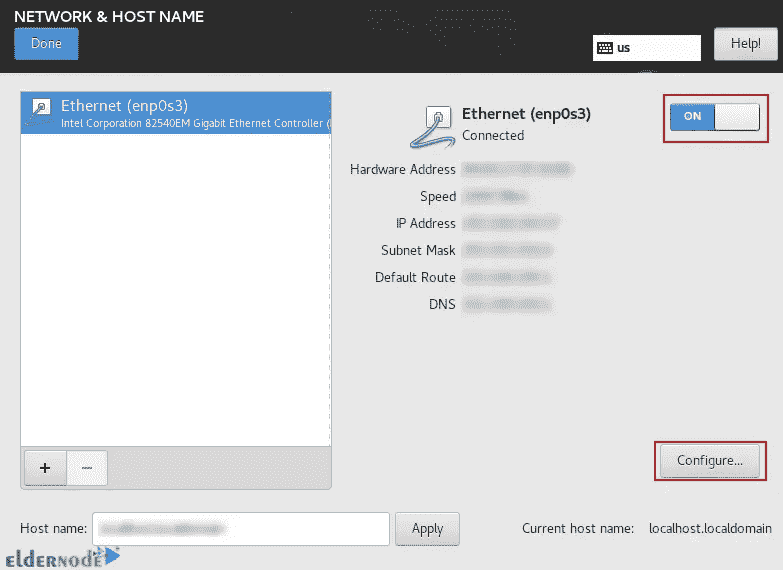

现在是时候**安装 NethServer** 了。点击**开始安装**:

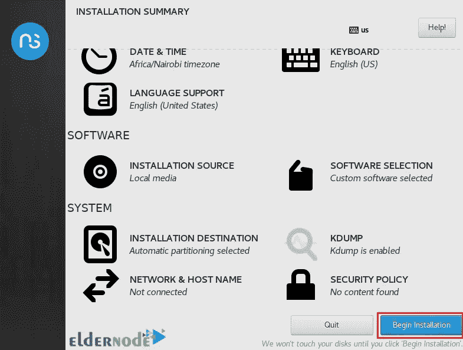

然后你应该**创建系统用户**并且**为根用户设置一个密码**:

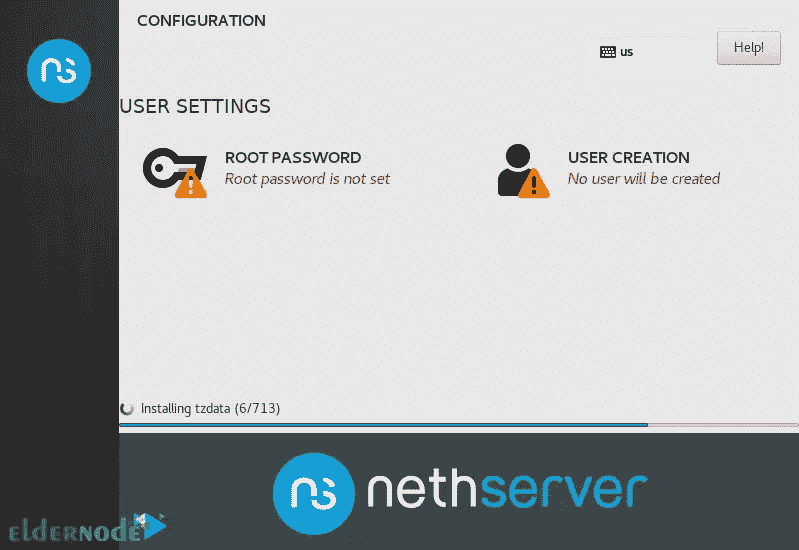

最后，重新启动机器，使其无法从引导中弹出介质。

### **如何在 CentOS 上访问服务器管理器**

首先，您需要通过输入以下命令来访问管理服务器 web 界面:

```
URL https://IP_address:9090
```

```
https://domain_name:9090
```

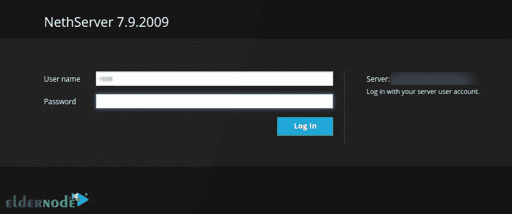

现在**作为根用户**登录。如果需要，您可以使用以下命令重置 root 密码:

```
sudo passwd root
```

登录后，您应该会看到仪表板:

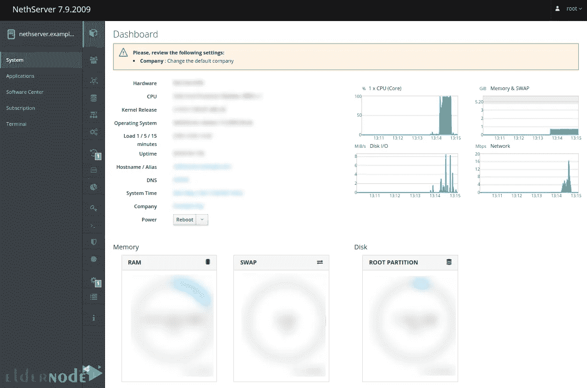

就是这样！

## 结论

通过安装 NethServer，您可以使用内置模块将您的系统转换为 DNS、Web、代理、邮件、IDS、Vpn、Cloud 和 Samba。在本文中，我们教您如何在 CentOS 上安装和配置 NethServer 7。我希望这篇教程对你有用。如有疑问，可在评论中联系我们。