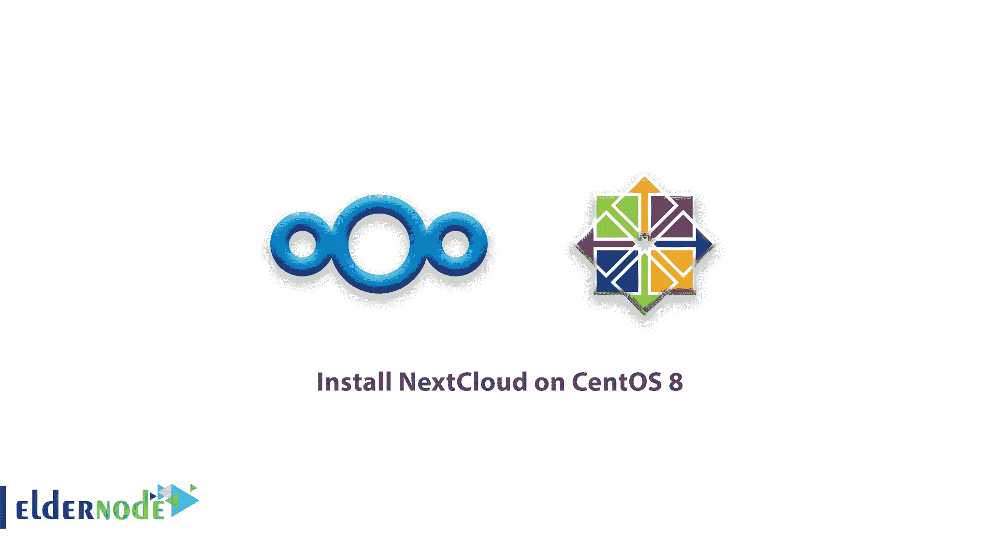

# 如何在 CentOS 8 上安装 next cloud-CentOS 技巧，PHP 模块

> 原文：<https://blog.eldernode.com/install-nextcloud-centos-8/>



为了引入开源、本地文件共享和协作平台，您将了解如何在 CentOS 8 上安装 next cloud**。NextCloud 允许您保存文件，并在多种设备(如 PC、智能手机和平板电脑)上访问它们。作为一个流行的自托管平台，它的工作方式很像[**【DropBox】**](https://www.dropbox.com/business/landing-t61fl?_tk=paid_sem_goog_biz_b&_camp=1033325477&_kw=dropbox%7Ce&_ad=389584910361%7C%7Cc&gclid=Cj0KCQjwsuP5BRCoARIsAPtX_wE94LCIPlh5D6UJV_NH3YZNJbXfbz-a5xb1GORd8VM34Xgvj9-TqV4aAgbTEALw_wcB)，它允许你在各种项目上无缝协作，管理你的日历，收发电子邮件以及进行视频通话。**

此外，您还可以使用相关文章:

[如何在 Ubuntu](https://eldernode.com/install-nextcloud-ubuntu/) 安装 next cloud

#### 先决条件:

由于您将通过浏览器访问 **NextCloud** ，因此确保 [LAMP stack 已经安装在 CentOS 8 上至关重要。](https://eldernode.com/install-lamp-stack-on-centos-8/)

## 如何在 CentOS 8 上安装 next cloud

让我们通过本文的步骤向您展示如何在 CentOS 8 上安装 NextCloud。

### 1-安装额外的 PHP 模块

为了让 **NextCloud** 正常运行，需要一些必备的 **PHP** 模块。

```
sudo dnf install php-mysqlnd php-xml php-zip  php-curl php-gd php-intl php-json php-ldap php-mbstring php-opcache 
```

### 2-创建下一个云数据库

必要的 **PHP** 模块安装完成后，使用以下命令登录 MariaDB 数据库引擎并提供密码，创建一个包含 NextCloud 数据的数据库。

```
mysql -u root -p 
```

登录后，使用下面的命令为 **NextCloud** 创建一个数据库和一个数据库用户。

```
**MariaDB [(none)]>** CREATE DATABASE nextcloud_db;  **MariaDB [(none)]>** GRANT ALL ON nextcloud_db.* TO ‘nextcloud_user’@’localhost’ IDENTIFIED BY ‘[[email protected]](/cdn-cgi/l/email-protection)’;  **MariaDB [(none)]>** FLUSH PRIVILEGES;  **MariaDB [(none)]>** EXIT;
```

**[用 比特币](https://eldernode.com/bitcoin-vps/)** 购买 VPS

### 3-在 CentOS 上安装 next cloud 8

此时，你必须从 NextCloud 的官方网站下载 **NextCloud** 压缩文件。到写下本指南时， **NextCloud** 的最新版本是 **18.0.1** 。

```
sudo wget https://download.nextcloud.com/server/releases/nextcloud-18.0.1.zip 
```

然后，将文件解压到 **/var/www/html/** 路径。

```
sudo unzip nextcloud-18.0.1 -d /var/www/html/ 
```

现在，创建一个目录来存储管理员用户数据。

```
sudo mkdir -p /var/www/html/nextcloud/data 
```

接下来，为了让 Apache 用户可以向其中追加数据，您需要修改 NextCloud 的目录权限。

```
sudo chown -R apache:apache /var/www/html/nextcloud/ 
```

### 4-为 NextCloud 设置 SELinux 和防火墙

这一步需要你为 **SELinux** 做一些配置，这样它就可以毫无问题地处理 Nextcloud。为此，请键入以下命令:

```
sudo semanage fcontext -a -t httpd_sys_rw_content_t '/var/www/html/nextcloud/data'  sudo semanage fcontext -a -t httpd_sys_rw_content_t '/var/www/html/nextcloud/config(/.*)?'  sudo semanage fcontext -a -t httpd_sys_rw_content_t '/var/www/html/nextcloud/apps(/.*)?'  sudo semanage fcontext -a -t httpd_sys_rw_content_t '/var/www/html/nextcloud/3rdparty(/.*)?'  sudo semanage fcontext -a -t httpd_sys_rw_content_t '/var/www/html/nextcloud/.htaccess'  sudo semanage fcontext -a -t httpd_sys_rw_content_t '/var/www/html/nextcloud/.user.ini'  sudo restorecon -Rv '/var/www/html/nextcloud/
```

此外，您需要打开 webserver 端口 80，以允许外部用户从您的服务器访问 **NextCloud** 。为此，请键入以下命令:

```
sudo firewall-cmd --add-port=80/tcp --zone=public --permanent  sudo firewall-cmd --reload
```

### 5-最终确定下一次云安装

要开始这一步，首先，创建一个管理员用户名和密码。其次，点击“**存储和数据库**”。然后，选择“ **MariaDB** ”作为首选数据库引擎，并填写数据库详细信息。填写完数据库详细信息后，点击“**完成**按钮完成设置。

毕竟，这会将您带到登录页面。提供用户名和密码，点击“**进入**或点击“**登录**按钮。

**注** :第一次登录的话，会以幻灯片的形式给出一个关于 **NextCloud** 的简要演练。请随意向右滚动，查看更多提示。

**最后是**，您可以关闭窗口以访问仪表盘。

**好样的** ！您现在已经阅读完本指南，您可以在 **NextCloud** 上备份、同步和与您的朋友和同事共享文件。

亲爱的用户，我们希望这篇教程能对你有所帮助，如果你有任何问题或想查看我们的用户关于这篇文章的对话，请访问[提问页面](https://eldernode.com/ask)。也为了提高你的知识，有这么多有用的教程为[老年节点培训](https://eldernode.com/blog/)准备。