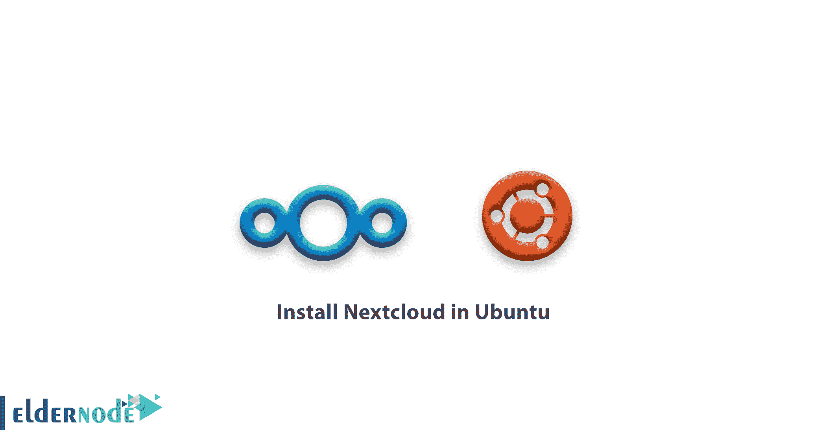

# 如何在 Ubuntu 中安装 Nextcloud-Ubuntu 上的 next cloud

> 原文：<https://blog.eldernode.com/install-nextcloud-ubuntu/>



我们带着新的 Ubuntu 教程回来了。在本文中，我们将向您介绍如何在 Ubuntu 中安装 Nextcloud。为了熟悉允许用户共享他们计算机上的一个或多个文件和目录的安全、可靠和灵活的解决方案，我们将向您展示如何安装这个开源、强大和安全的基于 PHP 的内容协作平台。

您可以在 [Linux](https://www.linux.com/what-is-linux/) 系统、Linux、Microsoft Windows 和 macOS 的客户端应用程序以及 Android 和 Apple iOS 的移动客户端上使用该解决方案。

**Nextcloud** 适用于小型和大型企业以及服务提供商。请注意你需要在你的服务器上安装一个[**LAMP**](https://eldernode.com/how-to-install-lamp-on-ubuntu-20-04/)stack(**Linux**， **Apache** ， **MySQL/MariaDB** ， **PHP** )来设置一个 Nextcloud。

## 如何在 Ubuntu 安装 next cloud

我们来看看如何在分别以 [**Apache**](https://eldernode.com/install-lamp-stack-on-ubuntu-18-04-quick-start/) 和 **MariaDB** 作为 web 服务器和数据库软件的 **Ubuntu Linux** 服务器上安装 **Nextcloud** 服务器。

### 在 Ubuntu 上安装灯

打开一个终端窗口，通过 **SSH** 连接到你的 **Ubuntu** 服务器，安装**灯**栈。然后使用下面的命令。

```
sudo apt-get update  sudo apt-get install apache2 mariadb-server libapache2-mod-php7.2 php7.2-gd php7.2-json php7.2-mysql php7.2-curl php7.2-mbstring php7.2-intl php-imagick php7.2-xml php7.2-zip 
```

如果需要检查两个服务是否已启动和启用，请键入:

```
systemctl status apache2  systemctl status mariadb  systemctl is-enabled apache2  systemctl is-enabled mariadb
```

如果您发现服务不起作用，请使用以下命令。

```
sudo systemctl start apache2  sudo systemctl start mariadb  sudo systemctl enable apache2  sudo systemctl enable mariadb
```

然后，使用软件包附带的安全脚本来保护 **MariaDB** 服务器的安装。

```
sudo mysql_secure_installation
```

现在，是时候回答一些问题了，比如下面的指导。

**注意** :不要忘记设置一个强而安全的根 [密码](https://eldernode.com/how-to-create-strong-password/) 。

*   输入 root 当前密码(无输入): **输入**
*   设置 root 密码？【Y/n】**Y**
*   删除匿名用户？【Y/n】**Y**
*   不允许远程 root 登录？【Y/n】**Y**
*   是否删除测试数据库并访问它？【Y/n】**Y**
*   现在重新加载权限表吗？【Y/n】**Y**

### 在 Ubuntu 安装 next cloud

在确保数据库安装安全之后，您应该为 **Nextcloud** 创建一个数据库和数据库用户。为此，登录 **MariaDB** 服务器访问 **MySQL** 外壳。

```
sudo mysql -u root -p
```

接下来，运行下面的 **sql** 命令。

**注意** :别忘了替换 **[【邮件保护】](/cdn-cgi/l/email-protection)！#@%$lab** "输入您的安全密码。

```
**MariaDB [(none)]>** CREATE DATABASE nextcloud;   **MariaDB [(none)]>** CREATE USER [[email protected]](/cdn-cgi/l/email-protection) IDENTIFIED BY '**[[email protected]](/cdn-cgi/l/email-protection)!#@%$lab**';   **MariaDB [(none)]>** GRANT ALL PRIVILEGES ON nextcloud.*  TO [[email protected]](/cdn-cgi/l/email-protection) IDENTIFIED BY '**[[email protected]](/cdn-cgi/l/email-protection)!#@%$lab**';   **MariaDB [(none)]>** FLUSH PRIVILEGES;   **MariaDB [(none)]>** EXIT;
```

现在，从 Nextcloud 下载页面下载 **Nextcloud** ，通过点击**下载 Nextcloud** Server = > **下载 Nextcloud** 来抓取一个 **。zip** 存档或运行以下命令，使用 wget 命令从命令行下载它。

```
sudo wget -c https://download.nextcloud.com/server/releases/nextcloud-18.0.0.zip 
```

然后，提取存档内容，并将提取的 **nextcloud** 目录/文件夹复制到您的 web 服务器的文档根目录中

```
sudo unzip nextcloud-18.0.0.zip  sudo cp -r nextcloud /var/www/html/  sudo chown -R www-data:www-data /var/www/html/nextcloud 
```

[**购买 Ubuntu VPS**](https://eldernode.com/ubuntu-vps/)

### `配置 Apache 服务 Nextcloud`

`如您所见，您需要在**/etc/Apache 2/sites-available**目录下为 **Nextcloud** 创建一个 Apache 配置文件。`

```
`sudo vim /etc/apache2/sites-available/nextcloud.conf`
```

`在文件中复制并粘贴以下行。`

`**注意** :如果你的安装目录不同，别忘了替换 **/var/www/html/nextcloud/** 。`

```
`Alias /nextcloud "/var/www/html/nextcloud/"    <Directory /var/www/html/nextcloud/>    Require all granted    Options FollowSymlinks MultiViews    AllowOverride All     <IfModule mod_dav.c>    Dav off   </IfModule>     SetEnv HOME /var/www//html/nextcloud   SetEnv HTTP_HOME /var/www/html/nextcloud  </Directory>`
```

`您现在可以保存并关闭它。`

`要继续，请在 Apache 配置结构中启用新创建的站点和其他 Apache 模块。`

```
`sudo a2ensite nextcloud.conf  sudo a2enmod rewrite  sudo a2enmod headers  sudo a2enmod env  sudo a2enmod dir  sudo a2enmod mime.`
```

`现在，您可以重新启动 **Apache2** 服务，以使最近的更改生效。`

```
`sudo systemctl restart apache2` 
```

### `通过图形向导 完成 Nextcloud 安装`

`在此步骤中，您需要通过 web 浏览器中的图形安装向导来完成安装。所以打开你的浏览器，指向以下地址:`

```
`http://SERVR_IP/nextcloud/ OR http://SERVER_ADDRESS/nextcloud/`
```

`加载向导安装后，您需要创建一个 nextcloud 超级用户/管理员用户帐户。所以输入用户名和密码。此外，单击**存储和数据库**链接，访问 Nextcloud 数据目录和数据库的其他安装配置选项。`

`填写完数据库连接详细信息后，点击**完成设置**。`

``

`如果您完成安装，您将看到以下窗口。因此，要继续并遵循提示，请单击将出现在蓝色窗口右侧的前进箭头。`

``

`现在，要开始使用新的 Nextcloud 服务器，请在下面的窗口中单击**完成设置**。`

``

`还有**最后**，你可以看到 Nextcloud 网页浏览器客户端的主仪表盘。`

``

`Recommended Article: [Russia VPS Server](https://blog.eldernode.com/russia-vps-server/)`

`亲爱的用户，我们希望这篇关于如何在 Ubuntu 中安装 Nextcloud 的教程能对你有所帮助，如果你对这篇文章有任何疑问或想查看我们用户的对话，请访问 [提问页面](https://eldernode.com/ask) 。也为了提高自己的见识，准备了这么多有用的教程给 [Eldernode 培训](https://eldernode.com/blog/) 。`