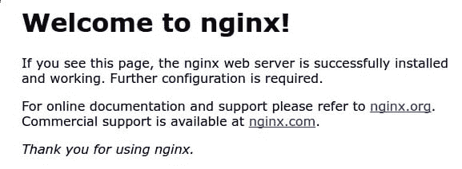

# 如何在 Debian 10 上安装 Nginx 如何调整防火墙

> 原文：<https://blog.eldernode.com/install-nginx-debian-10/>


在接下来的 [Nginx](https://eldernode.com/install-nginx-on-ubuntu-20-04-lts/) 教程中，在这篇文章中，我们将学习**如何在 Debian 10** 上安装 Nginx。但是首先，Nginx 基本上是什么？Nginx 是世界上最受欢迎的网络服务器之一，负责托管互联网上一些最大、流量最高的网站。在大多数情况下，它比 Apache 更加资源友好，可以用作 web 服务器或反向代理服务器。

**先决条件**

如果您知道以下内容，本教程可能会更有用:

## 如何在 Debian 10 上安装 Nginx

让我们浏览本教程的步骤，并讨论如何在 Debian 10 上安装 **Nginx。**

**不要错过相关文章:**

[教程 CentOS 8 上安装 Nginx](https://eldernode.com/installation-nginx-on-centos-8/)

[教程 Ubuntu 20.04 中用 Nginx 安装 WordPress](https://eldernode.com/wordpress-installation-nginx-ubuntu20/)

[如何在 Ubuntu 20.04 上用 Let's Encrypt 保护 Nginx](https://eldernode.com/secure-nginx-encrypt-ubuntu/)

### 1-安装 Nginx

因为 Debian 的默认库已经是 Nginx，所以可以使用 apt 打包系统从这些库中安装它。

因此，因为这是您在本次会议中第一次与 apt 打包系统进行交互，所以让我们首先更新我们的本地包索引，以便我们可以访问最新的包列表:

```
sudo apt update
```

现在，您可以安装 Nginx:

```
sudo apt install nginx
```

然后，当系统询问您时，点击输入继续。之后， apt 将把 Nginx 和任何需要的依赖项安装到你的服务器上。

### 2-调整防火墙

由于防火墙软件要求，您需要在测试 Nginx 之前对其进行调整，以允许访问该服务。

键入以下内容，列出 ufw 知道如何使用的应用程序配置:

```
sudo ufw app list
```

输出

```
Available applications:  ...    Nginx Full    Nginx HTTP    Nginx HTTPS  ...
```

如您所见，Nginx 有三个可用的概要文件:

*   **Nginx Full** :此配置文件同时打开端口 80 (正常、未加密的 web 流量)和端口 443 (TLS/SSL 加密流量)
*   **Nginx HTTP** :此配置文件仅打开端口 80 (正常、未加密的网络流量)
*   **Nginx HTTPS** : 此配置文件仅打开端口 443 (TLS/SSL 加密流量)

**注意** :建议您启用最严格的配置文件，该文件仍将允许您已配置的流量。由于您还没有在本指南中为我们的服务器配置 SSL，您只需要允许端口 80 上的 HTTP 流量。

您可以通过键入以下命令来启用它:

```
sudo ufw allow 'Nginx HTTP
```

并验证这些更改:

```
sudo ufw status
```

输出

```
Status: active    To                         Action      From  --                         ------      ----  OpenSSH                    ALLOW       Anywhere                    Nginx HTTP                 ALLOW       Anywhere                    OpenSSH (v6)               ALLOW       Anywhere (v6)               Nginx HTTP (v6)            ALLOW       Anywhere (v6)
```

**[用比特币购买虚拟机](https://eldernode.com/bitcoin-vps/)**

3-检查你的网络服务器

### 一旦安装完成，Debian 10 就启动 Nginx。web 服务器应该已经启动并运行。

您可以通过键入以下命令来检查 systemd init 系统，以确保服务正在运行:

输出

```
systemctl status nginx
```

通过接收上述输出，这意味着服务似乎已经成功启动。然而，最好的测试方法是从 Nginx 实际请求一个页面。

```
● nginx.service - A high performance web server and a reverse proxy server     Loaded: loaded (/lib/systemd/system/nginx.service; enabled; vendor preset: enabled)     Active: active (running) since Wed 2019-07-03 12:52:54 UTC; 4min 23s ago       Docs: man:nginx(8)   Main PID: 3942 (nginx)      Tasks: 3 (limit: 4719)     Memory: 6.1M     CGroup: /system.slice/nginx.service             ├─3942 nginx: master process /usr/sbin/nginx -g daemon on; master_process on;             ├─3943 nginx: worker process             └─3944 nginx: worker process
```

您可以通过导航到服务器的 IP 地址来访问默认的 Nginx 登录页面，以确认软件运行正常。如果您不知道服务器的 IP 地址，请尝试在服务器的命令提示符下键入以下内容:

你会得到几行。你可以在你的网络浏览器中尝试每一种方法，看看它们是否有效。

```
ip addr show eth0 | grep inet | awk '{ print $2; }' | sed 's/\/.*$//'
```

获得服务器的 IP 地址后，将其输入浏览器的地址栏:

然后，应该会显示默认的 Nginx 登录页面。

```
http://your_server_ip
```



通过此页面，您将看到服务器正在正确运行。

4-管理 Nginx 进程

### 由于 web 服务器已经启动并运行，您可以查看一些基本的管理命令。

使用下面的命令停止您的 web 服务器。

此外，您可以在 web 服务器停止时启动它:

```
sudo systemctl stop nginx
```

要停止然后再次启动该服务:

```
sudo systemctl start nginx
```

如果只是简单地修改配置，Nginx 通常可以在不中断连接的情况下重新加载。为此，请键入:

```
sudo systemctl restart nginx
```

**默认**，Nginx 配置为服务器启动时自动启动。如果这不是您想要的，您可以通过键入以下命令来禁用此行为:

```
sudo systemctl reload nginx
```

要重新启用服务以在引导时启动，您可以键入:

```
sudo systemctl disable nginx
```

```
sudo systemctl enable nginx
```

5-设置服务器块

### 要了解更多关于设置服务器块的信息，让我们这样解释:当使用 Nginx web 服务器时，服务器块可用于封装配置细节，并在一台服务器上托管多个域。您将建立一个名为 **your_domain** 的域。要了解更多关于使用 DigitalOcean 设置域名的信息，请参阅我们的 DigitalOcean DNS 简介。

Debian 10 上的 Nginx 有一个默认启用的服务器块，它被配置为从位于 /var/www/html 的目录中提供文档。虽然这对于单个站点来说很有效，但是如果你托管多个站点，这就变得难以管理了。不要修改 /var/www/html ，让我们在 /var/www 中为 **your_domain** 网站创建一个目录结构，保留 /var/www/html 作为缺省目录，如果一个客户端请求与任何其他站点都不匹配，就提供这个目录。

为 **your_domain** 创建目录，如下所示，使用 -p 标志创建任何必要的父目录:

现在，使用 $USER 环境变量分配目录的所有权，该变量应该引用您当前的系统用户:

```
sudo mkdir -p /var/www/your_domain/html
```

如果您没有修改您的 umask 值，您的 webroot 权限应该是正确的，但是您可以通过键入以下命令来确保:

```
sudo chown -R $USER:$USER /var/www/your_domain/html
```

然后，使用 nano 或您喜欢的编辑器创建一个示例index.html页面:

```
sudo chmod -R 755 /var/www/your_domain
```

在内部添加以下示例 HTML:

```
nano /var/www/your_domain/html/index.html
```

/var/www/your _ domain/html/index . html

完成后，现在您可以保存并关闭文件。

```
<html>      <head>          <title>Welcome to your_domain</title>      </head>      <body>          <h1>Success! Your Nginx server is successfully configured for <em>your_domain</em>. </h1>  <p>This is a sample page.</p>      </body>  </html>
```

您需要创建一个服务器块，其中包含指向我们的自定义 webroot 的正确指令，以便为 Nginx 提供这些内容。与其直接修改默认配置文件，不如在/etc/nginx/sites-available/your _ domain新建一个:

粘贴以下配置块，该配置块与默认配置块相似，但针对新目录和域名进行了更新:

```
sudo nano /etc/nginx/sites-available/your_domain
```

/etc/nginx/sites-available/your _ domain

**请注意**您已经将根配置更新到我们的新目录，并将服务器名称更新到我们的域名。

```
server {          listen 80;          listen [::]:80;            root /var/www/your_domain/html;          index index.html index.htm index.nginx-debian.html;            server_name your_domain www.your_domain;            location / {                  try_files $uri $uri/ =404;          }  }
```

接下来，让我们通过在启用了站点的目录中创建一个到我们的定制配置文件的符号链接来启用这个服务器块，Nginx 在启动时从这个目录中读取数据。

两个服务器块现在被启用并配置为基于它们的 listen 和 server_name 指令来响应请求。

```
sudo ln -s /etc/nginx/sites-available/your_domain /etc/nginx/sites-enabled/
```

your_domain :将响应 your_domain 和 www.your_domain 的请求。

*   默认:将响应端口 80 上与其他两个块不匹配的任何请求。
*   为了避免在您的配置中添加额外的服务器名称可能导致的哈希桶内存问题，有必要在 /etc/nginx/nginx.conf 文件中调整一个值。打开文件:

现在，找到server _ names _ hash _ bucket _ size指令，并删除 # 符号以取消对该行的注释:

```
sudo nano /etc/nginx/nginx.conf
```

/etc/engine x/engine x . conf

完成后，现在您可以保存并关闭文件。

```
...  http {      ...      server_names_hash_bucket_size 64;      ...  }  ...
```

您还可以进行测试，以确保您的任何 Nginx 文件中没有语法错误:

输出

```
sudo nginx -t
```

当您通过配置测试后，重新启动 Nginx 以使您的更改生效。

```
nginx: the configuration file /etc/nginx/nginx.conf syntax is ok  nginx: configuration file /etc/nginx/nginx.conf test is successful
```

**请注意【Nginx 现在应该为您的域名提供服务。您可以通过导航到 http://your_domain 来测试这一点，您应该会看到类似这样的内容:**

```
sudo systemctl restart nginx
```

6-熟悉重要 Nginx 文件和目录

```
``
```

### ``既然您知道如何管理 Nginx 服务本身，那么您应该花几分钟时间熟悉一些重要的目录和文件。``

``内容``

#### ``/var/www/html :实际的 web 内容，默认情况下只包含您之前看到的默认 Nginx 页面，是在 /var/www/html 目录之外提供的。您可以通过修改 Nginx 配置文件来改变它。``

*   ``服务器配置``

#### ``/etc/Nginx:Nginx 配置目录。所有 Nginx 配置文件都在这里。``

*   ``/etc/Nginx/Nginx . conf:Nginx 主配置文件。您可以对其进行修改，以更改 Nginx 全局配置。``
*   ``/etc/nginx/sites-available/:可以存储每个站点的服务器块的目录。Nginx 不会使用在这个目录中找到的配置文件，除非它们链接到站点启用的目录。通常，所有服务器块配置都在此目录中完成，然后通过链接到另一个目录来启用。``
*   ``/etc/nginx/sites-enabled/:存储已启用的每个站点的服务器块的目录。通常，它们是通过链接到在站点-可用的目录中找到的配置文件来创建的。``
*   ``/etc/nginx/snippets :这个目录包含可以包含在 nginx 配置中其他地方的配置片段。潜在的可重复配置段是重构为代码片段的良好候选。``
*   ``服务器日志``

#### ``/var/log/nginx/access . log:对 web 服务器的每个请求都记录在这个日志文件中，除非 Nginx 被配置为其他方式。``

*   ``/var/log/nginx/error.log :任何 nginx 错误都会记录在这个日志中。``
*   ``**好样的** ！接触到这一点，你就成功地完成了这本如何在 Debian 10 上安装 Nginx 的指南。现在，您已经安装了 web 服务器，对于可以提供的内容类型和可以用来为用户创建更丰富体验的技术，您有许多选择。``

``**Good job**! By touching this point, you have successfully finished this guide of How to install Nginx on Debian 10\. and you have your web server installed now, you have many options for the type of content you can serve and the technologies you can use to create a richer experience for your users.``