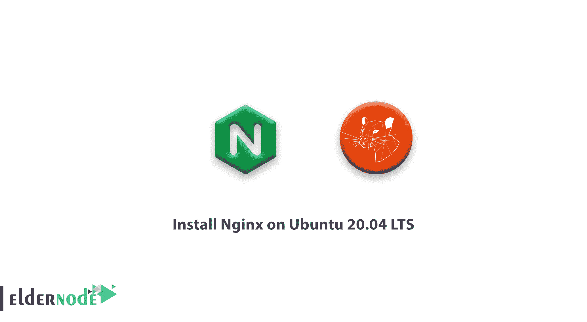
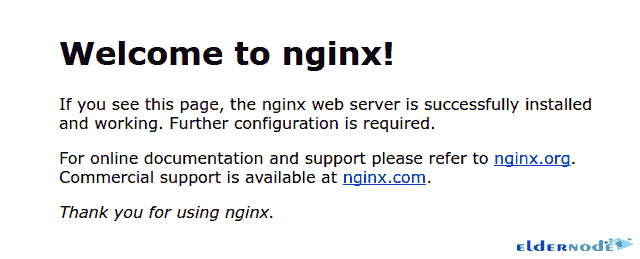

# 如何在 Ubuntu 20.04 LTS 版上安装 Nginx 教程 Linux | Eldernode 博客

> 原文：<https://blog.eldernode.com/install-nginx-on-ubuntu-20-04-lts/>



【更新日期:2021-01-21】作为高流量网站的管理员，你需要一台高性能的 web 服务器。Nginx 是一个开源的、流行的 web 服务器，享誉全球。此外，您可以将其用作反向代理。在本文中，你将学习如何**在 Ubuntu 20.04 LTS** 上安装 Nginx。如果你不确定要买一个 [Linux VPS](https://eldernode.com/linux-vps/) ，我们完美的套装会让你满意。你可以购买自己的 [Ubuntu VPS](https://eldernode.com/ubuntu-vps/) 并继续学习本指南。

## **教程在 Ubuntu 20.04 上安装 Nginx LTS**

为了让本教程更好地发挥作用，请考虑以下**先决条件**:

拥有 sudo 权限的非 root 用户。

要进行设置，请遵循我们在 Ubuntu 20.04 上的[初始服务器设置。](https://blog.eldernode.com/initial-server-setup-on-ubuntu-20/)

## **在 Ubuntu 20.04 上安装 Nginx |**Ubuntu 18.04

Nginx 是在 2 条款 BSD 许可下发布的，你可以在 20 分钟内将它安装到你的 Ubuntu 服务器上。Nginx 可以在 Ubuntu 的默认库中找到。所以，你可以通过 *apt* 打包系统来安装仓库。让我们通过这个指南的步骤来学习和完成它。

### 第一步:安装 Nginx

首先，您应该使用下面的命令更新本地包:

```
sudo apt update 
```

然后用下面的命令安装 Nginx:

```
sudo apt install nginx 
```

### 第二步:调整 ubuntu 20.04 上的防火墙

首先，你需要启用 UFW 防火墙。然后使用以下命令检查可用的 UFW 防火墙应用程序配置文件:

```
sudo ufw app list 
```

输出:

```
Available applications:  Nginx Full  Nginx HTTP  Nginx HTTPS  OpenSSH 
```

现在启用允许端口 80 上的流量:

```
sudo ufw allow 'Nginx HTTP' 
```

您应该验证更改:

```
sudo ufw status 
```

输出:

```
Status: active    To                         Action      From  --                         ------      ----  OpenSSH                    ALLOW       Anywhere                    Nginx HTTP                 ALLOW       Anywhere                    OpenSSH (v6)               ALLOW       Anywhere (v6)               Nginx HTTP (v6)            ALLOW       Anywhere (v6)
```

### 第三步:检查网络服务器

检查 web 服务器是否正在运行:

```
systemctl status nginx 
```

输出应该如下所示:

```
nginx.service - A high performance web server and a reverse proxy server       Loaded: loaded (/lib/systemd/system/nginx.service; enabled; vendor preset:>       Active: active (running) since Mon 2020-05-07 21:35:26 UTC; 2min 20s ago         Docs: man:nginx(8)     Main PID: 13255 (nginx)        Tasks: 2 (limit: 1137)       Memory: 4.6M       CGroup: /system.slice/nginx.service               ├─13255 nginx: master process /usr/sbin/nginx -g daemon on; master>               └─13256 nginx: worker process
```

然后，您应该使用下面的命令检查在浏览器中访问默认的 Nginx 登录页面:

```
http://your_server_ip 
```

在浏览器上输入 IP 地址后，您应该会看到默认的 Nginx 登录页面:



## 结论

在本文中，您了解了如何在 Ubuntu 20.04 上安装 Nginx。从现在开始，您可以配置 PHP、Python、Perl 和 Ruby 应用程序或安装 TLS、SSL 证书来保护流量。如果你有兴趣阅读更多内容，可以找到我们关于如何在 Debian 10 上安装 Nginx 的相关文章。