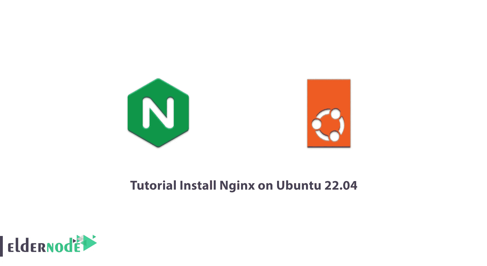
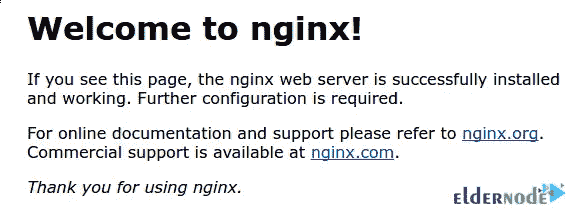

# 教程在 Ubuntu 22.04 上安装 Nginx-elder node 博客

> 原文：<https://blog.eldernode.com/install-nginx-on-ubuntu-22-04/>



Nginx 是开源软件，被用作 web 服务器、反向代理、缓存系统、负载平衡系统和流媒体网络等。此外，要了解 Nginx 是什么，您应该考虑 Nginx 是作为一个具有最大性能和稳定性的 web 服务器而设计的。在本文中，我们将教你如何在 Ubuntu 22.04 上安装 Nginx。如果你想购买一台 [**Ubuntu VPS**](https://eldernode.com/ubuntu-vps/) 服务器，你也可以在 [Eldernode](https://eldernode.com/) 网站上查看可用的软件包。

## **如何在 Ubuntu 22.04 上设置 Nginx**

### **Nginx**简介

就硬件而言，web 服务器是一种存储 web 服务器软件和 web 相关组件(如 HTML 文档、图像、CSS 样式表和 JavaScript 文件)的服务器。web 服务器连接到 Internet，并支持与连接到 web 的其他设备交换物理数据。

Nginx 从一开始就被用作 web 服务器，正如前面提到的，它现在被用作各种 VPS 服务器上的反向代理、HTTP 缓存和负载平衡系统。

如今很多知名公司在他们的[专用服务器](https://eldernode.com/dedicated-server/)上使用 Nginx。自从 NGINX 最初发布以来，网站已经从简单的 HTML 页面发展到动态和多方面的内容。NGINX 也随之发展，现在支持所有现代 web 组件，包括 Web Socket、HTTP/2、gRPC 和多格式视频回放(HDS、HLS、RTMP 等等)。还有，如果需要购买 SSL，可以很容易的安装在 Nginx 服务器上。

因此，在选择和注册域名并购买服务器后，您可以轻松地在您的 VPS 或专用服务器上安装 Nginx，并享受使用它的乐趣。

在本文的续篇中，加入我们一步步教你如何在 [Ubuntu](https://blog.eldernode.com/tag/ubuntu/) 22.04 上安装 Nginx。

### **在 Ubuntu 22.04 上安装 Nginx 的先决条件**

->使用新安装的操作系统

->对服务器的 SSH 访问

->非根 sudo 用户或对根用户的访问

## **在 Ubuntu 22.04 上安装 Nginx**

在这一节中，我们将向你展示如何在 Ubuntu 22.04 上安装 Nginx。要做到这一点，只需小心谨慎地遵循以下步骤。

建议您在第一步使用以下命令更新系统中的软件包:

```
sudo apt update
```

```
sudo apt upgrade
```

由于 Nginx 默认位于 Ubuntu 存储库，您需要通过运行以下命令来安装最新版本:

```
sudo apt install nginx
```

成功安装 Nginx 后，现在需要使用以下命令**启用**:

```
sudo systemctl enable nginx
```

然后，您需要借助以下命令**启动** Nginx:

```
sudo systemctl start nginx
```

您也可以检查 Nginx 的**状态**:

```
sudo systemctl status nginx
```

最后，您可以使用以下命令**确认**Nginx 的安装:

```
nginx -v
```

### **针对 Nginx 访问的防火墙设置**

在这一节中，我们将调整 Ubuntu 22.04 上的防火墙。由于 UFW 防火墙运行在 Ubuntu 22.04 上，您可以使用以下命令轻松启用连接:

```
sudo ufw allow 'Nginx FULL'
```

然后，您需要使用以下命令启用 UFW:

```
sudo ufw enable
```

最后，您可以查看 UFW 的状态:

```
sudo ufw status
```

### **如何运行 Web 服务器**

一旦您成功完成了上述所有步骤，您将看到 Nginx 正在运行。要检查 web 服务器，只需遵循以下步骤。您可以使用以下命令检查服务是否正在运行:

```
systemctl status nginx
```

在下一步中，您可以通过运行以下命令来访问默认的 Nginx 登录页面:

```
http://your_server_ip/
```

通过运行上述命令，您将看到下图:



## 结论

如前所述，NGINX 是一个 web 服务器，它还充当电子邮件代理、反向代理和负载平衡。该软件的结构是异步和事件驱动的，允许同时处理许多请求。NGINX 也是高度可扩展的，这意味着它的服务随着它的客户流量而增长。在这篇文章中，我们试图教你如何在带有防火墙配置的 Ubuntu 22.04 上安装 Nginx。