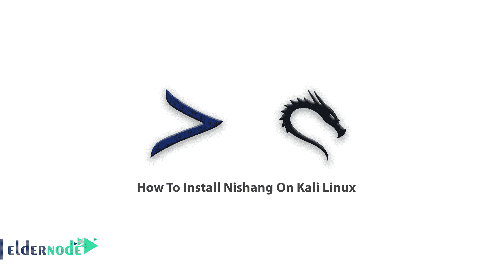

# 如何在 Kali Linux - Eldernode 博客上安装霓裳

> 原文：<https://blog.eldernode.com/install-nishang-on-kali-linux/>



了解如何**在 Kali Linux** 上一步步安装 Nishang。在下面的渗透测试工具中，在这篇文章中，您将了解 Nishang 及其在 Kali Linux 上的安装方式。要获得安全的 [Linux VPS](https://eldernode.com/linux-vps/) 或安全的 BTS，请查看我们在 [Eldernode](https://eldernode.com/) 上的完美包。

## 什么是霓裳

当您决定使用 PowerShell 进行后期开发时，您不需要编写自己的脚本。你可以使用 Nishang，作为一个脚本和负载的集合。脚本分为各种类别，如信息收集、扫描、特权提升等。这个开源框架支持在渗透测试期间使用 PowerShell 进行攻击性安全和 posts 开发。

## 教程在 Kali Linux 上安装 Nishang

请阅读本文，以便更好地熟悉这份有据可查的文档及其出色的帮助选项。

运行以下命令来**安装 Nishang** 和它所依赖的任何其他包:

```
sudo apt-get install nishang
```

### 霓裳脚本和播放量

霓裳有许多有趣的脚本，以下是一些霓裳脚本和有效载荷:

**1-**[ActiveDirectory](https://github.com/samratashok/nishang/blob/master/ActiveDirectory/Set-DCShadowPermissions.ps1)

**2-**[Antak-the Webshell](https://github.com/samratashok/nishang/tree/master/Antak-WebShell)

**3-** [借壳](https://github.com/samratashok/nishang/blob/master/Backdoors/HTTP-Backdoor.ps1)

**4-** [旁路](https://github.com/samratashok/nishang/blob/master/Bypass/Invoke-AmsiBypass.ps1)

**5-** [客户端](https://github.com/samratashok/nishang/blob/master/Client/Out-CHM.ps1)

**6-** [升级](https://github.com/samratashok/nishang/blob/master/Escalation/Enable-DuplicateToken.ps1)

**7-** [执行](https://github.com/samratashok/nishang/blob/master/Execution/Download-Execute-PS.ps1)

**8-** [聚集](https://github.com/samratashok/nishang/blob/master/Gather/Check-VM.ps1)

**9-** [MITM](https://github.com/samratashok/nishang/blob/master/MITM/Invoke-Interceptor.ps1)

**10-** [支点](https://github.com/samratashok/nishang/blob/master/Pivot/Create-MultipleSessions.ps1)

**11-** [普拉萨德哈](https://github.com/samratashok/nishang/blob/master/Prasadhak/Invoke-Prasadhak.ps1)

**12-** [扫描](https://github.com/arjunkc/scanner-scripts)

**13-** [演示者](https://github.com/samratashok/nishang/tree/master/powerpreter)

**14-** [炮弹](https://github.com/samratashok/nishang/blob/master/Shells/Invoke-PsGcat.ps1)

**15-** [效用](https://github.com/samratashok/nishang/blob/master/Utility/Add-Exfiltration.ps1)

键入以下命令以**获得任何脚本或函数的帮助**:

```
PS C:\nishang> Get-Help [scriptname] -full
```

*注意*:当你运行脚本时，你可以使用帮助而不是脚本本身。另外，请注意函数的名称与脚本名称相同。

### 学习在 Kali Linux 上安装 Nishang

请看下面的例子:

如果您需要查看关于 Get-WLAN-Keys.ps1 的帮助，您需要使用下面的命令

```
PS C:\nishang> . C:\nishang\Get-WLAN-Keys.ps1  PS C:\nishang> Get-Help Get-WLAN-Keys -Full
```

要导入当前 PowerShell 会话中的所有脚本，请运行以下命令:

```
PS C:\nishang> Import-Module .\nishang.psm1
```

## 如何卸载霓裳

要删除 N ishang 包本身，使用以下命令:

```
sudo apt-get remove nishang
```

如果您希望删除 N ishang 包和任何其他不再需要的相关包，请键入以下命令:

```
sudo apt-get remove --auto-remove nishang
```

## 结论

在本文中，您了解了如何在 Kali Linux 上安装 Nishang。如果您正在阅读这些文字，这意味着[安全性](https://blog.eldernode.com/how-to-test-security-of-vps/)对您来说很重要，并且您已经完成了本指南。所以，继续阅读我们关于[如何在 Debian 10](https://blog.eldernode.com/install-armitage-on-debian-10/) 上安装 Armitage 的相关文章。