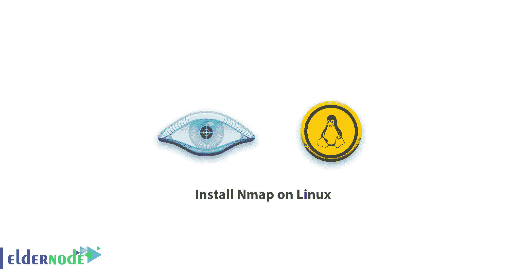

# 如何在 Linux 服务器上安装 Nmap-elder node 博客

> 原文：<https://blog.eldernode.com/install-nmap-on-linux/>



在这篇文章中，我们将学习如何在 Linux 上安装 Nmap。那么我们开始了解 Nmap 吧。

## 教程在 Linux 上安装 Nmap

### 什么是 Nmap？

Nmap 是一个开源的免费工具，它使网络发现和安全。[网络管理](https://en.wikipedia.org/wiki/Network_administrator)系统发现网络映射器( [Nmap](https://blog.eldernode.com/tutorial-nmap-commands/) )对任务很有用。
有些任务就像管理服务升级计划、监控主机或服务正常运行时间以及网络库存。

Nmap 也是灵活的、强大的、可移植的、简单的、免费的、有良好文档记录的、受支持的、受欢迎的。为了确定网络上可用的主机，map 以新颖的方式使用 row IP 数据包。它旨在快速扫描大型网络，并能很好地应对单个主机。

### 再来了解一下 Nmap 的优势

该软件的优点是支持 Xmas、Ack 扫描、FIN、反向识别、TCP syn、TCP 连接、空扫描等。方法。这款多功能软件可以安装在所有的 Linux T2 和 Windows T4 操作系统上。

### 如何在 centos Linux 上安装 Nmap

1.进入您的 centos 终端环境。

2-输入以下命令安装 Nmap。

```
yum install nmap
```

注意:在安装步骤中，如果你提出问题，输入 **y**

3-要验证 Nmap 的安装和操作，请输入以下命令下载程序版本。

```
nmap --version
```

### 如何在 Ubuntu Linux 上安装 Nmap

首先，用下面的命令更新 Ubuntu。

```
sudo apt-get update 
```

2-输入以下命令下载并安装它。

```
sudo apt-get install nmap 
```

注意:在安装步骤中，如果你提出问题，输入 **y**

3-完成上述步骤后，Nmap 安装完毕。

4-要验证 Nmap 的安装和操作，请输入以下命令以接收版本。

```
nmap –version
```

## 结论

亲爱的用户，我们希望你能喜欢这个教程，你可以在评论区提出关于这个培训的问题，或者要解决其他关于老年节点培训的问题，请参考提问页面，尽快提出你的问题。腾出时间给其他用户和专家来回答你的问题。