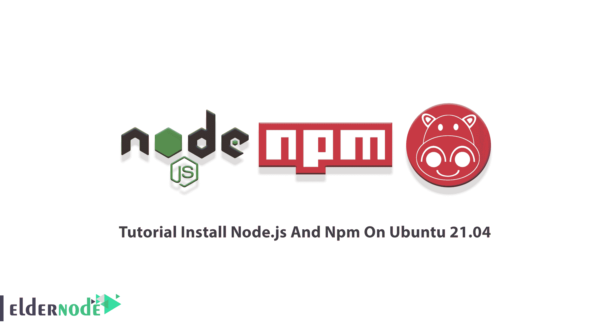

# 教程在 Ubuntu 21.04 上安装 Node.js 和 Npm-elder node 博客

> 原文：<https://blog.eldernode.com/install-node-js-and-npm-on-ubuntu/>



要在您的机器上运行 Javascript 代码，您需要安装 Node.js。它是一个开源的跨平台软件，可以在 Ubuntu 存储库中找到。Node.js 旨在在服务器端执行 JavaScript 代码，并由 Node.js 包管理器提供支持。Npm 是 Node.js 的默认包管理器，也是世界上最大的软件注册中心。在 Ubuntu 上安装 Node.js 和 Npm 有三种方式。根据 Ubuntu 新版本，复习**教程在 Ubuntu 21.04** 上安装 Node.js 和 Npm。要购买你自己的即时廉价的 [Ubuntu VPS](https://eldernode.com/ubuntu-vps/) ，在 [Eldernode](https://eldernode.com/) 上订购你需要的东西。

## **如何在 Ubuntu 21.04 上安装 Node.js 和 Npm**

[Node.js](https://blog.eldernode.com/install-and-config-node-js-on-ubuntu-20-04/) 是一个跨平台的 JavaScript 运行时环境，一般用于构建后端应用。作为全栈和前端解决方案，它也很受欢迎。加入我们这篇文章，了解在 Ubuntu 21.04 上安装 Node.js 和 Npm 的不同方法。让我们看看这三种方式的标题，然后继续研究说明:

**1-来自标准的 Ubuntu 库**

**2-来自节点源存储库。**

**3-使用节点版本管理器( *nvm* )**

在本教程结束时，您可以使用任何基于 Ubuntu 的发行版的指导，包括 Kubuntu、Linux Mint 和 Elementary OS。

### **在 Ubuntu 21.04**T3 上安装 Node.js 和 Npm 的先决条件

为了让本教程更好地工作，请考虑以下先决条件:

_ 拥有 Sudo 权限的非 root 用户。

_ 要安装，请遵循我们在 Ubuntu 21.04 上的[初始服务器设置。](https://blog.eldernode.com/initial-server-setup-on-ubuntu-21-04/)

## **从 Ubuntu 库安装 Node.js 和 Npm**

这是在 Ubuntu 21.04 上安装 Node.js 和 Npm 的第一个也是最简单的方法。因此，您可以期待一个简单的安装。

使用以下命令**更新包**索引和 **install Node.js 和 N** **pm** :

```
sudo apt update
```

```
sudo apt install nodejs npm
```

通过这种方式，您将安装许多包，包括从 Npm 编译和安装本地插件所必需的工具。完成后，运行下面的命令让**验证安装**:

```
nodejs --version
```

## **从 NodeSource** 安装 Node.js 和 Npm

如果你想**安装一个不同于 Ubuntu 库提供的 Node.js 版本**，你可以使用这个方法。目前 NodeSource 支持 Node.js ***v14*** 、 ***v13*** 、 ***v12*** 、 ***v10*** 。

**NodeSource** 维护一个包含多个 Node.js 版本的 APT 存储库。如果您的应用程序需要特定版本的 Node.js，请使用这个存储库。在撰写本文时，NodeSource 库提供了 **v14** 、 **v13** 、 **v12** 和 **v10** 版本。

在这里，您将安装 Node.js *版本 14.x* 。因此，使用下面的命令**下载并执行 NodeSource 安装脚本**:

```
curl -sL https://deb.nodesource.com/setup_14.x | sudo -E bash -
```

这样，NodeSource 签名密钥将被添加到您的系统中。该脚本还将创建一个 apt 存储库文件，安装所有必需的包，并刷新 apt 缓存。

***注意:*** 要把 Node.js 的版本换成另一个认为的版本(例如 ***12x、*** )你只需要把 ***setup_14.x*** 换成 ***setup_12.x*** 。

启用 NodeSource 存储库后，运行下面的命令**安装 Node.js 和 Npm** :

```
sudo apt install nodejs
```

***注***:node . js 包中同时包含了 ***节点*** 和 ***npm*** 二进制文件。

然后，您可以验证 Node.js 和 Npm 是否成功安装。为此，请运行:

```
node --version
```

```
npm --version
```

使用以下命令**安装开发工具**，它允许你**从 npm** 编译本地插件:

```
sudo apt install build-essential
```

## **使用 NVM** 安装 Node.js 和 Npm

第三种也是最后一种安装 Node.js 和 Npm 的方法是使用节点版本管理器。如果你需要在同一台机器上安装**多个 Node.js 版本**，这个方法是你必须使用的。还有，如果你是 **Node.js 开发者**，建议你选择这种安装方式。

NVM 是一个 bash 脚本。您将使用这个方法来管理每个用户的多个 Node.js 版本。此外，您将能够**安装和卸载**任何您希望使用或测试的 Node.js 版本。

要下载并安装 nvm 脚本，请转到 [nvm GitHub 库](https://github.com/nvm-sh/nvm#installing-and-updating)页面，复制 **curl** 或 **wget** 命令:

```
curl -o- https://raw.githubusercontent.com/nvm-sh/nvm/v0.35.3/install.sh | bash
```

***注意*** :由于 **Sudo** 为 root 用户启用 nvm，所以不要使用。

该脚本会将项目的资源库从 Github 克隆到 ***~/。nvm*** 目录。

***注意* :** 在输出中，会要求您关闭并重新打开终端，或者运行命令将 nvm 脚本的路径添加到当前 shell 会话中。选择哪一个对你来说更容易。

当脚本在您的**路径**中时，运行下面的命令来验证 **nvm** 是否正确安装:

```
nvm --version
```

使用下面的命令获取可以与 nvm 一起安装的所有 Node.js 版本的**列表:**

```
nvm list-remote
```

这样，它将打印所有可用 Node.js 版本的巨大列表。

现在，运行以下命令来**安装 Node.js 的最新可用版本**，运行:

```
nvm install node
```

成功安装后，运行下面的命令，通过打印 Node.js 版本进行验证:

```
node --version
```

## 结论

在本文中，您了解了如何在 Ubuntu 21.04 上安装 Node.js 和 Npm。有三种不同的方法可以达到这一目的，您已经全部复习过了。由于每个部分的解释，您可以选择适合您的环境。但是如果您不确定要安装哪个 Node.js 版本，请查阅您要部署的应用程序的文档。