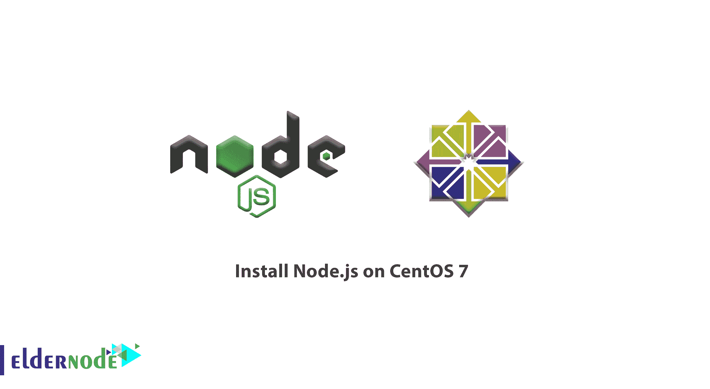

# 如何在 CentOS 7 - Eldernode 上安装 Node.js

> 原文：<https://blog.eldernode.com/install-node-js-centos-7/>



Node.js 是一个用于服务器端编程的 Javascript 平台。它允许用户轻松创建需要后端功能的网络应用程序。通过使用 Javascript 作为客户机和服务器语言，开发可以快速且一致。在本指南中，我们将向您展示在 CentOS 7 服务器上安装 Node.js 的几种不同方法，以便您可以开始使用。大多数用户会希望使用 [EPEL 安装](https://eldernode.com/how-fix-epel-repository-error-centos-7/)指令或 NVM 安装步骤。为了让你的研究更有用，联系作为 [VPS](https://eldernode.com/centos-vps/) 提供商的 Eldernode 团队，拥有你自己的 Linux 虚拟服务器。

## 如何在 CentOS 7 上安装 node . js

与我们一起阅读本指南，了解如何在 CentOS 7 上安装 Node.js。如果您需要查看这个过程的最新版本，请关注我们的文章[如何在 CentOS 8](https://blog.eldernode.com/install-node-js-centos-8/) 上安装 Node.js。

### 步骤 1:从源安装节点

获取 Node.js 的一种方法是获取源代码，自己编译。

为此，您应该从项目网站上获取源代码。在[下载页面](http://nodejs.org/download/)上，右键单击“源代码”链接，然后单击“复制链接地址”或浏览器提供的任何类似选项。

在您的服务器上，使用 wget 并粘贴您复制的链接，以便下载归档文件:

```
wget http://nodejs.org/dist/v0.10.30/node-v0.10.30.tar.gz 
```

通过键入以下命令，提取归档文件并移动到新目录中:

```
tar xzvf node-v* && cd node-v* 
```

为了编译代码，我们需要从 CentOS 库下载一些包。使用 yum 立即获取这些:

```
sudo yum install gcc gcc-c++ 
```

现在，我们可以配置和编译软件:

```
./configure  make 
```

汇编需要相当长的时间。完成后，您可以通过键入以下命令将软件安装到您的系统上:

```
sudo make install 
```

要检查安装是否成功，您可以要求 Node 显示其版本号:

```
node --version 
```

```
v0.10.30 
```

如果您看到版本号，则安装成功完成。

### 步骤 2:从节点站点安装软件包

在您的服务器上安装 Node.js 的另一个选择是简单地从 Node.js 网站获得预构建的包并安装它们。

因为 CentOS 7 只有 64 位架构，所以右键单击“Linux Binaries (.tar.gz)”下面标有“64 位”的链接。选择“复制链接地址”或浏览器提供的任何类似选项。

在您的服务器上，切换到您的主目录并使用 wget 实用程序下载文件。将刚刚复制的 URL 粘贴为命令的参数:

```
cd ~  wget http://nodejs.org/dist/v0.10.30/node-v0.10.30-linux-x64.tar.gz
```

***注意*** :您在 URL 中的版本号很可能与上面的版本号不同。使用从 Node.js 站点复制的地址，而不是本指南中提供的特定 URL。

接下来，我们将用 **tar** 命令将二进制包提取到我们系统的本地包层次结构中。归档文件打包在一个版本化的目录中，我们可以绕过–strip-components**1**选项来摆脱它。我们将使用 -C 命令指定命令的目标目录:

```
sudo tar --strip-components 1 -xzvf node-v* -C /usr/local 
```

这将安装系统的 /usr/local 分支中的所有组件。

您可以通过向节点询问其版本号来验证安装是否成功:

```
node --version 
```

```
v0.10.30 
```

安装成功，现在您可以开始在 CentOS 7 服务器上使用 Node.js。

### 步骤 3:从 EPEL 存储库中安装节点

另一种安装方法是使用 CentOS 和相关发行版提供的 EPEL(Enterprise Linux 的额外软件包)存储库。

要访问 EPEL 回购，您必须修改安装的回购列表。幸运的是，我们可以通过安装当前 repos 中的一个名为 epel-release 的包来重新配置对这个存储库的访问。

```
sudo yum install epel-release 
```

现在您已经可以访问 EPEL 存储库了，您可以使用常规的 yum 命令安装 Node.js:

```
sudo yum install nodejs
```

同样，您可以通过要求 Node 返回其版本号来检查安装是否成功:

```
node --version 
```

```
v0.10.30 
```

许多人还想访问 npm 来管理他们的节点包。您也可以通过键入以下内容从 EPEL 获得此信息:

```
sudo yum install npm 
```

### 步骤 4:使用节点版本管理器安装节点

另一种特别灵活的安装 Node.js 的方法是通过 NVM，即节点版本管理器。这个软件允许你同时安装和维护 Node.js 的许多不同的独立版本，以及它们相关的节点包。

要在 CentOS 7 机器上安装 NVM，请访问该项目的 GitHub **页面**。从主页面显示的自述文件中复制 **卷曲** 或 **wget** 命令。这将引导您找到安装脚本的最新版本。

在将命令传递给 **bash** 之前，最好检查一下脚本，确保它没有做任何您不同意的事情。你可以通过删除 **| bash** 段末尾的 **curl** 命令来实现:

```
curl https://raw.githubusercontent.com/creationix/nvm/v0.13.1/install.sh 
```

看一看，确保你对它所做的改变感到满意。当您满意时，再次运行该命令，并在末尾追加 **| bash** 。您使用的 URL 将根据 NVM 的最新版本而变化，但现在，可以通过键入以下内容来下载和执行该脚本:

```
curl https://raw.githubusercontent.com/creationix/nvm/v0.13.1/install.sh | bash 
```

这将安装 **nvm** 脚本到您的用户帐户。要使用它，你必须首先找到你的。bash_profile :

```
source ~/.bash_profile 
```

现在，您可以询问 NVM 它知道哪个版本的 Node:

```
nvm list-remote 
```

```
. . .  v0.10.29  v0.10.30   v0.11.0   v0.11.1   v0.11.2   v0.11.3   v0.11.4   v0.11.5   v0.11.6   v0.11.7   v0.11.8   v0.11.9  v0.11.10  v0.11.11  v0.11.12  v0.11.13
```

您可以通过键入您看到的任何版本来安装 Node 的一个版本。例如，要获得版本 0.10.30，您可以键入:

```
nvm install v0.10.30 
```

您可以通过键入以下命令来查看已安装的不同版本:

```
nvm list 
```

```
->  v0.10.30        system
```

您可以通过键入以下命令在它们之间切换:

```
nvm use v0.10.30 
```

```
Now using node v0.10.30 
```

要将此版本设置为默认版本，请键入:

```
nvm alias default v0.10.30 
```

```
default -> v0.10.30 
```

您可以使用其他部分中的相同技术，通过键入以下命令来验证安装是否成功:

```
node --version  v0.10.30 
```

从版本号输出中，我们可以看出 Node 按照我们的预期安装在我们的机器上。

## 结论

在本文中，您已经完成了在 CentOS 7 上安装 Node.js。如您所见，在 CentOS 7 服务器上运行 Node.js 有多种不同的方式。如果其中一种安装方法出现问题，请尝试其他方法。如果你有兴趣回顾更多相关文章，可以在下面找到[如何在 Ubuntu 20.04 上安装和配置 node . js](https://blog.eldernode.com/install-and-config-node-js-on-ubuntu-20-04/)和[如何在 Debian 10 上安装 node . js](https://blog.eldernode.com/install-node-js-on-debian-10/)或者 windows 用户[如何在 Windows 上安装 node . js](https://blog.eldernode.com/install-node-js-on-windows/)。