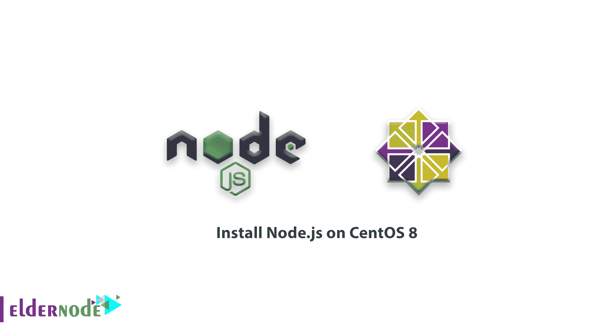

# 如何在 CentOS 8 - Eldernode 上安装 Node.js

> 原文：<https://blog.eldernode.com/install-node-js-centos-8/>



Node.js 是用于服务器端编程的 JavaScript 运行时。它允许开发人员使用 JavaScript 创建可伸缩的后端功能，这是一种许多人在基于浏览器的 web 开发中已经熟悉的语言。

为了让你的研究更有用，联系 Eldernode 团队作为 [VPS](https://eldernode.com/centos-vps/) 提供商来拥有你自己的 Linux 虚拟服务器。

在本教程的以下内容中，您将看到在 CentOS 8 服务器上安装 Node.js 的三种不同方式:

**使用 dnf** 从 CentOS 的默认 AppStream 库安装 nodejs 包。

**安装节点版本管理器 nvm** ，用它来安装和管理节点的多个版本。

**从源头构建和安装**节点。

如果您是一名开发人员或者需要管理 Node 的多个安装版本，请使用 **nvm** 方法。大多数用户很少需要从源代码构建。当然，他们要用 **dnf** 来安装 Node 的内置预打包版本。

为了让本教程更好地发挥作用，请考虑下面的**先决条件** s:

## 如何在 CentOS 8 上安装 node . js

让我们通过这篇指南来学习如何在 **CentOS 8** 上安装 **Node.js** 。如果你使用的是 windows，你可以在[找到如何在 Windows](https://blog.eldernode.com/install-node-js-on-windows/) 上安装 node.js 的目标指南。

### 如何从 CentOS AppStream 存储库安装节点

Node.js 可从 CentOS 8 的默认 **AppStream** 软件库中获得。但是由于有多个版本可用，您可以通过启用适当的模块流在它们之间进行选择。

**首先是**，使用下面的命令列出 **nodejs** 模块可用的流。

```
sudo dnf module list nodejs
```

输出

```
Name                     Stream                   Profiles                                                Summary  nodejs                   10 [d]                   common [d], development, minimal, s2i                   Javascript runtime  nodejs                   12                       common, development, minimal, s2i                       Javascript runtime
```

如你所见，有两个流可用， **10** 和 **12** 。**【d】**表示版本 10 为默认流。如果您更愿意安装 Node.js 12，现在就切换模块流:

```
sudo dnf module enable nodejs:12
```

之后，你必须确认你的决定。因此，版本 12 流将被启用，我们可以继续安装。

现在，用 **dnf** 安装 **nodejs** 包:

```
sudo dnf install nodejs
```

同样， **dnf** 将要求您确认它将采取的行动。按 **y** 然后**回车**这样做，软件就会安装。

通过查询节点的版本号来检查安装是否成功:

```
node --version
```

输出

```
v12.13.1
```

***注意*** :你的**–版本** 输出如果你改为安装 Node.js 10 会不一样。Node.js 的两个可用版本都是长期支持版本，这意味着它们有更长的维护保证期

**请考虑**安装 **nodejs** 包也要安装 **npm** 节点包管理器实用程序作为依赖项。验证其安装是否正确:

```
npm --version
```

输出

```
6.12.1
```

**点**:您已经使用 CentOS 软件库成功安装了 Node.js 和 npm。

### 如何使用节点版本管理器安装节点

让我们验证一下安装 Node.js 的另一种特别灵活的方法是使用 nvm，即节点版本管理器。这个软件允许你同时安装和维护 Node.js 的许多不同的独立版本，以及它们相关的节点包。

要在你的 CentOS 8 机器上安装 **NVM** ，请访问[该项目的 GitHub 页面](https://github.com/nvm-sh/nvm)。从主页上显示的自述文件中复制 **curl** 命令。这将为您提供最新版本的安装脚本。

另外，在将命令传递给 **bash 之前，最好对脚本进行审核，以确保它没有做任何您不同意的事情。**你可以通过删除 **curl** 命令末尾的 **| bash** 段来实现:

```
curl -o- https://raw.githubusercontent.com/nvm-sh/nvm/v0.35.3/install.sh
```

然后，你需要确保你对它所做的改变感到满意。当您满意时，再次运行该命令，并在末尾追加 **| bash** 。您使用的 URL 将根据 NVM 的最新版本而变化，但现在，可以通过键入以下内容来下载和执行该脚本:

```
curl -o- https://raw.githubusercontent.com/nvm-sh/nvm/v0.35.3/install.sh | bash
```

这样，你就可以将 **nvm** 脚本安装到你的用户账户上。要使用它，你必须首先找到你的**。bash_profile** 文件。

```
source ~/.bash_profile
```

接下来，询问 NVM 有哪些版本的 Node。

```
nvm list-remote 
```

```
. . .         v12.13.0   (LTS: Erbium)         v12.13.1   (LTS: Erbium)         v12.14.0   (LTS: Erbium)         v12.14.1   (LTS: Erbium)         v12.15.0   (LTS: Erbium)         v12.16.0   (LTS: Erbium)         v12.16.1   (Latest LTS: Erbium)          v13.0.0          v13.0.1          v13.1.0          v13.2.0          v13.3.0          v13.4.0          v13.5.0          v13.6.0          v13.7.0          v13.8.0          v13.9.0         v13.10.0         v13.10.1         v13.11.0         v13.12.0
```

如你所见，这是一个很长的列表！您可以通过键入您看到的任何已发布版本来安装 Node 的一个版本。例如，要获得 v13.6.0 版，您可以键入:

```
nvm install v13.6.0
```

键入下面的命令，查看您已安装的不同版本。

```
nvm list 
```

输出

```
->      v13.6.0  default -> v13.6.0  node -> stable (-> v13.6.0) (default)  stable -> 13.6 (-> v13.6.0) (default)
```

这在第一行显示了当前活动的版本 **( - > v13.6.0** )，后面是一些命名的别名和这些别名指向的版本。

***注意* :** 如果您也有通过 CentOS 软件库安装的 Node 版本，您可能会在此处看到一个**system->v 12 . 13 . 1**(或其他版本号)行。您可以随时使用 **nvm 使用系统** 激活 Node 的系统版本。

此外，您将看到 Node 的各种长期支持(或 LTS)版本的别名:

输出

```
lts/* -> lts/erbium (-> N/A)  lts/argon -> v4.9.1 (-> N/A)  lts/boron -> v6.17.1 (-> N/A)  lts/carbon -> v8.17.0 (-> N/A)  lts/dubnium -> v10.19.0 (-> N/A)  lts/erbium -> v12.16.1 (-> N/A)
```

我们也可以基于这些别名安装一个版本。例如，要安装最新的长期支持版本**铒**，请运行以下命令:

```
nvm install lts/erbium
```

输出

```
Downloading and installing node v12.16.1...  . . .  Now using node v12.16.1 (npm v6.13.4)
```

此外，您可以使用通过 **nvm 在已安装的版本之间切换:**

```
nvm use v13.6.0 
```

```
Now using node v13.6.0 (npm v6.13.4) 
```

然后，使用其他部分中的相同技术验证安装是否成功

```
node --version 
```

输出

```
v13.6.0
```

此时，正如我们所期望的，Node 的正确版本已经安装在我们的机器上。也有兼容版本的 **npm** 。

### 如何从源安装节点

在这一步中，我们将验证安装 Node.js 的另一种方法是下载源代码并自己编译。

为此，请使用您的网络浏览器导航至**官方 Node.js 下载页面**，右键单击**源代码**链接，然后单击**复制链接地址**或您的浏览器提供的任何类似选项。

回到您的 SSH 会话，首先，确保您位于可以写入的目录中。您将使用当前用户的主目录:

```
cd ~
```

然后输入 **curl** ，粘贴你从网站上复制的链接，后面跟着| tar xz:

```
curl https://nodejs.org/dist/v12.16.1/node-v12.16.1.tar.gz | tar xz
```

这将使用 **curl** 实用程序下载源代码，然后通过管道将其直接传输到 **tar** 实用程序，该实用程序会将其提取到当前目录中。

现在，进入新创建的源目录:

```
cd node-v*
```

为了编译代码，需要从 CentOS 库下载一些包。要安装这些，请使用以下命令:

```
sudo dnf install gcc-c++ make python2
```

现在，您必须确认安装。键入 **y** 然后 **回车** 这样做。此外，您还可以配置和编译软件:

```
./configure  make -j4
```

在四核服务器上，编译大约需要 30 分钟。您已经使用了 **-j4** 选项来运行四个并行编译进程。您可以忽略此选项，或者根据您可用的处理器内核数量来更新数量。

完成编译后，使用以下命令将软件安装到您的系统上。

```
sudo make install
```

您还可以要求 Node 显示其版本号，以确保安装成功。

```
node --version
```

```
v12.16.1 
```

## 结论

在本文中，您了解了在 CentOS 8 上安装 Node.js 的 3 个选项。请注意，如果您看到正确的版本号，则安装成功完成。默认情况下，Node 还会安装一个兼容版本的**【NPM】**，所以应该也是可用的。如果你需要阅读更多关于这个主题的内容，可以找到我们的相关文章[如何在 Debian](https://blog.eldernode.com/install-node-js-on-debian-10/) 10 上安装 Node.js 和[如何在 Ubuntu 20.04](https://blog.eldernode.com/install-and-config-node-js-on-ubuntu-20-04/) 上安装和配置 Node.js。