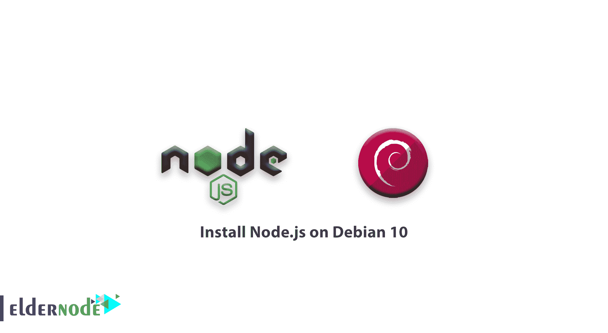

# 如何在 debian 上安装 node . js 10-教程 Debian 上的 nodejs

> 原文：<https://blog.eldernode.com/install-node-js-on-debian-10/>



如果用户需要快速构建异步网络应用程序怎么办？在本教程中，你将学习如何在 Debian 10 上安装 Node.js。通过这个 JavaScript 平台，您可以使 web 应用程序开发更加一致和集成。

本文将回顾如何在 Debian 10 上入门 [Node.js](https://nodejs.org/en/) ，通过个人包存档库从默认的 Debian 库安装 Node，使用 Node 版本管理器安装并激活 Node 的不同版本。当然，我们不会忘记向您展示如何卸载这些不同版本的 Node。

**先决条件**

如果您知道以下内容，本教程可能会更有用:

## 如何在 Debian 10 上安装 node . js

让我们通过以下步骤开始并完成 **Node.js** 的安装。

**您可能会感兴趣:**

[如何在 Ubuntu 20.04 上安装和配置 node . js](https://eldernode.com/install-and-config-node-js-on-ubuntu-20-04/)

### 安装官方 Debian Node.js 包

由于此版本为 10.15.2，2021 年 4 月 1 日将是其生命周期的终点，您将不再获得安全和错误修复支持。由于 Debian 在其默认的存储库中包含了 Node.js 版本，您可以从 Debian repo 安装它以使它有意义。所以要从默认的 Debian 软件仓库中获取 Node.js，可以使用 apt 包管理器

要刷新本地包索引，请运行以下命令。

```
sudo apt update
```

接下来，安装 Node.js 包， npm 节点包管理器:

```
sudo apt install nodejs npm 
```

您可以通过运行带有 -v 标志的节点命令来获取版本，从而检查安装过程。

```
node -v
```

输出

```
v10.15.2
```

### `使用 PPA 安装 `

`如果您想使用备用存储库，您可以从 NodeSource 维护的 PPA(个人包归档)安装。它仍然可以和 apt 一起工作，并且会有比官方 Debian 库更多的 Node.js 最新版本。当你安装 PPA 时，这将把库添加到我们的包列表中，并允许我们使用 apt 安装新的包。`

```
`cd ~  curl -sL https://deb.nodesource.com/setup_12.x -o nodesource_setup.sh`
```

`**注** :确保将 12.x 替换为您喜欢的版本字符串。`

`要使用 nano ( 或您喜欢的文本编辑器)验证该脚本的内容:`

```
`nano nodesource_setup.sh` 
```

`然后，使用 sudo 运行脚本并退出文本编辑器。`

```
`sudo bash nodesource_setup.sh`
```

`现在您可以用同样的方式安装 nodejs 包，因为 PPA 将被添加到您的配置中，并且您的本地包缓存将被自动更新。`

```
`sudo apt install nodejs`
```

`要通过使用-v 版本选项运行 node 来验证安装，请键入:`

```
`node -v`
```

`输出`

`v12.8.0`

`运行以下命令来验证是否安装了 npm 并创建配置文件:`

```
`npm -v`
```

`输出`

`6.10.2`

`因为您需要 npm 包才能工作，所以您需要安装构建必需的包:`

```
`sudo apt install build-essential` 
```

`[购买 Linux 虚拟私有服务器](https://eldernode.com/linux-vps/)`

### ``使用 NVM 安装``

``通过 apt 安装 Node.js 的另一种替代方法是使用一种叫做节点版本管理器( nvm) 的工具。你可以安装 Node.js 的多个自包含版本，而不会影响整个系统。当您使用 nvm 控制您的环境时，您可以访问 Node.js 的最新版本，同时还可以保留和管理以前的版本。``

``**请注意**版本号可能与下面突出显示的不同。``

```
``curl -sL https://raw.githubusercontent.com/nvm-sh/nvm/v0.34.0/install.sh -o``
```

``要使用 nano 验证安装脚本:``

```
``install_nvm.sh``
```

``然后，使用 bash 运行脚本并退出文本编辑器。``

```
``bash install_nvm.sh`` 
```

``现在，您需要注销并重新登录，或者获取 ~/。profile 文件来访问 nvm 功能，并让会话知道这些更改。``

```
``source ~/.profile`` 
```

``由于安装了 nvm ，您可以安装独立的 Node.js 版本，通过键入以下命令，您将获得关于可用的 Node.js 版本的信息。``

```
``nvm ls-remote``
```

```输出```

```
```. . .         v10.16.2   (Latest LTS: Dubnium)          v11.0.0          v11.1.0          v11.2.0          v11.3.0          v11.4.0          v11.5.0          v11.6.0          v11.7.0          v11.8.0          v11.9.0         v11.10.0         v11.10.1         v11.11.0         v11.12.0         v11.13.0         v11.14.0         v11.15.0          v12.0.0          v12.1.0          v12.2.0          v12.3.0          v12.3.1          v12.4.0          v12.5.0          v12.6.0          v12.7.0          v12.8.0```
```

```然后，安装最新版本。```

```默认情况下， nvm，将使用最新安装的版本。你也可以告诉 nvm 使用你刚刚下载的版本```

```
```nvm install 10.16.2``` 
```

``要验证当前是否正在使用 Node.js 版本，请使用下面的命令。``

```
``nvm use 10.16.2``
```

``输出``

```
``node -v``
```

``如果您有多个 Node.js 版本，您可以看到安装了什么。``

```
``v10.16.2``
```

``如果你想默认一个特定的版本。``

```
``nvm ls``
```

``当一个新的会话产生时，这个版本将被自动选择。``

```
``nvm alias default 10.16.2``
```

``删除 Node.js``

```
``nvm use default``
```

### ```最后，是时候学习如何从 Debian 仓库或 PPA 中删除已安装的版本了。根据您想要的版本，您可以使用 apt 或 nvm 卸载 Node.js。所以你需要在系统级使用 apt 工具。```

```要继续，您需要确定要删除的版本是否是当前活动的版本，因此，运行以下命令。```

```
```sudo apt remove nodejs```
```

``如果当前活动版本和您的目标版本**不**相同，请键入``

```
``nvm current``
```

``如果当前激活的版本和您的目标版本**相同**，禁用 nvm 以启用您的更改。``

```
``nvm uninstall node_version`` 
```

```
``nvm deactivate``
```

``总之``

#### ``如您所见，有几种方法可以在您的 Debian 10 服务器上启动并运行 Node.js。根据具体情况，您可以选择在本文中学到的方法之一。但是从 PPA 安装并与 npm 或 nvm 一起工作提供了额外的灵活性。``

``亲爱的用户，我们希望本教程能对你有所帮助，如有任何问题或想查看我们的用户关于本文的对话，请访问 [提问页面](https://eldernode.com/ask) 。也是为了提高自己的见识，准备了这么多有用的教程给 [Eldernode 培训](https://eldernode.com/blog/) 。``

``**同样，参见**``

``[如何在 Debian 10 上安装 MySQL](https://eldernode.com/install-mysql-on-debian-10/)``

``[如何在 Windows 上安装 node . js](https://eldernode.com/install-node-js-on-windows/)``

``**和**``

``[如何在 CentOS 7 上安装 node . js](https://eldernode.com/install-node-js-centos-7/)``

``**And**``

``[How To Install Node.js on CentOS 7](https://eldernode.com/install-node-js-centos-7/)``