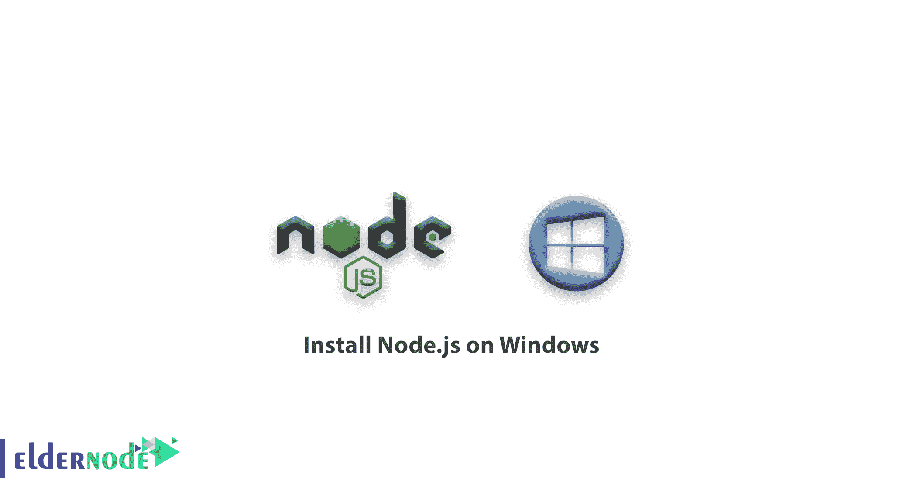
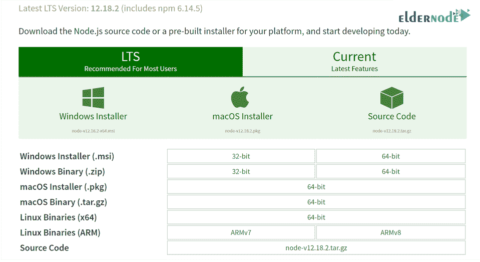
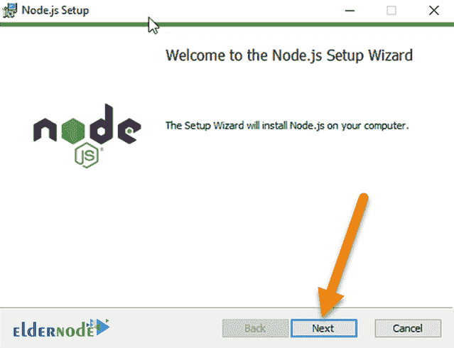
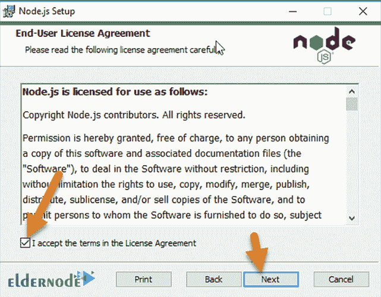
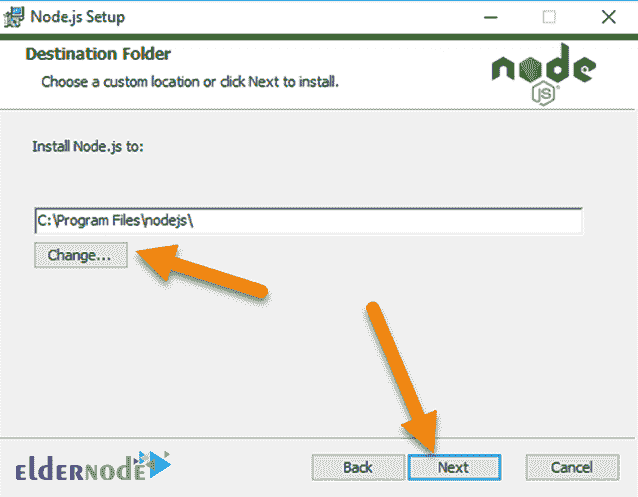
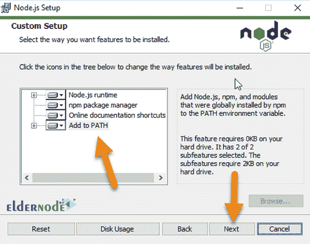
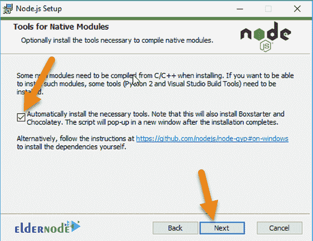
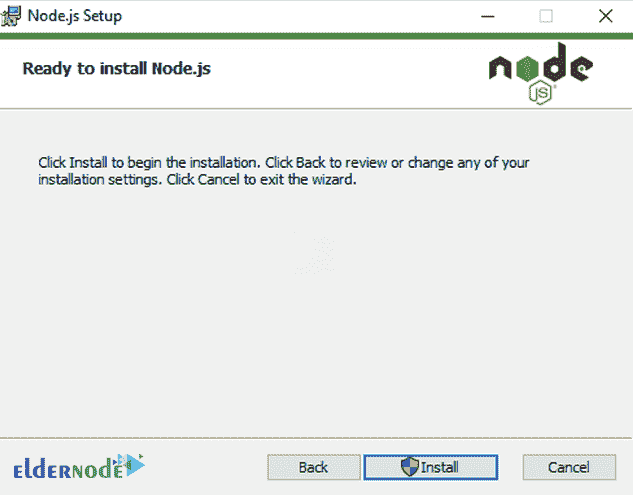
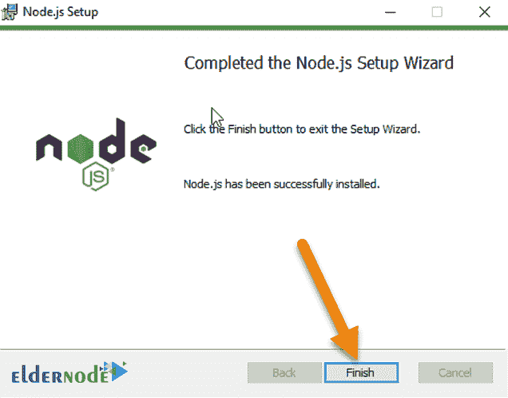

# 如何在 Windows 上安装 node.js【完整】-教程安装 node.js

> 原文：<https://blog.eldernode.com/install-node-js-on-windows/>



【更新】Node.js 是基于谷歌 Chrome JavaScript 引擎(V8 引擎)的服务器端平台。Node.js 提供了运行用 JavaScript 编写的程序所需的一切。使用 Node.js，JavaScript 编程语言运行在服务器环境中，而不是运行在浏览器中。需要注意的是，Node.js 允许您轻松简单地编写可伸缩的大型网络应用程序。在这篇文章中，我们想教你如何在 Windows 上安装 node.js。如果你想买一台 [**Windows VPS**](https://eldernode.com/windows-vps/) 服务器，你可以在 [Eldernode](https://eldernode.com/) 看到可用的软件包。

## **教程在 Windows 上安装 node . js**

### **node . js 简介**

要开始使用 Node.js 编程，必须首先在系统上安装它。Node.js 可以安装在 [Windows](https://blog.eldernode.com/tag/windows/) 、 [Ubuntu](https://blog.eldernode.com/tag/ubuntu/) 、OSX 等各种操作系统上。一旦 Node.js 安装完成，您就可以使用它启动您的项目。

当你安装 node.js 的时候，npm ( **节点包管理器**)也被安装在后台，你可以用它来管理与你的项目或者整个系统相关的包和模块。

Node.js 包含了大量的模块，比如 **fs** 或者 **path** 或者 **HTTP** 模块。其他公司和开发人员也创建了模块并与他人共享，您可以使用 npm 安装和使用这些模块。比如使用 **MongoDB 模块**，可以连接 **MongoDB 数据库**，管理想要的信息。

## **在 Windows 上安装 node . js**

开始使用 Node 的第一步是在您的系统上安装它。要做到这一点，你需要从其官方网站进入 Node.js 的[下载链接，选择与你的操作系统相关的版本并下载。](https://nodejs.org/en/download)



在上述两种情况下，将要安装的 **npm 版本**是相同的。如上图所示，我们计划下载并安装用于 Windows 的 Node.js 的 **64 位版本。为此，请单击指定的链接完成下载。**

**之后。msi** 文件下载完毕，双击它开始安装。在接下来的步骤中，点击**下一个**按钮:



下一步，阅读并接受**许可协议**和 Node.js 许可问题，点击**下一步**按钮。



您可以在接下来的步骤中更改**安装位置**，但我们不会更改该位置。建议不要更改，点击**下一步**。



在下一部分中，您还可以管理安装在您系统上的东西。



一些 **npm 模块**在安装时必须使用 C 或 C ++语言编译。如果你想在你的系统上安装和使用这些模块，你需要 [在你的系统上安装 Python](https://blog.eldernode.com/install-python-on-windows/) 、Visual Studio build 工具等等。



如果你检查上面的图片，Node.js 会默认为你做所有的事情。也可以取消勾选，点击**下一个**。

在这种情况下，您必须手动并通过其他方法在您的系统上安装 **node-gyp** ，这更容易实现自动化。

在下一部分中，单击 **Install** 并等待 Node.js 被安装。稍后，Node.js 将安装在您的系统上:



点击**完成**完成 Node.js 的安装，就可以使用了。



### **如何检查 Node.js 的版本**

为此，您需要检查系统上是否正确安装了节点和 npm。打开**命令行**，输入以下命令，然后按**回车**执行。如果显示了所需的版本，则表明 Node.js 已成功安装在您的系统上:

```
node -v
```

```
npm -v
```

一旦您确定 Node.js 已经成功安装在您的系统上，您就可以开始使用它了。

### **如何更新 Node.js 版本**

更新你的 Node.js 版本最好最简单的方法就是从[官方 Node.js 站点](https://nodejs.org/)下载最新版本并安装。该网站已经正式记录了新版本的所有变化和更新，你可以看到它们。

另外一种**为其他操作系统 [Linux](https://blog.eldernode.com/tag/linux/) 更新 Node.js** 的方法是使用 **nvm** 或者**节点版本管理器**。 **nvm** 让你安装和管理 Node.js 的不同版本，换句话说，你可以根据项目的需要，使用 nvm 在你的电脑上安装想要的 Node.js 版本，在版本之间切换，运行版本。

***注意:*** 这种方法不适合 Windows 因为 nvm 本来就是为 Linux 写的。

## 结论

Node.js 可用于许多具有不同目的的应用程序。唯一不应该使用的场景是程序需要很长处理时间的地方。在本文中，我们试图教您如何在 Windows 上安装 node.js。如果你愿意，可以在 [**Ubuntu**](https://blog.eldernode.com/install-and-config-node-js-on-ubuntu-20-04/) 、 [**Debian**](https://blog.eldernode.com/install-node-js-on-debian-10/) 、 [**CentOS**](https://blog.eldernode.com/install-node-js-centos-7/) 、 [**Fedora**](https://blog.eldernode.com/install-node-js-on-fedora/) 上访问**如何安装 Node.js。**