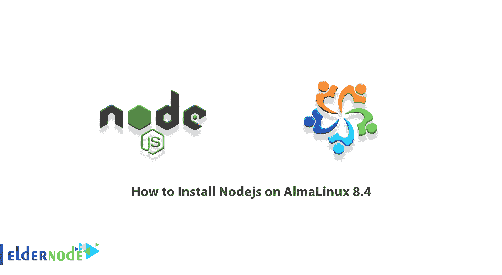

# 如何在 AlmaLinux 8.4 上安装 Nodejs-elder node 博客

> 原文：<https://blog.eldernode.com/install-nodejs-on-almalinux/>



Nodejs 是一个 JavaScript 执行环境，由于它的单线程特性，它主要用于无阻塞和事件驱动的服务器。需要注意的是，Nodejs 用于传统的网站和 API 支持服务，但是是用实时的、基于推送的架构设计的。这允许用户用 JavaScript 编写网站，其代码运行在服务器上而不是客户端浏览器上。在本文中，我们将教你如何在 AlmaLinux 8.4 上安装 Nodejs。如果你想买一个 [**Linux VPS**](https://eldernode.com/linux-vps/) 服务器，你可以在 [Eldernode](https://eldernode.com/) 看到可用的软件包。

## **教程在 AlmaLinux 8.4 上安装 Nodejs**

## **alma Linux 简介**

如你所知， [CentOS](https://blog.eldernode.com/tag/centos/) 是最流行的 Linux 发行版之一，但它不会像以前那样发布了！总的来说，CentOS 将不再稳定！这是 CentOS 的新东家 RedHat 的决定。因此，一家依赖 CentOS 产品的公司决定发布一个 Linux 发行版，就像 CentOS 一样，名为 AlmaLinux OS，与基于 RedHat 的 CentOS 完全相同。

[免费开源的 AlmaLinux](https://blog.eldernode.com/install-and-use-almalinux/) 就像 CentOS 一样，可以迅速获得人气。此外，还有一个将现有 CentOS 服务器转换为 AlmaLinux 的解决方案，只需一个命令即可完成，所有服务都将在服务器上不间断运行。

AlmaLinux 站点可以为您提供关于这个 Linux 发行版的更多信息。既然这样的发行版背后有 Cloud Linux 这样的公司，很多人就决定信任和使用这个发行版。所以至少你可以试试。

### **什么是 Nodejs？**

Nodejs 是一个基于 Google Chrome JavaScript 引擎的平台，可以轻松创建可扩展的网络应用。该平台使用事件驱动的非阻塞 I/O 模型，这减轻了服务器的压力并提高了性能。因此，它非常适合在分散式服务器上运行实时使用的基于数据的应用程序。

这个框架提供了一个巨大的不同 JavaScript 模块库，极大地方便了 web 应用程序的开发。该平台最重要的特性使其成为程序员在网站设计中的首选:

1-异步和关键事件

2-高速

3-单一主题，但非常灵活

4-无缓冲

### **在 AlmaLinux 8.4 上安装 Nodejs 的先决条件**

在本节中，我们将列出在 AlmaLinux 8.4 上安装 Nodejs 必须具备的先决条件。这些先决条件是:

_ 一个 AlmaLinux 安装的[专用服务器](https://eldernode.com/dedicated-server/)

_ 具有管理权限的根用户访问或普通用户

## **在 AlmaLinux 8.4 上安装 Nodejs**

在这一节，我们将教你如何在 AlmaLinux 8.4 上安装 Nodejs。为此，您必须遵循以下步骤。

第一步是使用以下命令使服务器保持最新状态:

```
dnf update -y
```

然后，您应该通过运行以下命令列出可用的 Nodejs 流。应该注意，该流与 Nodejs 的原始版本兼容:

```
dnf module list nodejs
```

最后，您可以使用以下命令在 AlmaLinux 上**安装 Nodejs** :

```
dnf module install nodejs:14
```

### **如何在 AlmaLinux 8.4 上验证 Nodejs**

在前面的小节中，已经向您介绍了 Nodejs 和 AlmaLinux。我们还解释了如何在 AlmaLinux 8.4 上安装 Nodejs。现在，您可以通过运行以下命令来轻松验证 AlmaLinux 8.4 中的 Nodejs:

```
node -v && npm -v
```

## 结论

Nodejs 是服务器端使用的 JavaScript 编程语言的编码平台。Nodejs 用于电子商务网站或社交网站。如果你的网站需要实时服务，比如聊天室或者在线游戏，Nodejs 是一个不错的选择。在本文中，我们试图向您展示如何在 AlmaLinux 8.4 上安装 Nodejs。