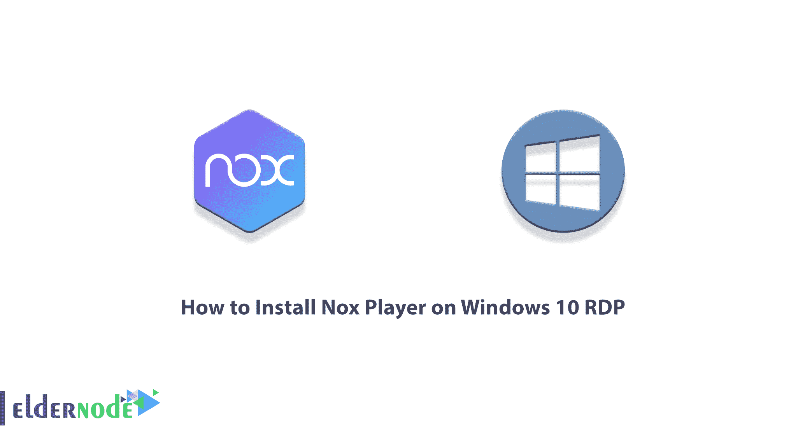
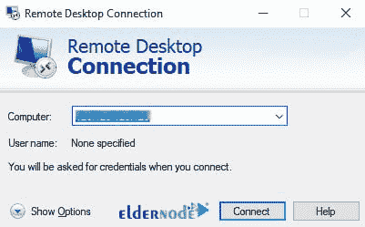
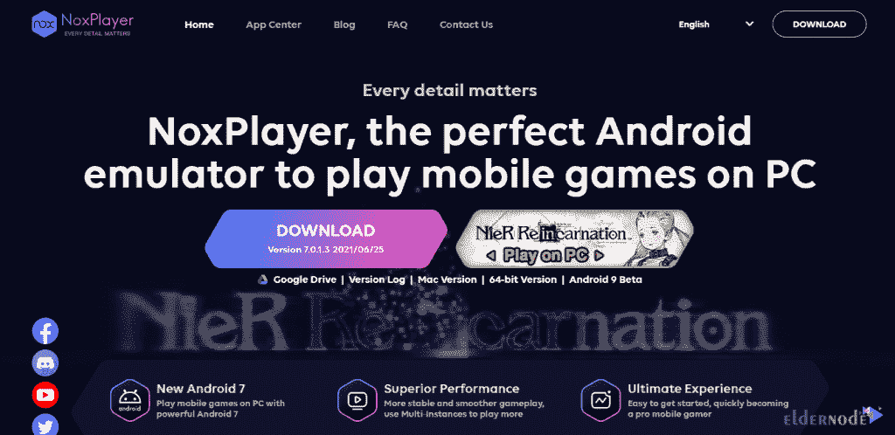
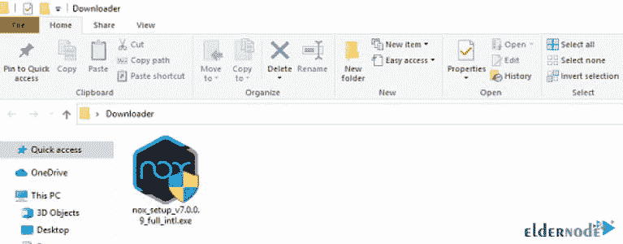
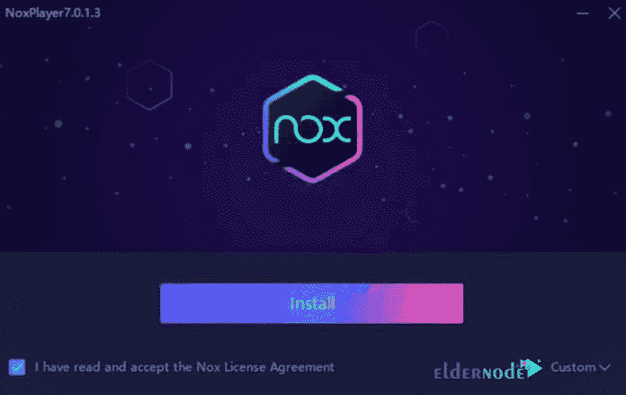
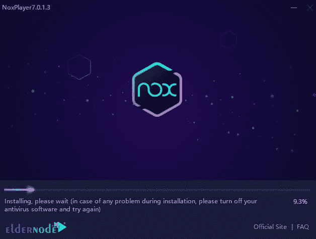
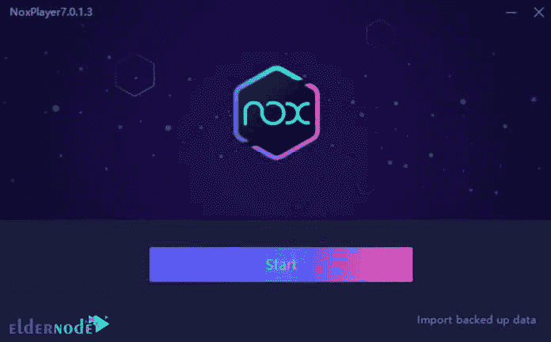
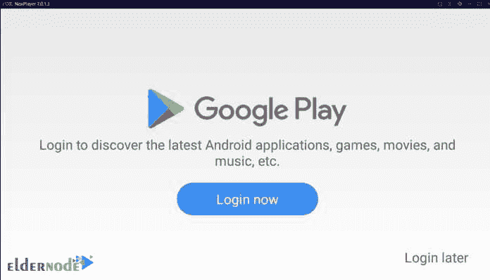
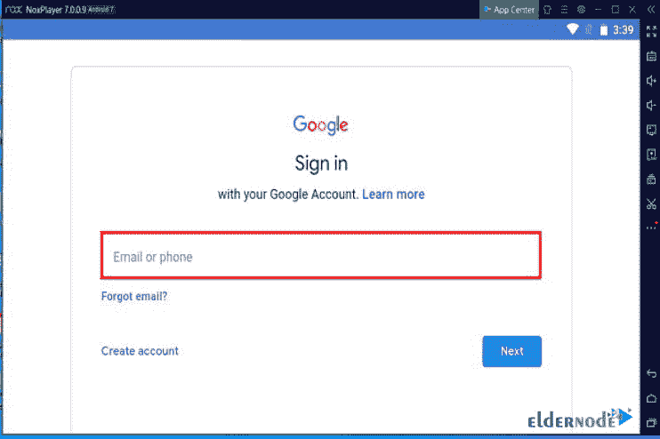
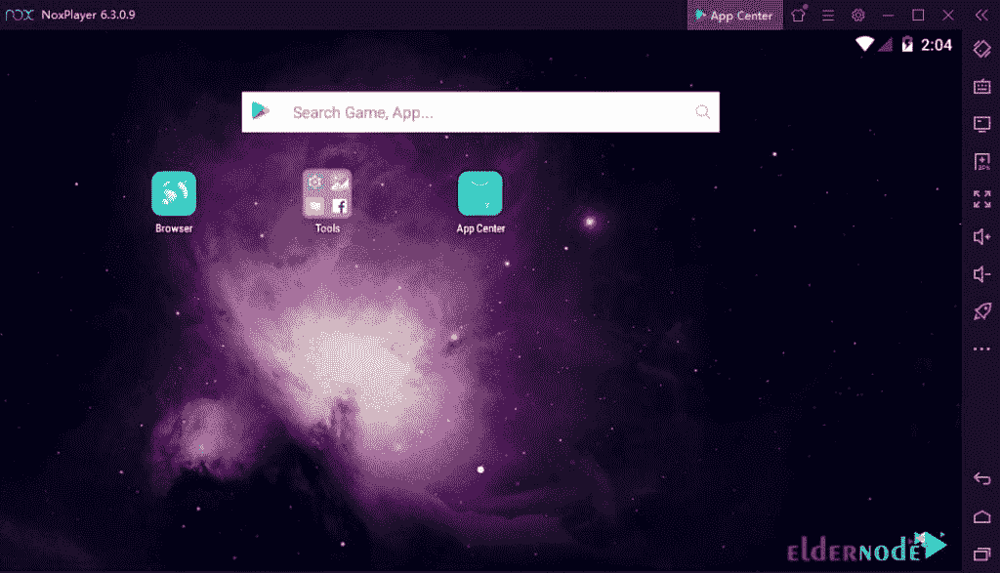

# 如何在 Windows 10 上安装 Nox 播放器 RDP - Eldernode 博客

> 原文：<https://blog.eldernode.com/install-nox-player-on-windows-10/>

你可能是那些对在你的电脑上运行 Android 软件和游戏感兴趣的人之一。有很多方法可以做到这一点，它可以给你带来独特的 Android 游戏和应用程序的体验。Nox Player 是一款方便可靠的工具，可以用来在电脑上运行 Android 应用和游戏。这个软件实际上在你的操作系统中创建了一个虚拟机，你可以用它在你的电脑上运行 Android 应用程序和游戏。在这篇文章中，我们将教你如何在 Windows 10 RDP 上安装 Nox 播放器。如果你想买一台 [**Windows VPS**](https://eldernode.com/windows-vps/) 服务器，你可以在 [Eldernode](https://eldernode.com/) 看到可用的软件包。

## **教程在 Windows 10 上安装 Nox 播放器 RDP**

### **Nox 玩家简介**

Nox Player 是一个 Android 模拟器，它在 [Windows](https://blog.eldernode.com/tag/windows/) 或 Mac 上构建了一个虚拟的 Android 操作系统，允许用户使用他们想运行的软件。

如果您的计算机硬件不是最新的，您不应该期望从该虚拟机获得适当的性能；因为 Nox Player 是会需要 CPU、RAM 等电脑硬件资源的软件之一。

安装 Nox 播放器后，您可以指定为 Nox 播放器提供多少电脑硬件电源。比如你可以给这个软件分配一些 CPU 核心和一些电脑 RAM。这项功能对开发者来说非常有用，因为他们可以用它来找出他们在不同硬件的手机上制作的软件或游戏。如果你安装 Nox Player 的目的只是为了运行 Android 游戏，我们建议你保持默认设置。

有趣的是，Nox Player 的制作者们已经把主要精力放在了运行游戏上。据 Nox Player 官方网站介绍，这款虚拟机是运行游戏的绝佳模拟器。

关于 Nox Player 还有一点很重要，就是这个虚拟机使用的是 Android 5.1 版本，可能会有一些新的应用跑进去。当然，这个操作系统是 Nox Player 的默认版本，你可以随时在上面安装更新版本的 Android。当然，你必须记住，新版本的 Android 也需要更强大的硬件。

### **Nox 播放器特性**

适用于 Windows 的 Nox App Player 的一些功能包括:

1.与 Bluestacks 相比，很少使用系统资源

2.完全离线安装，容易，没有任何歧义和困难

3.用户可以选择设备类型:手机或平板电脑

4.能够由用户选择所需的分辨率和 DPI

5.能够选择用户所需的处理器数量和 RAM 容量

6.与所有 Windows 7、8、10 和 XP 兼容

7.轻松完整地访问您的所有 Windows 驱动器

8.在模拟器上同时执行几个游戏和程序

9.集成键盘、摄像头和麦克风，轻松打字

10.与类似的程序相比，时尚的用户界面没有困难

## **在 Windows 10 上安装 Nox 播放器 RDP**

在您完全熟悉前面几节中的 Nox Player 之后，我们现在要一步一步地向您展示如何在 Windows 10 RDP 上安装 Nox Player。为此，只需按顺序执行以下步骤。

第一步，你需要从你的 Windows **开始菜单**中搜索并运行**远程桌面连接**。在打开的窗口中，输入想要进入 Windows 10 RDP 环境的 IP，点击**连接**:

进入 Windows 10 RDP 环境后，现在应该打开一个自己喜欢的浏览器，到 Nox 网站 [**下载 Nox 播放器**](https://www.bignox.com/) :

下载完成后，转到下载文件的位置，双击该文件开始程序安装过程:

在打开的窗口中，检查“**我已经阅读并接受 Nox 许可协议**”。然后点击**安装**:

安装程序可能需要几分钟时间，因此请耐心等待:

最后，Nox 播放器安装完成后，点击**开始**即可使用:

### **如何在 Windows 10 上设置 Nox 播放器 RDP**

正如您在上一步中看到的，我们教您如何在 Windows 10 RDP 上安装 Nox Player。现在我们想向您展示如何设置它。要运行 Nox 播放器，只需双击**桌面**上的图标。你也可以从**开始菜单**中搜索 **Nox 播放器**名称来运行它。

现在你需要点击 **Google Play** 商店图标。这将要求您的**谷歌账户**:

如果你有账户，你可以通过输入你的**电子邮件**和**密码**进入你的账户。否则，点击**创建账户**，为自己创建一个账户。然后，点击**下一个**:

在下图中，您可以看到与您的帐户相关的 Nox 播放器应用程序环境:

## 结论

Nox App Player 可以被认为是 Windows 上最快、最好、最高效的 Android 模拟器软件之一，它具有非常漂亮的用户界面，并带来了在 PC 上拥有 Android 的不同体验。Bluestacks 软件面临的一个问题是，谷歌软件并没有与之相处。Nox App Player 软件解决了这个问题，连接各种谷歌服务没有任何问题。在这篇文章中，我们试图教你如何在 Windows 10 RDP 上安装 Nox 播放器。