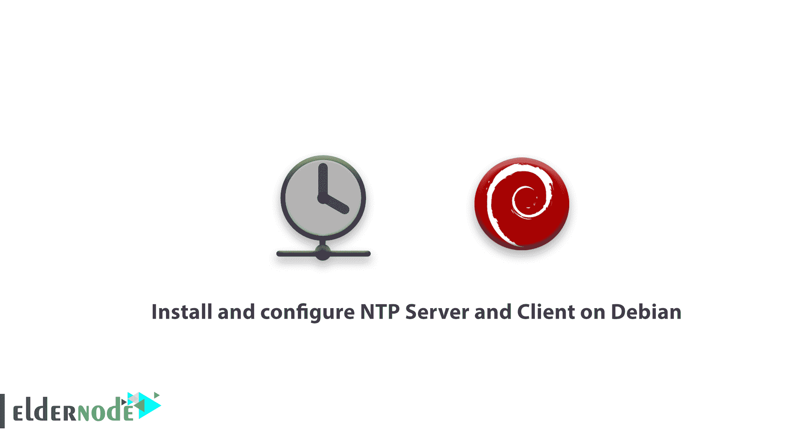
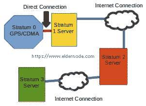
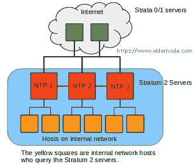
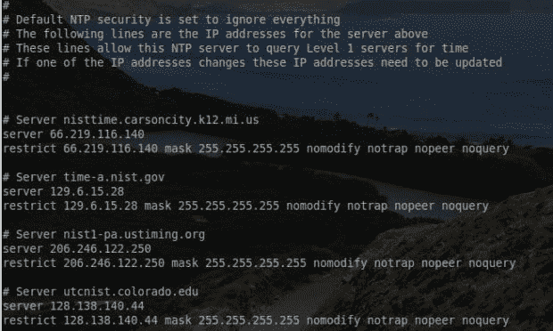
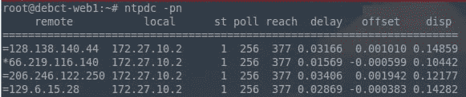
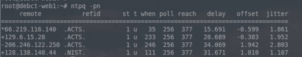
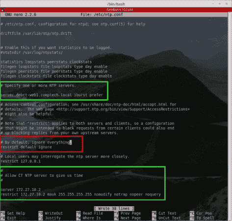
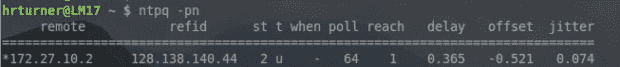
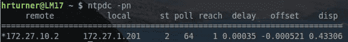

# 如何在 Debian - NTP 上安装和配置 NTP 服务器和客户端

> 原文：<https://blog.eldernode.com/install-ntp-debian/>



为了了解更多关于**网络时间协议**，在这篇文章中我们将学习**如何在 Debian** 上安装和配置 NTP 服务器和客户端。众所周知，时间同步非常重要，原因有很多，从应用程序时间戳到安全性再到正确的日志条目，而 **NTP** 为公司提供了一种独特的功能，可以同步公司内所有系统的时钟。

因为从故障排除的角度来看，当一个组织的系统都保持不同的时钟时间时，很难确定特定事件可能在何时以及在什么条件下发生。NTP 提供了一种简单的方法来确保所有系统保持正确的时间，这反过来可以大大减轻管理员/技术支持的负担。

#### 但是 NTP 是怎么工作的呢？

**NTP** 工作在与参考时钟同步的前提下，也称为“ **stratum 0** 服务器。然后，所有其他 NTP 服务器根据它们与参考服务器的距离成为较低级别的分层服务器。

NTP 链的起点是一个**层 1** 服务器，它总是直接连接到一个**层 0** 参考时钟。从这里，较低层的服务器通过网络连接连接到较高层的服务器。

请看下图，更好地了解本指南。



建立一个**第 0 层**或**第 1 层**服务器会很昂贵，我们将专注于较低层的服务器设置。

**此外，以下文章可能有用:**

[在 Linux CentOS 上安装 NTP 服务器](https://eldernode.com/install-ntp-server-on-linux-centos/)

[教程在 Windows Server 2019 中配置 NTP 服务器](https://eldernode.com/configure-ntp-server-in-windows-server/)

## 如何在 Debian 上安装和配置 NTP 服务器和客户端

不是让网络上的所有主机都向公共 NTP 服务器查询，而是由一台或多台服务器联系公共 NTP 系统，然后为本地网络中的所有主机提供时间。加入我们来完成本指南的步骤，并学习如何在 Debian 上安装和配置 NTP 服务器和客户端。

为了节省网络带宽，并通过 NTP 限制和加密来提高安全性，最好使用内部 NTP 服务器。要了解这与第一张图有何不同，请参见下面的第二张图。



### 安装 NTP 服务器

首先，您需要安装 NTP 服务器软件来设置内部 NTP 结构。Debian 中名为“ **NTP** 的软件包目前包含了建立 NTP 层次结构所需的所有服务器实用程序

```
pt-get install ntp  dpkg --get-selections ntp          [Can be used to confirm NTP is installed]  dpkg -s ntp                        [Can also be used to confirm NTP is installed]
```

**注** : **根**或**须藤**访问假定。

### NTP 服务器的配置

在此步骤中，安装 NTP 后，您将配置要查询时间的更高层服务器。NTP 的配置文件存储在“ **/etc/ntp.conf** ”中，可以使用任何文本编辑器进行修改。该文件将包含查询该 NTP 服务器的主机的特殊参数，以及更高级别服务器的完全限定域名，以及为此 NTP 服务器设置的限制。

现在，您可以开始配置过程了。这需要配置更高级别的服务器。默认情况下，Debian 会将 Debian NTP 池放在配置文件中。这些对于大多数目的来说都很好，但是管理员可以访问 NIST 来指定某些服务器或者以循环方式使用 NIST 的所有服务器。

我们将配置特定的服务器。配置文件分为几个主要部分，默认情况下针对 IPv4 和 IPv6 进行配置，但是要开始配置过程，必须使用文本编辑器打开配置文件。

请注意，前几个部分(**漂移文件**、**统计数据**和**统计数据**)都被设置为默认值。但是下一部分包含更高级别的服务器，该服务器应该通过这些服务器请求时间。

每个服务器条目的语法非常简单:

```
server <fully qualified domain name> <options>  server time.nist.gov iburst â     [sample entry]
```

从这个列表中选择几个更高层次的服务器是一个好主意。该服务器将查询列表中的所有服务器，以确定哪一个是最可靠的。对于本教程，我们使用

[https://tf.nist.gov/tf-cgi/servers.cgi](https://tf.nist.gov/tf-cgi/servers.cgi)

来获得服务器。

配置 NTP 限制

NTP 限制用于**允许**或**不允许**主机与 NTP 服务器交互。NTP 的默认设置是向任何人提供服务时间，但不允许在 IPv4 和 IPv6 连接上进行配置。

此服务器当前仅在 IPv4 网络上使用，因此通过两种方法禁用了 IPv6。在 NTP 服务器上禁用 IPv6 的第一件事是更改守护程序启动的默认值。这是通过更改' /etc/default/ntp '中的行来实现的。

回到主配置文件( /etc/ntp.conf )，ntp 守护程序将自动配置为与所有 IPv4/6 主机共享时间，但不允许配置。这可以通过下面两行看出:

### NTPD 在允许的基础上工作，除非被拒绝。由于 IPv6 被禁用，可以删除“ **【限制-6”**行，或者用“ **#** 注释掉

这将更改 NTP 忽略所有消息的默认行为，因为限制子句将用于微调需要访问的主机对此 NTP 服务器的访问。

为了让服务器知道谁可以向服务器查询时间，以及他们还可以对 NTP 服务器做什么，我们提到了一个由 **172.27.0.0/16** 组成的专用网络将用于构建 restrict 节。

```
nano /etc/default/ntp 
```

```
NTPD_OPTS='-4 -g' [Add the ' **-4** ' to this line to tell NTPD to only listen to IPv4] 
```

这条线是做什么的？它通知服务器允许来自 **172.27.0.0/16** 网络的任何主机访问服务器一段时间。掩码后的参数有助于控制该网络中的任何主机在查询服务器时可以执行的操作。

```
# By default, exchange time with everybody, but don't allow configuaration.  restrict -4 default kod notrap nomodify nopeer noquery  restrict -6 default kod notrap nomodify nopeer noquery
```

要验证更多这些限制选项，请查看下面的。

```
# By default don't answer anything - HRT 04/09/2018  restrict default ignore
```

**受限** :表示如果客户端滥用包数速率控制，该包将被服务器丢弃。如果死亡之吻数据包被启用，它将被发送回滥用主机。管理员可以配置费率，但这里采用的是默认值。

**KOD** :死亡之吻。如果主机违反了发送给服务器的数据包限制，服务器将向违反限制的主机发送 KoD 数据包作为响应。

```
restrict 172.27.0.0 mask 255.255.0.0 limited kod nomodify notrap nopeer noquery
```

**Notrap** :拒绝模式 6 控制消息。这些控制消息用于远程日志程序。

**Nomodify** :阻止会修改服务器配置的 ntpq 和 ntpdc 查询，但仍允许信息查询。

*   **Noquery** :该选项阻止主机向服务器查询信息。例如，如果没有此选项，主机可以使用 ntpdc 或 ntpq 来确定特定时间服务器从何处获取时间，或者从可能与之通信的其他对等时间服务器获取时间。

*   查询 NTP 服务器网络
*   因为这是一个适度限制的网络配置，所以该服务器想要查询的时间服务器会有一些问题。

因此，需要为每个被查询的时间服务器添加一个受限语句来纠正这个问题。这些限制节确保该服务器可以访问更高级别的服务器，以获得适当的时间偏移。下面是允许先前在 **ntp.conf** 文件中配置的服务器的正确节。



如果您还记得，就在第三步之前，一个服务器列表被确定为该服务器要查询的主要 NTP 服务器。按照当前的配置，' **restrict default ignore** '节将阻止该服务器与配置的服务器进行通信。

这可以通过为每个服务器创建一个特定的 server/restrict 节来改变。这是一个简单的过程，每台服务器都必须这样做。

**服务器 129.6.15.28**:这一行必须有 IP 地址而不是主机名。这是为了安全起见，有助于避免 DNS 受到损害的问题。

**r129.6.15.28 面具 255 . 255 . 255 . 255 no modify not rap no peer no query**:这行做的挺多的。第一部分允许服务器 129.6.15.28。nomodify、nopeer、notrap 和 noquery 限制了允许服务器(129.6.15.28)对此 NTP 服务器执行的操作。

**现在，**系统将准备好开始记录时间。现在需要保存配置更改，并且需要重新启动 NTP 服务。

与已配置的 NTP 服务器同步，需要一段时间才能完成，但是可以使用' **ntpdc** 或' **ntpq** '实用程序轻松监控该过程。

*   请注意，这两个命令中的参数做同样的事情。' -p '将打印对等体列表以及当前状态，而' -n '将告诉实用程序显示远程服务器的 IP 地址，而不是主机名。
*   

```
nslookup time-a.nist.gov    [The system will reply back with the IP address] 
```

重要的是，这个“ntpdc”输出的一部分是 IP 地址的最左边，这一点很明显。星号 ( * ) 字符表示服务器已选择该服务器的时钟来同步时间。

```
service ntp restart
```



```
ntpdc -pn   [This utility will provide basic information about the higher level NTP servers]  ntpq -pn    [This utility will provide slightly more information than 'ntpdc']
```

让我们更详细地讨论这个输出，星号 ( * ) 字符也很重要，因为它表示同步。其他符号也有含义，例如，加号 ( + ) 表示同步的可能候选，减号(–)表示暂时被丢弃的异常值。减号表示特定的服务器不是最佳选择，也不意味着不会使用其他服务器。

总之，假设服务器的时区设置正确，服务器将反映正确的时间，并与上层服务器同步！此时，可以添加更多的内部服务器，网络中的“对等”或主机可以被定向到新的内部 NTP 服务器，而不必查询公共 NTP 服务器。

NTP 客户端配置

由于此服务器设置的目的是创建一个内部网络可以查询时间的 **Strata 2** 服务器，因此在此步骤中服务器正在运行

假设一台 Linux 机器试图从新创建的 **Strata 2** 服务器收集时间。Linux 主机上的第一步是安装 NTP 包:

通过运行该程序，您可以安装刚刚安装在服务器上的相同 NTP 包，但这一次，NTP 将被配置为查看本地服务器，而不是公共 NTP 服务器。在主机上，打开配置文件“ /etc/ntp.conf ”。

### 这个 Linux 主机上的大部分配置都是相同的，只是服务器节现在指向内部服务器，如下所示。



```
apt-get install ntp
```

```
nano /etc/ntp.conf
```

接下来，保存配置并退出 **nano** (或您使用的任何文本编辑器)。此时，客户机被配置为从新创建的服务器上监听时间！接下来重启 NTP 服务，并确认主机正在与新创建的 Debian NTP 服务器同步。

**注意**:确保在绿色方框中替换适当的服务器名称和 IP 地址。

当您看到下面的截图时，您可以确保该主机正在与新创建的 NTP 服务器同步时钟。通过本地 NTP 服务器的 IP 地址验证星号 ( * ) ，用“ **ntpdc** 和“ **ntpq** 确认这一点。





```
service ntp restart  ntpdc -pn  ntpq -pn
```

通过达到这一点，Debian 服务器从 **Strata 1** 服务器获取正确的时间，然后将正确的时间分发给内部网络主机。现在，可以配置其他设备来查询该 NTP 服务器的时间。

**好样的** ！这种特殊的配置已经过测试，可以在多种 Cisco 设备、其他 Debian Linux 服务器和几个基于 Debian/Ubuntu 的发行版上运行。

亲爱的用户，我们希望你喜欢这个教程**如何在 Debian** 上安装和配置 NTP 服务器和客户端，你可以在评论区提出关于这个培训的问题，或者解决 [Eldernode](https://eldernode.com/) 培训领域的其他问题，请参考 [提问页面](https://eldernode.com/ask) 部分并在其中提出你的问题。

By reaching this point, the Debian server is pulling the correct time from the **Strata 1** servers and then handing out the proper time to the internal network hosts. other devices can be configured to query this NTP server as well for the time now.

**Good job**! You’re all and this particular configuration has been tested and works with multiple Cisco devices, other Debian Linux servers, and several Debian/Ubuntu-based distributions.

Dear user, we hope you would enjoy this tutorial **How to Install and Configure NTP Server and Client on Debian**, you can ask questions about this training in the comments section, or to solve other problems in the field of [Eldernode](https://eldernode.com/) training, refer to the [Ask page](https://eldernode.com/ask) section and raise your problems in it.