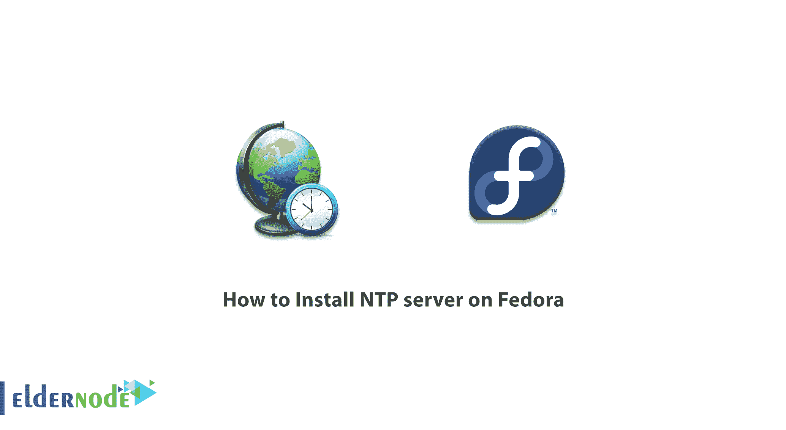
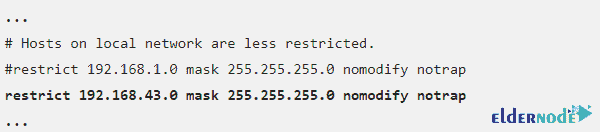
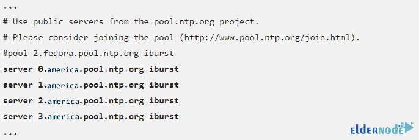

# 如何在 Fedora[新发布] - Eldernode 博客上安装 NTP 服务器

> 原文：<https://blog.eldernode.com/install-ntp-server-on-fedora/>



NTP 代表网络时间协议，用于微调和同步系统和设备的时钟与原子钟。NTP 服务器遵循一种称为 Stratum 的分层结构。该协议使用 UDP 123 端口，并允许网络设备同步它们的时间。理想情况下，这些设备应该与可信的服务器同步时间。您可以将路由器配置为本地网络的 NTP 服务器。另一方面，该路由器必须是互联网上的另一个 NTP 服务器或另一个接入点，作为 NTP 客户端，以便与其同步时间。在这篇文章中，我们试图学习如何在 Fedora 上安装 NTP 服务器。你也可以访问 [Eldernode](https://eldernode.com/) 中的套装来购买 [VPS 服务器](https://eldernode.com/vps/)。

## **教程在 Fedora 上安装 NTP 服务器 33**

网络时间协议是用于同步操作系统操作时间的默认算法。该协议具有容错功能。它也是一种基于特定和设计的时间源执行时间统一的协议。NTP 协议的时间同步在一段时间内执行，并涉及 NTP 数据包的传输。NTP 数据包包含一个时间戳，它就像一个标签，包含用户的时间模式和参与服务器的模式。

NTP 依靠时钟源来为系统的其余部分设置时间，以指定通用时间。该协议使用 UTC(协调世界时)作为时间标准的精确来源。UTC 使 NTP 算法能够在全球范围内使用，而不受时区设置的影响。时区是从英国格林威治开始将世界分成 15 个部分的地理划分，它的作用是显示世界不同地区的时钟。

### **NTP 是如何工作的？**

世界上有成千上万的 NTP 服务器可以访问原子钟和 GPS 时钟服务。如果我们打算为任何一台计算机配备这些服务器，这是没有意义的，也是不经济的。但是通过实现 NTP 协议，您可以创建这种同步。例如，在 [Windows](https://blog.eldernode.com/tag/windows/) 版本中，此功能可用，但默认情况下不启用。

NTP 客户端请求与 [NTP 服务器](https://blog.eldernode.com/ntp-server-configuration-via-powershell/)进行时间交换。由于这种交换，客户能够计算链路延迟和本地偏移，并设置自己的本地时钟以匹配服务器上的时钟。通常，需要在大约 5 到 10 分钟内进行六次交换来确定初始时间。同步后，NTP 客户端每 10 分钟更新一次，通常只需要一次消息交换。该事务通过 UDP 协议的端口 123 完成。

### **NTP 特性(在 Fedora 33 上安装 NTP 服务器一文)**

1.NTP 提供一个参考时钟，作为所有同步过程的固定点。所有的时钟都根据这个时间同步。从一开始，协调世界时(UTC)，即众所周知的全球统一时钟，就被用于这一目的。

2.NTP 是一种自动搜索最佳同步时间源的协议。多个来源可以结合起来，以尽量减少协调中的任何累积误差。在可能的情况下，网络时间协议会检测并忽略临时或永久提供非常强的偏移值的时间源。

3.NTP 是高度可扩展的。每个同步网络可以有几个参考小时。此外，每个网络节点能够以双向(点对点)或单向分层结构传输时间信息。

4.NTP 非常准确。由于选择最佳同步候选的可能性，正确的结果可能高达一纳秒。

5.NTP 可以修复临时网络连接问题。

在本文的后续部分，请加入我们，学习如何在 Fedora 上安装 NTP 服务器。

### **在 Fedora** 上安装 NTP 服务器

在这一节中，我们试图教你如何在 Fedora 上使用 **NTPd** 安装 NTP 服务器。跟随我们在本教程中设置您的 NTP 服务器来自动设置时间。由于 NTP 守护程序是由 NTP 软件包提供的，因此您必须使用以下命令来安装 NTPd:

```
dnf install ntp -y
```

接下来，要从用户的默认空间守护进程 chronyd 使用 NTPd，必须停止并禁用它。因此，你应该使用以下命令**停止**和**禁止**重启系统。

```
systemctl stop chronyd
```

```
systemctl disable chronyd
```

执行上述命令后，现在应该使用以下命令在启动系统时**启动**和**使能** NTPd:

```
systemctl start ntpd
```

```
systemctl enable ntpd
```

### **如何在 Fedora**T3 上配置 NTP 服务器

注意，NTP 的主配置文件是 **/etc/ntp.conf** 。应该注意的是，这个配置文件是随 NTPd 一起安装的，并且默认配置为使用 Fedora 池中的时间服务器。

您可以使用 **ntp.conf** 文件中的 **restrict** 命令配置或**限制对 ntp 服务的访问**，以配置 NTP 服务访问控制。您还可以使用以下命令编辑 **/etc/ntp.conf** ，以限制对服务器的本地访问。通过这样做，您可以添加允许服务器接收请求的网络域。

```
vim /etc/ntp.conf
```



您还可以配置**时间服务器**。应该注意的是，NTP 默认配置为使用 Fedora 池中的时间服务器。您可以通过将时间服务器替换为靠近您所在区域的服务器来轻松改变这一点。



## 结论

世界上有成千上万的 NTP 服务器可以访问原子钟和 GPS 时钟服务。如果我们打算为任何一台计算机配备这些服务器，这是没有意义的，也是不经济的。您可以通过实现 NTP 协议来创建这种同步。在本文中，我们试图了解如何在 Fedora 上安装 NTP 服务器。如果你想在 [Ubuntu](https://blog.eldernode.com/setup-ntp-server-on-ubuntu-20-04/) 、 [CentOS](https://blog.eldernode.com/install-ntp-server-on-linux-centos/) 、 [Debian](https://blog.eldernode.com/install-ntp-debian/) 上安装配置 NTP 服务器，可以参考这些文章。