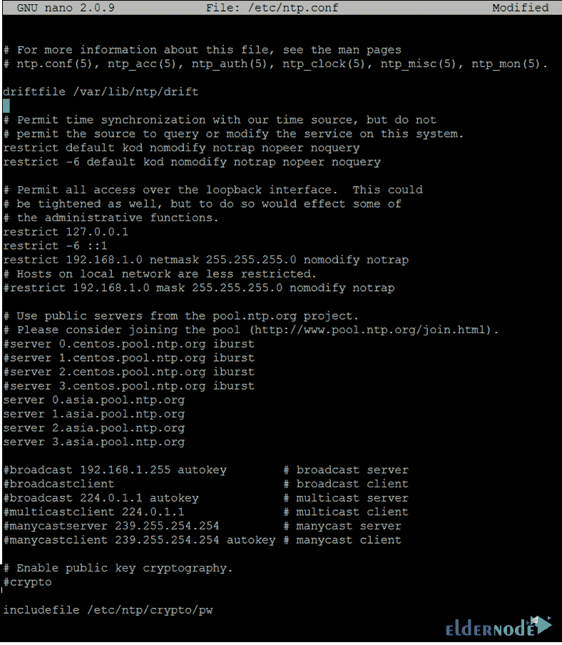

# 如何在 Linux CentOS - ElderNode 博客上安装 NTP 服务器

> 原文：<https://blog.eldernode.com/install-ntp-server-on-linux-centos/>


【更新】NTP 是一种网络时间协议。NTP 负责统一系统的时间和日期，以防止大型全球网络出现通信问题。在运行程序或打开网站时，您可能会看到一条消息，内容为“更新您的系统时间和时区”。当您的系统显示不正确的日期和时间时，会发生此过程。在大型 Windows 网络上，PDC Emulator 服务负责同步系统时间，而在 Linux 系统上，通常选择一个服务器作为 NTP 服务器。NTP 服务器从声誉良好的 NTP 互联网服务器接收及时的信息，并将它们提交给网络内系统。在这篇关于 [Linux](https://blog.eldernode.com/tag/linux/) 教程合集的文章中，我们将学习**在 Linux CentOS** 上安装 NTP 服务器。您可以访问 [Eldernode](https://eldernode.com/) 中提供的包来购买 [CentOS VPS](https://eldernode.com/centos-vps/) 服务器。

## **教程在 Linux CentOS 8 | CentOS 7 上安装 NTP 服务器**

在本教程中，我们将了解如何使用 [Linux 命令](https://blog.eldernode.com/initial-set-up-centos-8/)在 Linux CentOS 上设置 NTP 服务器，并运行 NTP 服务器。请继续关注本教程的剩余部分。

### **NTP 协议是如何工作的？**

NTP 向服务器提供来自原子钟的时间信号，并在 UTC 世界时钟的帮助下在系统中分发该信号。NTP 服务器由同步设备组成，如客户端和接收 UTC 时间并将其提供给客户端的 NTP 服务器。

客户端和服务器通过一系列请求和响应进行通信，如下所示:

–客户端向时间服务器发送 NTP 请求数据包，并确认执行时间(源开始时间)。

–服务器确认收到请求包的时间。

–服务器再次向客户端发送响应数据包。

–客户在收到响应包时确认目的地时间。

这个过程可能只需要几纳秒。时间戳允许客户端计算环岛中的延迟，检查其内部时间与服务器提供的时间之间的差异，并在必要时准确重置时钟。

在本文的后续部分，我们将学习如何在 Linux [CentOS](https://blog.eldernode.com/tag/centos/) 上安装 NTP 服务器。

### **如何在 Linux CentOS 上安装 NTP 服务器**

1-首先，连接到您的 CentOS Linux 控制台。

2-使用 **yum** 命令安装 NTP 服务包。

```
yum install ntp
```

3-安装后，用编辑器打开 **NTP 设置文件**。

```
nano /etc/ntp.conf
```

***注意** :* 在这个文件中，你会看到你的 NTP 服务器的相关设置。查找以“服务器”开头的短语，然后用#号将它们改为注释。你可以从 ntppool.org[那里得到帮助，选择一个更好更近的服务器。首先，登录并选择您的地理区域，以显示离您最近的服务器的名称。建议您向该文件添加 2 或 3 个服务器。](https://www.ntppool.org/en/)

4-接下来，在 **ntp.conf** 文件中输入以下命令，向您的网络 IPs 发送服务许可。

```
restrict 192.168.1.0 netmask 255.255.255.0 nomodify notrap
```

***注** :* 上述命令**允许**访问 192.168.1.0。确保输入**您的**网络 IP 地址，而不是网络的 IP 地址。然后在对 **ntp.conf** 文件进行更改后保存它。

5-如果您需要观察故障排除或服务操作，请创建一个日志文件，并在 **ntp.conf** 文件中添加以下短语。

```
logfile /var/log/ntp.log 
```

6-最后，在执行上述命令后，您的 **ntp.conf** 文件的图像如下。



7-当您完成所有更改后，**重启**服务一次。

```
service ntpd restart
```

8-输入以下命令来测试 NTP 服务的准确性。

```
ntpq -p
```

```
date -R
```

第一个命令将检查添加的服务器的连接。第二个命令将显示完整的系统更新日期。如果从上述命令中获得正确的结果，则在 [CentOS](https://blog.eldernode.com/tag/centos/) Linux 中的 NTP 服务器设置过程将成功完成。注意 NTP 协议在端口 123 上工作，并且使用 UDP 协议，所以在你的 [Linux](https://blog.eldernode.com/tag/linux/) 防火墙上做适当的改变来打开这个端口。

## 结论

网络时间协议是与传输层的 UDP 123 端口一起工作的协议。该协议允许网络计算机同步时间。随着时间的推移，计算机的内部时钟忽略了时间的问题。尤其是在客户端和服务器日志文件的情况下，或者如果您想要复制服务器或数据库。在本文中，我们试图向您展示如何在 Linux CentOS 上安装 NTP 服务器。如果想在 Ubuntu、Debian、Windows Server 上安装 NTP Server，也可以参考这些文章。