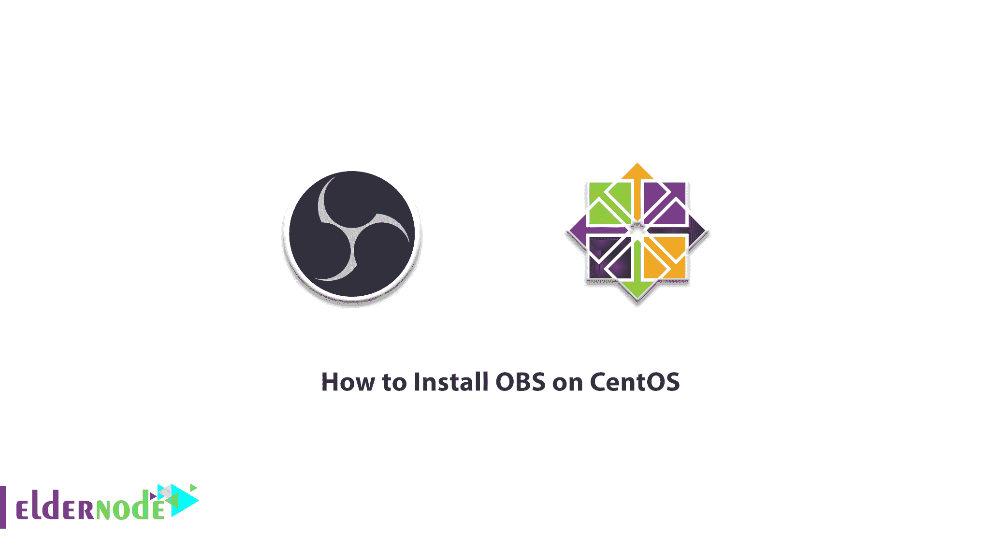
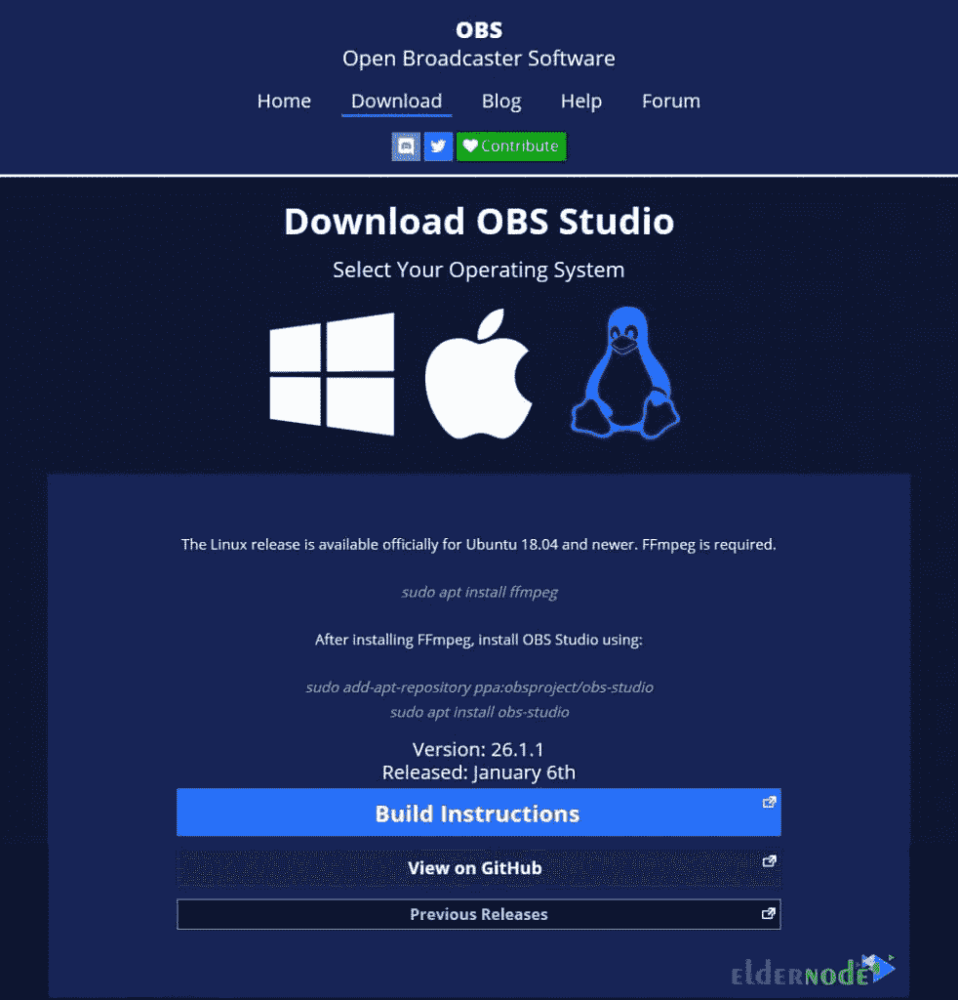
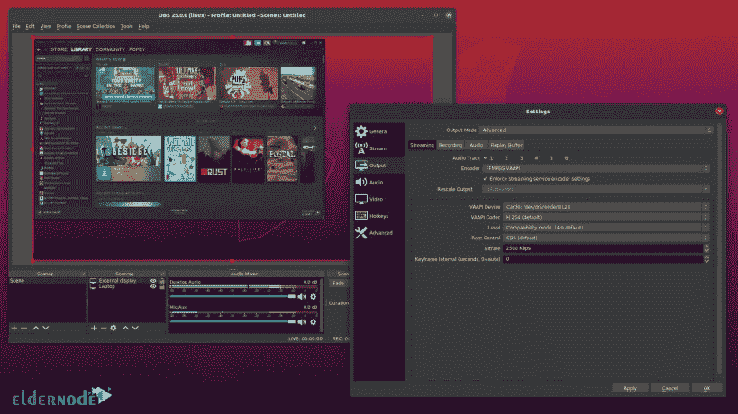

# 如何在 CentOS 7 / 8 - Eldernode 博客上安装 OBS

> 原文：<https://blog.eldernode.com/install-obs-on-centos/>



开放广播软件(OBS)是一个免费的开源跨平台软件。这是一个用 Qt 构建的流和记录程序，由 OBS 项目维护。OBS 软件自 2016 年起简称 OBS Studion。OBS Studio 是一个用于录制和直播的免费开源软件套件。它也适用于 Microsoft Windows、macOS 和 Linux 发行版。奥林匹克广播服务公司是由开放集体资助的。在本文中，您将学习如何在 CentOS 7 / 8 上安装 OBS。访问 [Eldernode](https://eldernode.com/) ，找到一个完美的套餐来购买您自己的 [CentOS VPS](https://eldernode.com/centos-vps/) 。

为了让本教程更好地发挥作用，请考虑以下**先决条件**:

拥有 sudo 权限的非 root 用户。

要进行设置，请遵循我们的[初始设置 centos 8](https://blog.eldernode.com/initial-set-up-centos-8/) 。

## **Turorial 在 CentOS 7 | CentOS 8 上安装 OBS**

OBS 受 GPL-2.0 许可。您可以使用 OBS 来捕获记录您的屏幕，同时也捕获音频。当您选择 OBS 时，意味着您不再需要任何内部昂贵的捕获卡。要开始使用 OBS，你需要一台可以处理流媒体的电脑，而不是一台旧电脑。你可以[从其官网下载 OBS](https://obsproject.com/download) 在 [Windows](https://blog.eldernode.com/tag/windows/) 、MacOS、 [Linux](https://blog.eldernode.com/tag/linux/) 上使用。由于您正在流式传输，您的计算机将同时捕获、渲染和上传视频和数据，因此您必须提供一台坚固的计算机。



### **如何打开快照**

要在 CentOS 上安装 OBS，首先需要在 [CentOS](https://blog.eldernode.com/tag/centos/) 上启用快照并安装 OBS Studio。正如您在以前的文章中所读到的，[快照](https://snapcraft.io/store)是打包了所有依赖项的应用程序，可以在一个版本中运行所有流行的 Linux 发行版。快照可以自动更新并正常回滚。



使用以下命令将 EPEL 存储库添加到您的系统中:

```
sudo yum install epel-release
```

然后，您可以通过运行以下命令来安装 snap:

```
sudo yum install snapd
```

当上述安装过程完成后，您需要启用系统单元。这样，主 snap 通信套接字将被管理。

```
sudo systemctl enable --now snapd.socket
```

您可以在 */var/lib/snapd/snap* 和 */snap* 之间创建一个符号链接来启用*经典* snap 支持。

```
sudo ln -s /var/lib/snapd/snap /snap
```

**注意**:为了确保 snap 的路径更新正确与否，您可以注销并重新登录。

### **如何在 CentOS 7 / 8 上安装 OSB Studio**

成功完成上述步骤后，您只需运行一个命令即可安装 OSB studio:

```
sudo snap install obs-studio
```

## **结论**

在本文中，您了解了如何在 CentOS 上安装 OBS。OBS 可以传输到许多不同的平台，如 Youtube、Instagram、Twitch 和脸书。使用 OBS 为您提供实时源和设备捕获、场景合成、编码、记录和广播。如果你有兴趣阅读更多内容，可以找到我们关于[介绍并在 Ubuntu 20.04](https://blog.eldernode.com/introducing-install-kazam-on-ubuntu-20-04/) 上安装 Kazam 的相关文章。