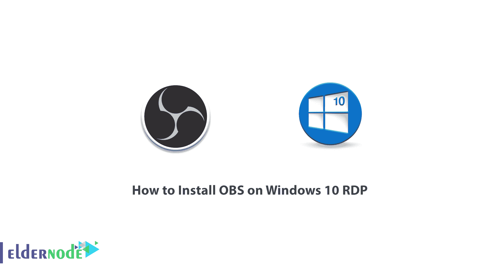
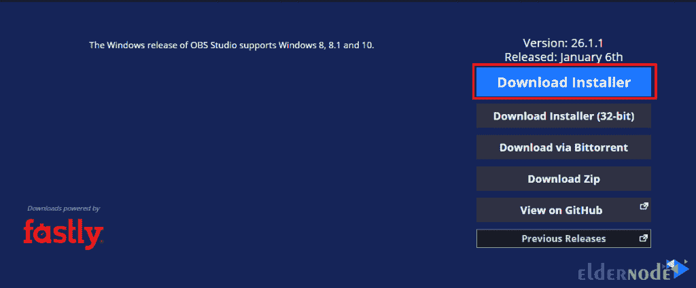
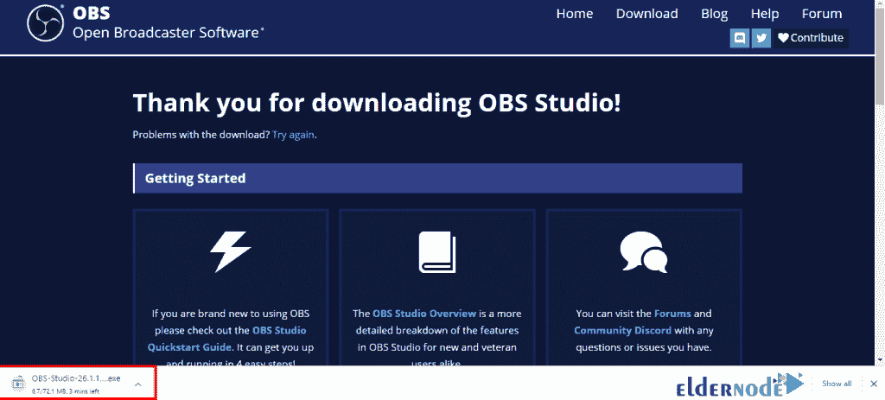
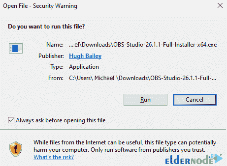
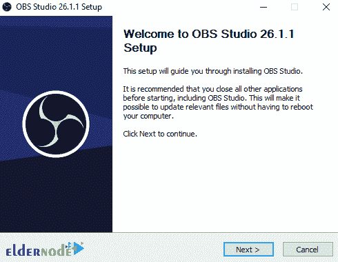
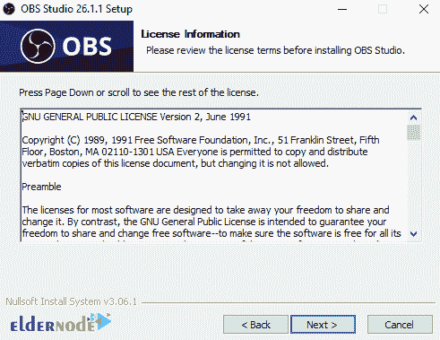
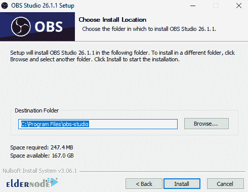
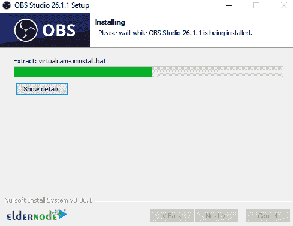
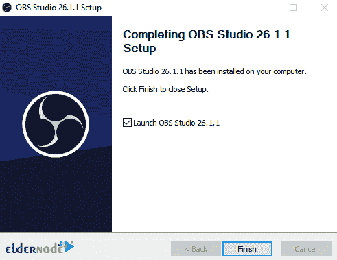
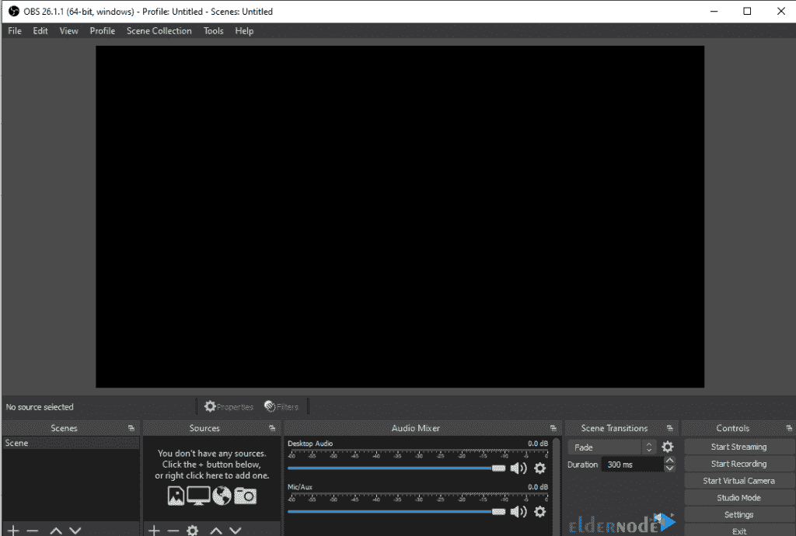

# 如何在 Windows 10 上安装 OBS RDP-elder node 博客

> 原文：<https://blog.eldernode.com/install-obs-on-windows-10-rdp/>

OBS 是专为游戏玩家、设计师、艺术家甚至是业余用户设计的软件，他们希望在在线流中分享他们的视频。使用该软件，您可以通过 OpenGL 或 Direct3D 创建高质量的记录，并轻松地在在线流中共享它们。OBS 与 Twitch 等各种流一起工作，通过为您提供的简单用户界面，您可以轻松地传输您的视频。你甚至可以添加自己的流。该工作室制作的视频将采用高质量的格式，如 MOV、FLV、MKV、MP4、ts。在这篇文章中，我们试图学习如何在 Windows 10 RDP 上安装 OBS。你可以在 [Eldernode](https://eldernode.com/) 看到购买 [Windows 10 RDP](https://eldernode.com/windows-10-rdp/) 服务器的套餐。

## **教程在 Windows 10 上安装 OBS RDP**

OBS 代表开放广播软件，是一种视频录制和回放软件。它是用 C、C++和 Qt 编写的开源软件，由 OBS 项目和一个独立开发者社区开发。有趣的是，这个程序支持广泛的插件来增加程序的性能。在下一节中，我们将提到一些 OBS 特性，然后教你如何在 [Windows](https://blog.eldernode.com/tag/windows/) 10 RDP 上安装 OBS。请和我们在一起。

### **OBS 特性**

OBS 软件有很好的性能，你可以给你的视频添加各种滤镜。如果我们想列举 OBS 软件的一些特性，我们可以说:

–黑暗与光明主题的存在

–能够过滤视频

–支持各种格式

–能够添加定制流

–简单的用户界面

跟随我们在这篇文章中学习如何一步一步地在 Windows 10 RDP 上安装 OBS。

### **OBS 安装系统要求**

要在 Windows 10 RDP 上安装 OBS，你的系统中需要有 **DirectX 10.1 兼容的 GPU** 。

### **在 Windows 10 RDP 服务器上安装 OBS**

要安装 OBS，第一步需要访问 [OBS 网站](https://obsproject.com/download)。然后在这个页面上，你可以通过选择**下载安装程序**选项来下载 64 位版本的 OBS。

您会看到 OBS 下载开始。

请参考下载文件的路径。然后双击它，选择**运行**。

现在你需要点击**下一个**来安装 OBS Studio。

再次点击**下一个**。

现在选择安装 OBS 的目标文件夹，点击**安装**。

您将看到 OBS Studio 开始安装。

最后，点击**完成**完成 OBS 安装。

成功安装 OBS 后，您将在下图中看到 OBS Studio 环境。

## 结论

OBS 是一个免费的开源软件套件，用于现场录制和回放。OBS 是用 C、C ++和 Qt 编写的，OBS 提供设备源和录制、场景合成、加密、录制和回放。该软件主要通过实时消息协议(RTMP)传输数据。在本文中，我们试图了解如何在 Windows 10 RDP 上安装 OBS。